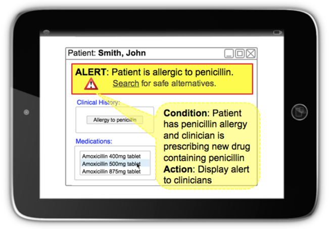

# Overview

## What is Clinical Decision Support?

Clinical Decision Support (CDS) is a service that enables healthcare providers to make well-informed decisions by supplying guidance, knowledge, and patient-specific information at relevant points in the patient journey, such as diagnosis, treatment, and follow-up. CDS uses a range of mechanisms to assist users in this process. Examples of these mechanisms include automated alerts or reminders, clinical guidelines, contextually relevant reference information, conditional order sets, diagnostic support, and patient-focused reports, forms, or templates. The beneficiaries of the information derived from CDS may include patients, clinicians, and others involved in the delivery of health care.

It is important to distinguish the general practice of clinical decision support from the application of tools designed to enhance decision support practices. One is performed by humans who make decisions based on knowledge they possess and information they consume. The other is computed by systems and engines using rules and predefined conditions. Although both are important, the technical components of CDS are designed to assist rather than replace the subtle judgment and guidance provided by the clinician.

Applications and tools that provide clinical decision support are known as as [Clinical Decision Support Systems](#user-content-fn-1)[^1] (CDSS). A clinical decision support system is defined as a computer system or software application designed to assist clinicians, caregivers, or patients in healthcare and/or treatment decisions.

Notes

* Typically a clinical decision support system responds to triggers, such as specific signs or symptoms, diagnoses, laboratory test results, medication selections, or complex combinations of such triggers. The system then provides information or recommendations relevant to the specific patient.

## History

It has been suggested that the origins of clinical decision support (CDS) can be traced back to the 1950s and 1960s.[ In an early example from 1961, Dr. Homer Warner, a cardiologist from the University of Utah developed a mathematical model which was used to diagnose heart disease](#user-content-fn-2)[^2]. Since then, there have been countless developments and advancements in the area of decision support. Many theories have been proposed as to how CDS should be approached and applied in clinical practice.

## The Five Rights

When implemented properly, CDS has the potential to enhance patient care, reduce errors and duplication of effort, and introduce efficiencies to the clinical workflow. Conversely, CDS tools can also be distracting and disruptive, even producing unwanted consequences. It is therefore important to consider the lessons learned from previous implementations of CDS and conduct thorough requirements analysis prior to designing or procuring a CDSS. One of the best practice frameworks that has been developed to guide those considering a CDS implementation is the[ "CDS Five Rights"](#user-content-fn-3)[^3]. "The Five Rights" suggests that to realize the full potential of CDS, solutions should:

* **Supply the&#x20;**_**right information**_**&#x20;(evidence-based guidance, address the clinical need)**
* **To the&#x20;**_**right people**_**&#x20;(entire care team, including the patient)**
* **Using the&#x20;**_**right channels**_**&#x20;(e.g., EHR, mobile devices, patient portals)**
* **In the&#x20;**_**right intervention formats**_**&#x20;(e.g., order sets, flow-sheets, dashboards, patient lists)**
* **At the&#x20;**_**right points in the workflow**_**&#x20;(for decision making or action)**

## Example

A typical application of CDS is shown in the diagram below:

<figure><figcaption><p>Example of simple application of CDS</p></figcaption></figure>

The clinical setting in which this hypothetical tool has been applied is the prescribing of a medication. In this example, the patient has previously had an [91936005 <mark style="color:blue;">|</mark> Allergy to penicillin<mark style="color:blue;">|</mark>](http://snomed.info/id/91936005) recorded. When prescribing a new drug, such as [27658006 <mark style="color:blue;">|</mark> Amoxicillin<mark style="color:blue;">|</mark>](http://snomed.info/id/27658006), an alert is displayed to remind the clinician of the previously diagnosed allergy. The application may also provide a mechanism to search for alternative medications. Note that the mechanics of this workflow uses a predefined rule which specifies a condition to be evaluated and an action to be taken if the condition evaluates to true.

## Functional Areas

This section addresses the functional scope of clinical decision support. CDS may be represented in a variety of formats or tools which depend on the clinical situation or environment. These tools are often referred to as CDS formats, types, or interventions and can be deployed to a wide variety of systems and platforms, such as mobile devices.

[Within these functional areas, CDS can be further subdivided into tools which are prompted by the tasks a clinician performs such as patient charting or diagnosis, and functions that are triggered by external events such as the expiration of a period of time](#user-content-fn-4)[^4].[1](https://confluence.ihtsdotools.org/display/DOCCDS/1.2.+Functional+Areas#Footnote1) Some of the more common CDS functions are described briefly in the table below. Use of these functions may be appropriate in a variety of clinical domains or use cases, some of which are discussed in the [Clinical Areas](1.1-overview.md#clinical-areas) section.

<table><thead><tr><th width="155.83984375">CDS Function</th><th>Description</th></tr></thead><tbody><tr><td><strong>Alerts or Reminders</strong></td><td>One of the more common types of decision support is computerized alerts (or reminders). These are triggered by rules and designed to interrupt clinicians or patients at the appropriate time. These alerts are also referred to as “best practice advisories” and can be implemented as pop-ups on a users screen or in monitoring tools such as a dashboard. Alerts can also be used to trigger other communication mechanisms such as paging or faxing. Examples of alerts include drug to drug interactions, or drug allergy warnings triggered when medications are prescribed.</td></tr><tr><td><strong>Clinical Guidelines and Reference Information</strong></td><td>These CDS functions are often implemented as links to external references which are published by third party, knowledge experts. Guidelines may be represented in a standardized format to facilitate interoperability - for example, the<a data-footnote-ref href="#user-content-fn-5"> HL7 Infobutton</a>. References can be based on relevant, context-dependent data captured in a patient health record or another electronic artifact such as an order or clinical document. </td></tr><tr><td><strong>Diagnostic Support Tools</strong></td><td>These tools use a combination of patient data, context-based suggestions and clinical knowledge links to aid the clinician in making a diagnosis. An example would be a tool that prompts a physician for additional findings and suggests additional tests or procedures to help differentiate the diagnosis.</td></tr><tr><td><strong>Automatically Triggered Smart Forms</strong></td><td>These documentation tools, which include reports and summaries, are aimed at high quality records, the reduction of errors, and more complete information. These tools can be triggered when a specific patient condition is detected or when a finding is deemed reportable to a jurisdictional health body. These can be represented as focused patient data reports or summaries and are often utilized at the point of care (POC) in real time.</td></tr><tr><td><strong>Conditional Order Sets and Pathway Support</strong></td><td>These are typically designed for complex ordering scenarios. They may be comprised of a proposed set of orders or a treatment regimen which is based on an explicit situation or medical condition. These interventions can ensure compliance with established protocols. They can also be utilized to guide clinicians though complex care pathways.</td></tr></tbody></table>

## Clinical Areas

The focus of this section is the clinical application of CDS tools or how the [functional components](1.1-overview.md#functional-areas) described earlier can be used in practice. Stakeholders from various clinical domains interact with clinical systems, such as EHRs with CDSS and CPOE (computerized physician order entry). The table below lists some of the clinical areas in which SNOMED CT enabled CDSSs can assist clinicians in making well informed decisions.

<table><thead><tr><th width="130.00390625">Clinical Area</th><th>Description</th></tr></thead><tbody><tr><td><h3 id="id-1.3.clinicalareas"></h3><p><strong>Medication Management</strong></p></td><td>A clinician uses an EHR with CDS to prescribe <a href="http://snomed.info/id/375374009">375374009 <mark style="color:blue;">|</mark> Warfarin sodium 4mg tablet<mark style="color:blue;">|</mark></a>. The CDSS queries the EHR and discovers that the patient is <a href="http://snomed.info/id/77386006">77386006 <mark style="color:blue;">|</mark> Pregnant<mark style="color:blue;">|</mark></a>. The CDSS determines that the proposed drug has <a href="http://snomed.info/id/372756006">372756006 <mark style="color:blue;">|</mark> Warfarin<mark style="color:blue;">|</mark></a> as an ingredient. As warfarin in contraindicated during pregnancy, the system triggers an alert to be displayed to the clinician. Relevant clinical guidelines are also displayed to the user. These guidelines suggest a safe alternate, such as <a href="http://snomed.info/id/714788005">714788005 <mark style="color:blue;">|</mark> Dabigatran<mark style="color:blue;">|</mark></a>, which the clinician then safely prescribes to the patient.</td></tr><tr><td><strong>Diagnosis</strong><br> <a data-footnote-ref href="#user-content-fn-6">(e.g. Diabetes)</a></td><td>A clinician uses an EHR with CDS in a case analysis scenario to aid in diagnosis. The clinician records the patient’s age and gender, then prepares to enter specific clinical findings, history, symptoms, etc. As the physician records symptoms of <a href="http://snomed.info/id/55350005">55350005 <mark style="color:blue;">|</mark> Hunger<mark style="color:blue;">|</mark></a> , <a href="http://snomed.info/id/84229001">84229001 <mark style="color:blue;">|</mark> Fatigue<mark style="color:blue;">|</mark></a>, and <a href="http://snomed.info/id/87715008">87715008 <mark style="color:blue;">|</mark> Dry mouth<mark style="color:blue;">|</mark></a>, a ranked list of common diseases, associated with these clinical findings, is dynamically presented to the clinician. At the top of this list is <a href="http://snomed.info/id/73211009">73211009 <mark style="color:blue;">|</mark> Diabetes mellitus<mark style="color:blue;">|</mark></a>. A scale is used to indicate the level of support for each disease. The CDSS then prompts the clinician for additional findings to help differentiate between diseases. Once a confirmed diagnosis is made, the differential diagnoses can be marked as <a href="http://snomed.info/id/2667000">2667000 <mark style="color:blue;">|</mark> Absent<mark style="color:blue;">|</mark></a>, <a href="http://snomed.info/id/52101004">52101004 <mark style="color:blue;">|</mark> Present<mark style="color:blue;">|</mark></a>, or <a href="http://snomed.info/id/261665006">261665006 <mark style="color:blue;">|</mark> Unknown<mark style="color:blue;">|</mark></a>. An additional finding of <a href="http://snomed.info/id/17173007">17173007 <mark style="color:blue;">|</mark> Always thirsty<mark style="color:blue;">|</mark></a> is recorded and the level of support for each disease in the list is adjusted accordingly. Support for <a href="http://snomed.info/id/73211009">73211009 <mark style="color:blue;">|</mark> Diabetes mellitus<mark style="color:blue;">|</mark></a> has now increased from minimal evidence to sufficient evidence. The clinician then selects <a href="http://snomed.info/id/44054006">44054006 <mark style="color:blue;">|</mark> Type 2 diabetes mellitus<mark style="color:blue;">|</mark></a> which opens an evidence screen displaying the recorded findings which either strongly support, support, or do not support the chosen disease. The clinician is then presented with a link that displays all the PubMed articles associated with <a href="http://snomed.info/id/44054006">44054006 <mark style="color:blue;">|</mark> Type 2 diabetes mellitus<mark style="color:blue;">|</mark></a>.</td></tr><tr><td><p><strong>Laboratory</strong></p><p><a data-footnote-ref href="#user-content-fn-7">(e.g. Critical Results)</a></p></td><td>A patient presented at Emergency complaining of <a href="http://snomed.info/id/29857009">29857009 <mark style="color:blue;">|</mark> Chest pain<mark style="color:blue;">|</mark></a> and was subsequently admitted to the hospital. The attending physician ordered a series of lab tests including a <a href="http://snomed.info/id/271236005">271236005 <mark style="color:blue;">|</mark> Serum potassium measurement<mark style="color:blue;">|</mark></a>. Laboratory tests are completed and published to the laboratory information system (LIS). The CDSS then queries the LIS and learns that the <a href="http://snomed.info/id/365760004">365760004 <mark style="color:blue;">|</mark> Potassium level<mark style="color:blue;">|</mark></a> is <a href="http://snomed.info/id/166690008">166690008 <mark style="color:blue;">|</mark> Low serum potassium level<mark style="color:blue;">|</mark></a> and considered critical. The CDSS then queries the EHR to confirm the patient has been prescribed <a href="http://snomed.info/id/350608001">350608001 <mark style="color:blue;">|</mark> Oral form digoxin<mark style="color:blue;">|</mark></a>, which has <a href="http://snomed.info/id/387461009">387461009 <mark style="color:blue;">|</mark> Digoxin<mark style="color:blue;">|</mark></a> as an active ingredient. A knowledge base rule has been defined which stipulates, if the drug prescribed contains <a href="http://snomed.info/id/387461009">387461009 <mark style="color:blue;">|</mark> Digoxin<mark style="color:blue;">|</mark></a> and the laboratory test indicates a <a href="http://snomed.info/id/166690008">166690008 <mark style="color:blue;">|</mark> Low serum potassium level<mark style="color:blue;">|</mark></a>, then inform the user. An alert, in the form of an urgent pager message, is generated and sent to the attending physician. </td></tr><tr><td><p><strong>Radiology</strong></p><p>(e.g. Contraindication)</p></td><td>An ordering physician has requested a 1343710007 <a href="https://browser.ihtsdotools.org/?perspective=full&#x26;conceptId1=1343710007&#x26;edition=MAIN&#x26;release=&#x26;languages=en"><mark style="color:blue;">|</mark>Plain X-ray series of upper gastrointestinal tract with barium contrast<mark style="color:blue;">|</mark></a>, which uses <a href="http://snomed.info/id/25419009">25419009 <mark style="color:blue;">|</mark> Barium sulfate<mark style="color:blue;">|</mark></a> materials. The patient presents at the imaging clinic on the day of their exam. During study protocoling, the imaging department uses the CDSS to query the patient record and determine the patient has a <a href="http://snomed.info/id/161524000">161524000 <mark style="color:blue;">|</mark> History of hay fever<mark style="color:blue;">|</mark></a>. An alert is triggered to advise the imaging technician about the risk of an allergic reaction. The imaging department, in consultation with the GI radiologist, calls the ordering doctor to discuss the associated risks. Additional guidelines related to preparing for reactions and symptom management ( <a href="http://snomed.info/id/247472004">247472004 <mark style="color:blue;">|</mark> Hives<mark style="color:blue;">|</mark></a>, <a href="http://snomed.info/id/418290006">418290006 <mark style="color:blue;">|</mark> Itching<mark style="color:blue;">|</mark></a>, <a href="http://snomed.info/id/65124004">65124004 <mark style="color:blue;">|</mark> Swelling<mark style="color:blue;">|</mark></a>, etc.) are provided via the CDSS. An additional medication is administered prior to the contrast material to reduce the risk of an allergic reaction. The imaging department proceeds with the planned procedure.</td></tr><tr><td><p><strong>Radiology</strong></p><p>(e.g. Appropriate Imaging)</p></td><td>A clinician records notes into the appropriate fields of an EHR. For example, Clinical notes: “Pt is 75 yo. LBP (lower back pain) for the past 2 weeks. On exam normal SLR (straight leg raise)…”  Using NLP, these notes are encoded as part of the record storage process. (For example, as <a href="http://snomed.info/id/279039007">279039007 <mark style="color:blue;">|</mark> Low back pain<mark style="color:blue;">|</mark></a> and <a href="https://browser.ihtsdotools.org/?perspective=full&#x26;conceptId1=298686006&#x26;edition=MAIN&#x26;release=&#x26;languages=en">298686006 <mark style="color:blue;">|</mark>Straight leg raising normal<mark style="color:blue;">|</mark></a>.) The clinician orders a series of imaging tests. The CDSS, based on specific quality metrics (e.g., <a href="https://en.wikipedia.org/wiki/Appropriate_Use_Criteria">appropriate use criteria</a> or AUC), evaluates whether or not imaging guidelines are being followed by analyzing the patient's health record together with the proposed tests. If the guidelines were not followed, the CDSS will display an alert informing the clinician that they may want to consider alternative imaging or additional tests. For example, an alert may indicate: “The patient has <a href="http://snomed.info/id/279039007">279039007 <mark style="color:blue;">|</mark> Low back pain<mark style="color:blue;">|</mark></a> and <a href="http://snomed.info/id/309537005">309537005 <mark style="color:blue;">|</mark> Numbness of lower limb<mark style="color:blue;">|</mark></a>. A <a href="http://snomed.info/id/394451000119106">394451000119106 <mark style="color:blue;">|</mark> MRI of lumbar spine without contrast<mark style="color:blue;">|</mark></a> for this case has an appropriateness rating of 8 (scale of 10) and is recommended.”</td></tr><tr><td><p><strong>Emergency Department</strong></p><p>(e.g. Order sets)</p></td><td>A patient has presented at the Emergency Room (ER) complaining of <a href="http://snomed.info/id/267036007">267036007 <mark style="color:blue;">|</mark> Shortness of breath<mark style="color:blue;">|</mark></a> . The attending physician records the appropriate clinical finding codes in the EHR. She then prepares a condition-specific order set in a Computerized Physician Order Entry (CPOE) system. The selection of the order set triggers the presentation of new clinical guidelines based on an analysis of the patient record with the proposed treatment. The physician then choses alternative treatment. Suggested dosage guidance is provided by relevant contextual links within the order set.</td></tr><tr><td><strong>Infectious Disease Reporting</strong></td><td>A primary care physician logs on to their EHR with CDS and opens a patient chart to record a condition deemed communicable, such as <a href="http://snomed.info/id/36989005">36989005 <mark style="color:blue;">|</mark> Mumps<mark style="color:blue;">|</mark></a> or <a href="http://snomed.info/id/14189004">14189004 <mark style="color:blue;">|</mark> Measles<mark style="color:blue;">|</mark></a>. The CDSS then triggers an alert to advise the provider that this condition is considered reportable to the jurisdictional public health office. The CDSS then provides a pre-populated smart form which facilitates quick, consistent, and accurate reporting of the condition to the local officer of medical health. The smart form is completed and submitted to the jurisdictional health office. The clinical findings in the report are terminology-encoded which promotes interoperability and facilitates population based health reporting.</td></tr><tr><td><strong>Clinical Treatment Audit</strong></td><td>A department head uses an EHR with CDS to conduct a treatment analysis. She uses the system to generate a list of all inpatients with a confirmed diagnosis of <a href="http://snomed.info/id/128053003">128053003 <mark style="color:blue;">|</mark> Deep venous thrombosis<mark style="color:blue;">|</mark></a>. She then uses the system to determine which of these patients have received <a href="http://snomed.info/id/103746007">103746007 <mark style="color:blue;">|</mark> Heparin therapy<mark style="color:blue;">|</mark></a> for at least 72 hours. The patients which have not met this criteria are flagged for appropriate treatment.</td></tr><tr><td><strong>Acute Asthma Management</strong></td><td><a data-footnote-ref href="#user-content-fn-8">Staff in an Emergency Department (ED) use their EHR with CDS and clinical management pathways to provide a standardized evidence-based approach to patient assessmen</a>t of <a href="https://browser.ihtsdotools.org/?perspective=full&#x26;conceptId1=281239006&#x26;edition=MAIN&#x26;release=&#x26;languages=en">281239006 <mark style="color:blue;">|</mark>Acute asthma<mark style="color:blue;">|</mark></a> in adults. The guidelines help document indications and contraindications to determine eligibility. A triage nurse queries the EHR and learns that the patient is over 16 years of age, has an <a href="https://browser.ihtsdotools.org/?perspective=full&#x26;conceptId1=281239006&#x26;edition=MAIN&#x26;release=&#x26;languages=en">281239006 <mark style="color:blue;">|</mark>Acute asthma<mark style="color:blue;">|</mark></a>, and one or more episodes of <a href="http://snomed.info/id/56018004">56018004 <mark style="color:blue;">|</mark> Wheezing<mark style="color:blue;">|</mark></a> which necessitated <a href="http://snomed.info/id/1366004">1366004 <mark style="color:blue;">|</mark> Breathing treatment<mark style="color:blue;">|</mark></a>. The CDSS then triggers an alert to follow the pathway’s medical directives, which are carried out by a Respiratory Therapist (RT). The directives, in this case of <a href="http://snomed.info/id/370218001">370218001 <mark style="color:blue;">|</mark> Mild asthma<mark style="color:blue;">|</mark></a>, include <a href="http://snomed.info/id/47101004">47101004 <mark style="color:blue;">|</mark> Heart rate monitoring<mark style="color:blue;">|</mark></a>, establishing various baseline <a href="http://snomed.info/id/251880004">251880004 <mark style="color:blue;">|</mark> Respiratory measurements<mark style="color:blue;">|</mark></a>, and administration of a <a href="http://snomed.info/id/372580007">372580007 <mark style="color:blue;">|</mark> Bronchodilator<mark style="color:blue;">|</mark></a> and <a href="http://snomed.info/id/374072009">374072009 <mark style="color:blue;">|</mark> Prednisone 50mg tablet<mark style="color:blue;">|</mark></a> . The RT then notifies the attending physician who fills out and signs discharge instructions which a nurse then reviews with the patient. The desired clinical outcomes of this pathway include improved adherence to evidence-based management and improved patient outcomes such as reduced number of hospitalizations and lower ED return rates.</td></tr><tr><td><strong>Nursing Interventions</strong></td><td>Research has provided evidence to show that patients receiving <a href="http://snomed.info/id/40617009">40617009 <mark style="color:blue;">|</mark> Mechanical ventilation<mark style="color:blue;">|</mark></a> are at high risk for <a href="http://snomed.info/id/233604007"><mark style="color:blue;">|</mark>Pneumonia<mark style="color:blue;">|</mark></a> :  <a href="http://snomed.info/id/42752001"><mark style="color:blue;">|</mark>due to<mark style="color:blue;">|</mark></a>  =  <a href="http://snomed.info/id/68052005"><mark style="color:blue;">|</mark>Aspiration<mark style="color:blue;">|</mark></a>. <a data-footnote-ref href="#user-content-fn-9">Published guidelines</a> recommend <a href="http://snomed.info/id/423171007">423171007 <mark style="color:blue;">|</mark> Elevation of head of bed<mark style="color:blue;">|</mark></a> from 30° to 45°, if not contraindicated, to reduce risk of <a href="http://snomed.info/id/233604007">233604007 <mark style="color:blue;">|</mark> Pneumonia<mark style="color:blue;">|</mark></a>. A nursing supervisor uses a dashboard-like tool in an ICU to monitor patients in her ward. Patients who meet the criteria for risk of <a href="http://snomed.info/id/422588002">422588002 <mark style="color:blue;">|</mark> Aspiration pneumonia<mark style="color:blue;">|</mark></a> are automatically flagged in the system using CDS logic so that the appropriate action may be initiated by nursing staff in the ward. Once the angle of the patient's bed is adjusted, the system is dynamically updated and the flag is removed.</td></tr></tbody></table>

## SNOMED CT Features

This section contains a brief summary of key SNOMED CT features and explains how they may be useful in CDSSs.

### Concepts

SNOMED CT concepts are used to represent clinical meanings. Every concept in SNOMED CT is uniquely identified by a distinct SNOMED CT Concept Identifier. For example, [195967001](http://snomed.info/id/195967001) is the concept identifier for the concept [195967001 | Asthma|](http://snomed.info/id/195967001) .

SNOMED CT concepts play an important role in CDS by enabling actions to be triggered based on the meaning of data recorded in the patient records.

### Descriptions

SNOMED CT descriptions provide the human-readable terms associated with SNOMED CT concepts. A concept may have one or more descriptions, which act as synonyms for the same clinical meaning. This is also how SNOMED CT supports different dialects and languages.

SNOMED CT descriptions allow common CDS rules to be consistently applied across patient records recorded using different synonyms, dialects and languages.

### Relationships

SNOMED CT relationships link concepts together to formally define the meaning of each concept. For example, one type of relationship is the [116680003 | is a|](http://snomed.info/id/116680003) relationship which relates a concept to a parent or supertype. These [116680003 | is a|](http://snomed.info/id/116680003) relationships define the subtype hierarchy of SNOMED CT concepts.

For example, the concepts [53084003 | Bacterial pneumonia|](http://snomed.info/id/53084003) and [75570004 | Viral pneumonia|](http://snomed.info/id/75570004) both have an [116680003 | is a|](http://snomed.info/id/116680003) relationship to [233604007 <mark style="color:blue;">|</mark>Pneumonia<mark style="color:blue;">|</mark>](https://browser.ihtsdotools.org/?perspective=full\&conceptId1=233604007\&edition=MAIN\&release=\&languages=en) which has an [116680003 | is a|](http://snomed.info/id/116680003) relationship to the more general concept [128601007 <mark style="color:blue;">|</mark>Infectious disease of lung<mark style="color:blue;">|</mark>](https://browser.ihtsdotools.org/?perspective=full\&conceptId1=128601007\&edition=MAIN\&release=\&languages=en). Subtype relationships can be used by CDS rules to refer to codes in an EHR that are any specific type of a relevant clinical concept.

Additional attribute relationships help to define the meaning of a concept. For example, the concept [75570004 | Viral pneumonia|](http://snomed.info/id/75570004) has a [246075003 | Causative agent|](http://snomed.info/id/246075003) relationship to the concept [49872002 | Virus|](http://snomed.info/id/49872002) and a [363698007 | Finding site|](http://snomed.info/id/363698007) relationship to the concept [113255004 <mark style="color:blue;">|</mark>Structure of parenchyma of lung<mark style="color:blue;">|</mark>](https://browser.ihtsdotools.org/?perspective=full\&conceptId1=113255004\&edition=MAIN\&release=\&languages=en).

Attribute relationships can be used by CDS rules to refer to codes recorded in an EHR that have a specific meaningful relationship with a concept of interest.

### Concept Model

The SNOMED CT concept model is a set of rules that govern the ways in which SNOMED CT concepts are permitted to be modeled using relationships to other concepts. It defines the types of relationships that may be used on each type of concepts, and the permitted values for each relationship type. The [Machine Readable Concept Model (MRCM)](https://app.gitbook.com/o/h8Z6qGxuQrzM9vbx5bPT/s/wLJPOzgAQsSAYr6nhvCl/) represents the rules in the SNOMED CT concept model in a form that can be read by a computer and applied to test that concept definitions and expressions comply with these rules.

The SNOMED CT concept model plays an important role in CDS by providing the rules by which the clinical meaning of SNOMED CT encoded health records can be queried. The MRCM makes it possible to process these rules in a machine-processable way.

### Expressions

SNOMED CT provides a mechanism which enables clinical phrases to be represented by a computable expression, when a single concept does not capture the necessary level of detail. For example, the following expression represents a right hip:

```json

182201002 |Hip joint|:
272741003 |Laterality| = 4028007 |Right|

```

SNOMED CT expressions enable additional clinical meanings to be captured in a health record, without requiring the terminology to include countless combinations and permutations of precoordinated concepts.

SNOMED CT expressions facilitate CDS over an expanded set of clinical meanings that extends beyond individual concepts. For more information about expressions, please refer to the [SNOMED CT Compositional Grammar - Specification and Guide](https://app.gitbook.com/o/h8Z6qGxuQrzM9vbx5bPT/s/VgpC90r7t9DyATri97GG/).

### Reference Sets

SNOMED CT reference sets are a flexible and standardized approach used to support a variety of requirements for the customization and enhancement of SNOMED CT. These include the representation of subsets, language preferences for use of particular terms, mapping from or to other code systems, and ordered lists.

Reference sets may be used in the following aspects of CDS:

* Representing subsets of SNOMED CT concepts that may trigger a CDS action
* Representing non-standard aggregations of concepts for specific CDS use cases
* Defining language or dialect specific sets of descriptions over which term searches can be performed

For more information about reference sets, please refer to the [SNOMED CT Reference Set Guide](https://app.gitbook.com/o/h8Z6qGxuQrzM9vbx5bPT/s/qOI2v58ZsXOoklmwBOk4/).

### Description Logic Features

Description Logic (DL) is a family of formal knowledge representation languages and used as the formal foundation of meaning in SNOMED CT. The way that concepts have been modeled in SNOMED CT permits them to be represented using Description Logic. DL helps computers to make useful inferences about concepts, and to classify SNOMED CT using a DL reasoner. Description Logic also helps by testing expressions for subsumption and equivalence.

The logical inferences supported by DL can be useful when executing CDS rules. For example, when a CDS rule requires an action to be performed when the patient has any type of [195967001 | Asthma|](http://snomed.info/id/195967001) , a DL reasoner may be used to determine that [281239006 <mark style="color:blue;">|</mark>Acute asthma<mark style="color:blue;">|</mark>](https://browser.ihtsdotools.org/?perspective=full\&conceptId1=281239006\&edition=MAIN\&release=\&languages=en) and [427603009 | Intermittent asthma|](http://snomed.info/id/427603009) are both types of [195967001 | Asthma|](http://snomed.info/id/195967001) and should therefore both trigger the action to be performed.

## Abbreviations

The following table contains the definition of abbreviations used in this document. Please refer to the [SNOMED Glossary](https://app.gitbook.com/o/h8Z6qGxuQrzM9vbx5bPT/s/P21QucCX9Y41nBQt50ad/) for additional definitions.

<table><thead><tr><th width="140.453125">Abbreviation</th><th>Full term linked to the SNOMED Glossary definition</th></tr></thead><tbody><tr><td>CDS</td><td><p><strong>Clinical decision support</strong>, which is defined as a service that assists clinicians, caregivers, or patients in healthcare and/or treatment decisions.</p><p>Notes</p><ul><li>A <strong>clinical decision support system</strong> is a computer system or software application designed to assist clinicians, caregivers, or patients in healthcare and/or treatment decisions.</li></ul></td></tr><tr><td>CDSS</td><td><p><strong>Clinical decision support system</strong>, which is defined as a computer system or software application designed to assist clinicians, caregivers, or patients in healthcare and/or treatment decisions.</p><p>Notes</p><ul><li>Typically a clinical decision support system responds to triggers, such as specific signs or symptoms, diagnoses, laboratory test results, medication selections, or complex combinations of such triggers. The system then provides information or recommendations relevant to the specific patient.</li></ul></td></tr><tr><td>EHR</td><td><strong>Electronic health record</strong>, which is defined as a systematic collection of health information about individual patients or populations that is stored in digital form.</td></tr><tr><td>KB</td><td><strong>Knowledge base</strong>, which is defined as the underlying set of facts, assumptions, and rules which a computer system has available to answer a question or solve a problem.<br></td></tr><tr><td>UI</td><td><strong>User interface</strong>, which is defined as the way in which a software application presents itself to a user.</td></tr><tr><td>NLP</td><td><strong>Natural language processing</strong>, which is defined as a service in which a computer system converts human-readable text and/or spoken language to formal representations of information. </td></tr><tr><td>POC</td><td><strong>Point of care</strong>, which is defined as the time and location at which healthcare professionals deliver healthcare products and services to patients. </td></tr></tbody></table>

[^1]: Definition based on content from [U.S. Department of Health and Human Services, Agency for Healthcare Research and Quality](https://cds.ahrq.gov/)

[^2]: [Timeline of the Development of Clinical Decision Support (OHSU)](http://clinfowiki.org/wiki/index.php/Timeline_of_the_Development_of_Clinical_Decision_Support)

[^3]: Osheroff, Teich, Levick et al., 2012. Improving outcomes with CDS: an implementer’s guide, Second Edition

[^4]: [http://www.himss.org/library/clinical-decision-support/issues](http://www.himss.org/library/clinical-decision-support/issues)

[^5]: [https://www.hl7.org/implement/standards/product\_brief.cfm?product\_id=208](https://www.hl7.org/implement/standards/product_brief.cfm?product_id=208)

[^6]: Based on workflow described in [DXPlain](http://www.mghlcs.org/projects/dxplain/) product literature.

[^7]: Example uses material from Brigham and Women’s Hospital, and was cited in the [BC Medical Journal](https://bcmj.org/articles/clinical-decision-support-systems).

[^8]: Uses material from [Educational and decision-support tools for asthma-management guideline implementation](http://www.ncbi.nlm.nih.gov/pmc/articles/PMC3269598/) and Adult Emergency Department Asthma Care Pathway.

[^9]: [http://ccn.aacnjournals.org/content/32/3/71.full](http://ccn.aacnjournals.org/content/32/3/71.full)
