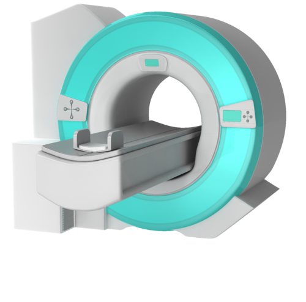
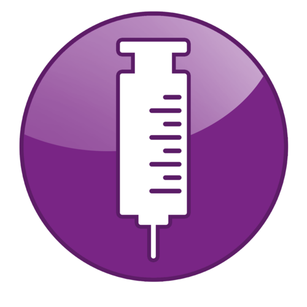
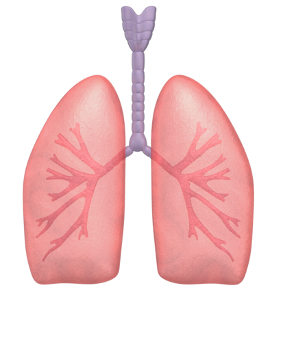

# 1.3. Clinical Areas

The focus of this section is the clinical application of CDS tools or how the [functional components](1.2.-Functional-Areas_123897421.html) described earlier can be used in practice. Stakeholders from various clinical domains interact with clinical systems, such as EHRs with CDSS and CPOE (computerized physician order entry). The table below lists some of the clinical areas in which SNOMED CT enabled CDSSs can assist clinicians in making well informed decisions.

Table 1.3-1: Clinical areas

## Clinical Area

| 

## Description  
  
---|---  
  
##  <figure></figure>

| 

## Medication Management

| A clinician uses an EHR with CDS to prescribe [ 375374009 | Warfarin sodium 4mg tablet|](http://snomed.info/id/375374009 "375374009 | Warfarin sodium 4mg tablet |") . The CDSS queries the EHR and discovers that the patient is [ 77386006 | Pregnant|](http://snomed.info/id/77386006 "77386006 | Pregnant |") . The CDSS determines that the proposed drug has [ 372756006 | Warfarin|](http://snomed.info/id/372756006 "372756006 | Warfarin |") as an ingredient. As warfarin in contraindicated during pregnancy, the system triggers an alert to be displayed to the clinician. Relevant clinical guidelines are also displayed to the user. These guidelines suggest a safe alternate, such as [ 714788005 | Dabigatran|](http://snomed.info/id/714788005 "714788005 | Dabigatran |") , which the clinician then safely prescribes to the patient.  

<figure></figure>| 

## Diagnosis

(e.g. Diabetes)[1](https://confluence.ihtsdotools.org/display/DOCCDS/1.3.+Clinical+Areas#Footnote1 "Footnote: Click here to display the footnote") | A clinician uses an EHR with CDS in a case analysis scenario to aid in diagnosis. The clinician records the patient’s age and gender, then prepares to enter specific clinical findings, history, symptoms, etc. As the physician records symptoms of [ 55350005 | Hunger|](http://snomed.info/id/55350005 "55350005 | Hunger |") , [ 84229001 | Fatigue|](http://snomed.info/id/84229001 "84229001 | Fatigue |") , and [ 87715008 | Dry mouth|](http://snomed.info/id/87715008 "87715008 | Dry mouth |") , a ranked list of common diseases, associated with these clinical findings, is dynamically presented to the clinician. At the top of this list is [ 73211009 | Diabetes mellitus|](http://snomed.info/id/73211009 "73211009 | Diabetes mellitus |") . A scale is used to indicate the level of support for each disease. The CDSS then prompts the clinician for additional findings to help differentiate between diseases. Once a confirmed diagnosis is made, the differential diagnoses can be marked as [ 2667000 | Absent|](http://snomed.info/id/2667000 "2667000 | Absent |") , [ 52101004 | Present|](http://snomed.info/id/52101004 "52101004 | Present |") , or [ 261665006 | Unknown|](http://snomed.info/id/261665006 "261665006 | Unknown |") . An additional finding of [ 17173007 | Always thirsty|](http://snomed.info/id/17173007 "17173007 | Always thirsty |") is recorded and the level of support for each disease in the list is adjusted accordingly. Support for [ 73211009 | Diabetes mellitus|](http://snomed.info/id/73211009 "73211009 | Diabetes mellitus |") has now increased from minimal evidence to sufficient evidence. The clinician then selects [ 44054006 | Type 2 diabetes mellitus|](http://snomed.info/id/44054006 "44054006 | Type 2 diabetes mellitus |") which opens an evidence screen displaying the recorded findings which either strongly support, support, or do not support the chosen disease. The clinician is then presented with a link that displays all the PubMed articles associated with [ 44054006 | Type 2 diabetes mellitus|](http://snomed.info/id/44054006 "44054006 | Type 2 diabetes mellitus |") .  

<figure></figure>| 

## Laboratory

(e.g. Critical Results)[2](https://confluence.ihtsdotools.org/display/DOCCDS/1.3.+Clinical+Areas#Footnote2 "Footnote: Click here to display the footnote") | A patient presented at Emergency complaining of [ 29857009 | Chest pain|](http://snomed.info/id/29857009 "29857009 | Chest pain |") and was subsequently admitted to the hospital. The attending physician ordered a series of lab tests including a [ 271236005 | Serum potassium measurement|](http://snomed.info/id/271236005 "271236005 | Serum potassium measurement |") . Laboratory tests are completed and published to the laboratory information system (LIS). The CDSS then queries the LIS and learns that the [ 365760004 | Potassium level|](http://snomed.info/id/365760004 "365760004 | Potassium level |") is [ 166690008 | Low serum potassium level|](http://snomed.info/id/166690008 "166690008 | Low serum potassium level |") and considered critical. The CDSS then queries the EHR to confirm the patient has been prescribed [ 350608001 | Oral form digoxin|](http://snomed.info/id/350608001 "350608001 | Oral form digoxin |") , which has [ 387461009 | Digoxin|](http://snomed.info/id/387461009 "387461009 | Digoxin |") as an active ingredient. A knowledge base rule has been defined which stipulates, if the drug prescribed contains [ 387461009 | Digoxin|](http://snomed.info/id/387461009 "387461009 | Digoxin |") and the laboratory test indicates a [ 166690008 | Low serum potassium level|](http://snomed.info/id/166690008 "166690008 | Low serum potassium level |") , then inform the user. An alert, in the form of an urgent  pager message, is generated and sent to the attending physician.   

<figure></figure>| 

## Radiology

(e.g. Contraindication)| An ordering physician has requested an  upper [ 75679007 | Gastrointestinal tract x-ray|](http://snomed.info/id/75679007 "75679007 | Gastrointestinal tract x-ray |") , which uses [ 25419009 | Barium sulfate|](http://snomed.info/id/25419009 "25419009 | Barium sulfate |") materials. The patient presents at the imaging clinic on the day of their exam. During study protocoling, the imaging department uses the CDSS to query the patient record and determine the patient has a [ 161524000 | History of hay fever|](http://snomed.info/id/161524000 "161524000 | History of hay fever |") . An alert is triggered to advise the imaging technician about the risk of an allergic reaction. The imaging department, in consultation with the GI radiologist, calls the ordering doctor to discuss the associated risks. Additional guidelines related to preparing for reactions and symptom management ( [ 247472004 | Hives|](http://snomed.info/id/247472004 "247472004 | Hives |") , [ 418290006 | Itching|](http://snomed.info/id/418290006 "418290006 | Itching |") , [ 65124004 | Swelling|](http://snomed.info/id/65124004 "65124004 | Swelling |") , etc.) are provided via the CDSS. An additional medication is administered prior to the contrast material to reduce the risk of an allergic reaction. The imaging department proceeds with the planned procedure.  

<figure></figure>| 

## Radiology

(e.g. Appropriate Imaging)| A clinician records notes into the appropriate fields of an EHR. For example, Clinical notes: “Pt is 75 yo. LBP (lower back pain) for the past 2 weeks. On exam normal SLR (straight leg raise)…” Using NLP, these notes are encoded as part of the record storage process. (For example, as [ 279039007 | Low back pain|](http://snomed.info/id/279039007 "279039007 | Low back pain |") and [ 164569007 | On examination - straight leg raising normal - left right|](http://snomed.info/id/164569007 "164569007 | On examination - straight leg raising normal - left right |") .) The clinician orders a series of imaging tests. The CDSS, based on specific quality metrics (e.g., [appropriate use criteria](https://en.wikipedia.org/wiki/Appropriate_Use_Criteria) or AUC), evaluates whether or not imaging guidelines are being followed by analyzing the patient's health record together with the proposed tests. If the guidelines were not followed, the CDSS will display an alert informing the clinician that they may want to consider alternative imaging or additional tests. For example, an alert may indicate: “The patient has [ 279039007 | Low back pain|](http://snomed.info/id/279039007 "279039007 | Low back pain |") and [ 309537005 | Numbness of lower limb|](http://snomed.info/id/309537005 "309537005 | Numbness of lower limb |") . A [ 394451000119106 | MRI of lumbar spine without contrast|](http://snomed.info/id/394451000119106 "394451000119106 | MRI of lumbar spine without contrast |") for this case has an appropriateness rating of 8 (scale of 10) and is recommended.”  

<figure></figure>| 

## Emergency Department

(e.g. Order sets)| A patient has presented at the Emergency Room (ER) complaining of [ 267036007 | Shortness of breath|](http://snomed.info/id/267036007 "267036007 | Shortness of breath |") . The attending physician records the appropriate clinical finding codes in the EHR. She then prepares a condition-specific order set in a Computerized Physician Order Entry (CPOE) system. The selection of the order set triggers the presentation of new clinical guidelines based on an analysis of the patient record with the proposed treatment. The physician then choses alternative treatment. Suggested dosage guidance is provided by relevant contextual links within the order set.  

<figure></figure>| 

## Infectious Disease Reporting

| A primary care physician logs on to their EHR with CDS and opens a patient chart to record a condition deemed communicable, such as [ 36989005 | Mumps|](http://snomed.info/id/36989005 "36989005 | Mumps |") or [ 14189004 | Measles|](http://snomed.info/id/14189004 "14189004 | Measles |") . The CDSS then triggers an alert to advise the provider that this condition is considered reportable to the jurisdictional public health office. The CDSS then provides a pre-populated smart form which facilitates quick, consistent, and accurate reporting of the condition to the local officer of medical health. The smart form is completed and submitted to the jurisdictional health office. The clinical findings in the report are terminology-encoded which promotes interoperability and facilitates population based health reporting.  

<figure></figure>| 

## Clinical Treatment Audit

| A department head uses an EHR with CDS to conduct a treatment analysis. She uses the system to generate a list of all inpatients with a confirmed diagnosis of [ 128053003 | Deep venous thrombosis|](http://snomed.info/id/128053003 "128053003 | Deep venous thrombosis |") . She then uses the system to determine which of these patients have received [ 103746007 | Heparin therapy|](http://snomed.info/id/103746007 "103746007 | Heparin therapy |") for at least 72 hours. The patients which have not met this criteria are flagged for appropriate treatment.  

<figure></figure>| 

## Acute Asthma Management

| Staff in an Emergency Department (ED) use their EHR with CDS and clinical management pathways to provide a standardized evidence-based approach to patient assessment of [ 304527002 | Acute asthma|](http://snomed.info/id/304527002 "304527002 | Acute asthma |") in adults[3](https://confluence.ihtsdotools.org/display/DOCCDS/1.3.+Clinical+Areas#Footnote3 "Footnote: Click here to display the footnote") . The guidelines help document indications and contraindications to determine eligibility. A triage nurse queries the EHR and learns that the patient is over 16 years of age, has a [ 304527002 | Acute asthma|](http://snomed.info/id/304527002 "304527002 | Acute asthma |") , and one or more episode of [ 56018004 | Wheezing|](http://snomed.info/id/56018004 "56018004 | Wheezing |") which necessitated [ 1366004 | Breathing treatment|](http://snomed.info/id/1366004 "1366004 | Breathing treatment |") . The CDSS then triggers an alert to follow the pathway’s medical directives, which are carried out by a Respiratory Therapist (RT). The directives, in this case of [ 370218001 | Mild asthma|](http://snomed.info/id/370218001 "370218001 | Mild asthma |") , include [ 47101004 | Heart rate monitoring|](http://snomed.info/id/47101004 "47101004 | Heart rate monitoring |") , establishing various baseline [ 251880004 | Respiratory measurements|](http://snomed.info/id/251880004 "251880004 | Respiratory measurements |") , and administration of a [ 372580007 | Bronchodilator|](http://snomed.info/id/372580007 "372580007 | Bronchodilator |") and [ 374072009 | Prednisone 50mg tablet|](http://snomed.info/id/374072009 "374072009 | Prednisone 50mg tablet |") . The RT then notifies the attending physician who fills out and signs discharge instructions which a nurse then reviews with the patient. The desired clinical outcomes of this pathway include improved adherence to evidence-based management and improved patient outcomes such as reduced number of hospitalizations and lower ED return rates.  

<figure></figure>| 

## Nursing Interventions

| Research has provided evidence to show that patients receiving [ 40617009 | Mechanical ventilation|](http://snomed.info/id/40617009 "40617009 | Mechanical ventilation |") are at high risk for [ |Pneumonia|](http://snomed.info/id/233604007 "233604007 | Pneumonia |") :  [ |due to|](http://snomed.info/id/42752001 "42752001 | due to |") =  [ |Aspiration|](http://snomed.info/id/68052005 "68052005 | Aspiration |") .[4](https://confluence.ihtsdotools.org/display/DOCCDS/1.3.+Clinical+Areas#Footnote4 "Footnote: Click here to display the footnote") Published guidelines recommend [ 423171007 | Elevation of head of bed|](http://snomed.info/id/423171007 "423171007 | Elevation of head of bed |") from 30° to 45°, if not contraindicated, to reduce risk of [ 233604007 | Pneumonia|](http://snomed.info/id/233604007 "233604007 | Pneumonia |") . A nursing supervisor uses a dashboard-like tool in an ICU to monitor patients in her ward. Patients who meet the criteria for risk of [ 422588002 | Aspiration pneumonia|](http://snomed.info/id/422588002 "422588002 | Aspiration pneumonia |") are automatically flagged in the system using CDS logic so that the appropriate action may be initiated by nursing staff in the ward. Once the angle of the patient's bed is adjusted, the system is dynamically updated and the flag is removed.  
  
  

* * *

Footnotes Ref | Notes  
---|---  
[1](https://confluence.ihtsdotools.org/display/DOCCDS/1.3.+Clinical+Areas#FootnoteMarker1-0 "Footnote: Click to return to reference in text") |  Based on workflow described in [DXPlain](http://www.mghlcs.org/projects/dxplain/) product literature.   
[2](https://confluence.ihtsdotools.org/display/DOCCDS/1.3.+Clinical+Areas#FootnoteMarker2-0 "Footnote: Click to return to reference in text") |  Example uses material from Brigham and Women’s Hospital, and was cited in the [BC Medical Journal](http://www.bcmj.org/article/clinical-decision-support-systems).   
[3](https://confluence.ihtsdotools.org/display/DOCCDS/1.3.+Clinical+Areas#FootnoteMarker3-0 "Footnote: Click to return to reference in text") |  Uses material from [Educational and decision-support tools for asthma-management guideline implementation](http://www.ncbi.nlm.nih.gov/pmc/articles/PMC3269598/) and [Adult Emergency Department Asthma Care Pathway](http://www.enao.me/uploads/Adult_ED_Asthma_Care_Pathway.pdf).   
[4](https://confluence.ihtsdotools.org/display/DOCCDS/1.3.+Clinical+Areas#FootnoteMarker4-0 "Footnote: Click to return to reference in text") |  <http://ccn.aacnjournals.org/content/32/3/71.full>
