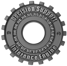
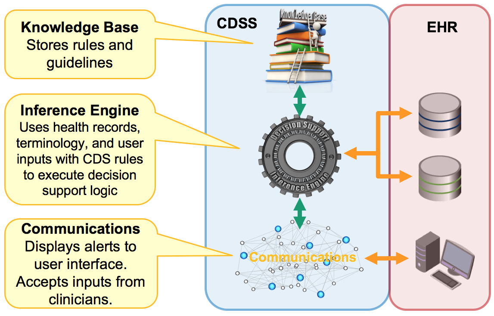

# 2.2. CDS System Architecture

This section describes the major architectural components of a CDSS and explores how they work together with the components of an EHR, as described in [2.1. EHR System Architecture](2.1.-EHR-System-Architecture_123897453.html).

# Major Components

Table 2.2-1: Descriptions of the major architectural components of a CDSS

## CDSS Component

| 

## Description  
  
---|---  

<figure></figure>| 

##  [Knowledge Base](3.-Knowledge-Base_123897475.html)

| The knowledge base (KB) stores clinical knowledge developed by domain experts as CDS artifacts. These knowledge artifacts (e.g. rules and guidelines) are stored in a machine processable format and made available to the inference engine to drive the CDS workflow.For additional information on this component please refer to section [3\. Knowledge Base](3.-Knowledge-Base_123897475.html).  

<figure></figure>| 

## [Inference Engine](4.-Inference-Engine_123897580.html)

| The inference engine processes the CDS knowledge artifacts, using information from the record services, the terminology services and user input to execute the CDS logic. A key part of this process is to determine which actions should be performed, based on the given patient's circumstances.For additional information on this component please refer to section [4\. Inference Engine](4.-Inference-Engine_123897580.html).  

<figure></figure>| 

##  [Communications](5.-Communications_123897660.html)

| The communications mechanism is responsible for accepting inputs from the user and delivering the outcomes of the inference engine back to the user. For example, when a clinician prescribes a drug, this information is communicated to the inference engine as an input. If the inference engine discovers that the medication is contraindicated, the communications mechanism will deliver an alert to the user interface.For additional information on this component please refer to section [5\. Communications](5.-Communications_123897660.html).  
  
# Logical Architecture

The diagram below illustrates how the components of the CDSS (shown in the blue box) work together with the components of the EHR system (shown in the red box).

<figure><figcaption>
Figure 2.2-1: CDSS components and key interactions
</figcaption></figure>

Internal CDSS interfaces are represented by the green directional arrows, while external CDSS interfaces are represented by the orange arrows. Note that the inference engine interfaces directly with record and terminology services while communications, which is focused on the delivery of CDSS inputs and outputs, interfaces directly with the user interface.

* * *
