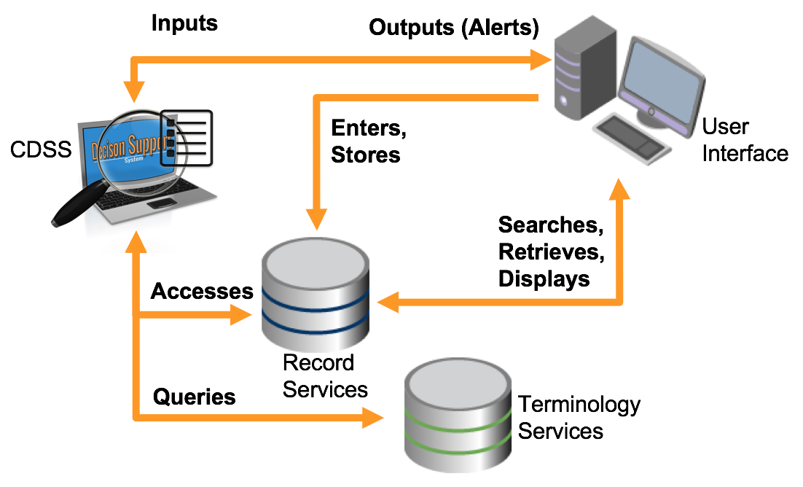
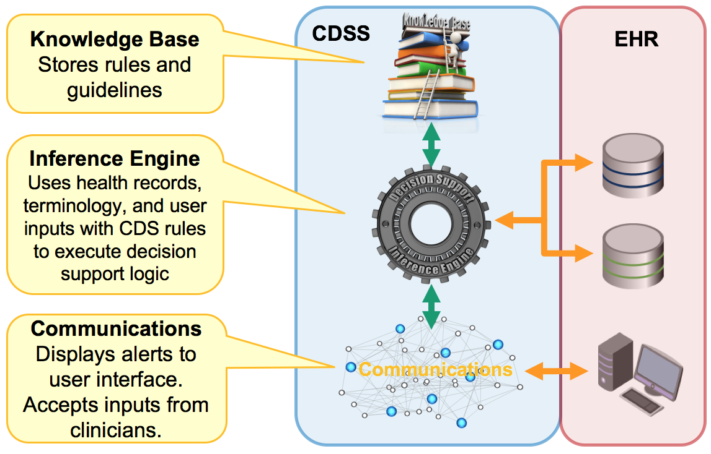

# Logical Architecture

This section provides an overview of the logical architecture of an electronic health record (EHR) which uses CDS.

In particular, it focuses on the logical architecture of[ knowledge-based CDSSs](#user-content-fn-1)[^1], which use pre-loaded CDS artifacts (such as rules and guidelines) that closely match a human's natural reasoning process. Non-knowledge-based CDSSs, which use artificial intelligence (AI) or machine learning to acquire knowledge over time, are outside the scope of this guide.

The logical architecture of knowledge-based CDSSs are explored in the following subsections.

## EHR System Architecture

To understand how clinical decision support (CDS) works, it is important to understand how CDS fits within the logical architecture of an [EHR](https://confluence.ihtsdotools.org/display/DOCGLOSS/EHR) system. This section describes the major architectural components of an EHR system, and the interactions between these components.

### Major Components 

Table: Descriptions of the major architectural components of an EHR system

<table><thead><tr><th width="222.203125">EHR System Component</th><th>Description</th></tr></thead><tbody><tr><td> <a href="https://app.gitbook.com/o/h8Z6qGxuQrzM9vbx5bPT/s/CEAcChvWjWEu16YmwNrz/"><strong>User Interface</strong></a></td><td>The user interface (UI) is a fundamental component of almost any clinical application, and is used within an EHR to both enter and display patient health records. The UI also has two main CDS functions. Firstly, the UI is used to provide inputs to the CDSS, such as recording a proposed medication or an observed finding. The second function of the UI is to display alerts, advisories and clinical guidelines to the user in an appropriate format, on behalf of the CDSS.</td></tr><tr><td> <strong>Record Services</strong></td><td>Record services are a set of services for managing patient health records. Record services provide functions like entering data into health records, searching for and retrieving health records, querying or extracting data from health records, and communicating or exchanging health records with other systems or applications. Record services interact with other components in this model such as the CDSS and the UI.</td></tr><tr><td><a href="https://app.gitbook.com/o/h8Z6qGxuQrzM9vbx5bPT/s/t4wRQcj6gyQPunraJrP0/"><strong>Terminology Services</strong></a></td><td>Terminology services are those services that directly manage the terminology resources. They include functions like querying concepts, relationships and reference sets, and installing or updating SNOMED CT from release files. Terminology services interact with the CDSS component in this model.</td></tr><tr><td><strong>Clinical Decision Support System</strong></td><td>The primary role of the CDSS is to execute the decision support logic. The CDSS does this using a number of subcomponents and subprocesses, which will be described in the next section - CDS System Architecture. The CDSS interacts with each of the other major components in the EHR.</td></tr></tbody></table>

### Interactions

The major architectural components of an EHR system that incorporates CDS interact with each other in a variety of ways to support the overall functioning of the EHR. The diagram below uses orange arrows to illustrate the primary interactions between these EHR components.

<figure><figcaption>
EHR components and key interactions
</figcaption></figure>

As shown above, the UI communicates with the record services to facilitate the storage and subsequent retrieval of health record data. The UI also provides inputs to the CDSS and displays alerts and guidelines on its behalf. The CDSS uses the inputs from the UI and data from the record and terminology services to processes decision support rules. The CDSS uses the inputs from the record and terminology services to determine whether or not the CDS conditions have been met, and if so then CDS interventions, such as alerts or knowledge resources, are delivered back to the UI. The internal components and processes of the CDSS will be described in more detail in the next section.

## CDS System Architecture

This section describes the major architectural components of a CDSS and explores how they work together with the components of an EHR, as described in [ EHR System Architecture](2-logical-architecture.md#ehr-system-architecture).

### Major Components 

Table: Descriptions of the major architectural components of a CDSS

<table><thead><tr><th width="161.48046875">CDSS Component</th><th>Description</th></tr></thead><tbody><tr><td><a href="https://confluence.ihtsdotools.org/display/DOCCDS/3.+Knowledge+Base"><strong>Knowledge Base</strong></a></td><td>
The knowledge base (KB) stores clinical knowledge developed by domain experts as CDS artifacts. These knowledge artifacts (e.g. rules and guidelines) are stored in a machine processable format and made available to the inference engine to drive the CDS workflow.

For additional information on this component please refer to the <a href="https://confluence.ihtsdotools.org/display/DOCCDS/3.+Knowledge+Base">Knowledge Base</a> section.
</td></tr><tr><td><a href="https://confluence.ihtsdotools.org/display/DOCCDS/4.+Inference+Engine"><strong>Inference Engine</strong></a></td><td>
The inference engine processes the CDS knowledge artifacts, using information from the record services, the terminology services and user input to execute the CDS logic. A key part of this process is to determine which actions should be performed, based on the given patient's circumstances.

For additional information on this component please refer to the <a href="https://confluence.ihtsdotools.org/display/DOCCDS/4.+Inference+Engine">Inference Engine</a> section.
</td></tr><tr><td><a href="https://confluence.ihtsdotools.org/display/DOCCDS/5.+Communications"><strong>Communications</strong></a></td><td>
The communications mechanism is responsible for accepting inputs from the user and delivering the outcomes of the inference engine back to the user. For example, when a clinician prescribes a drug, this information is communicated to the inference engine as an input. If the inference engine discovers that the medication is contraindicated, the communications mechanism will deliver an alert to the user interface.

For additional information on this component please refer to the<a href="https://confluence.ihtsdotools.org/display/DOCCDS/5.+Communications"> Communications</a> section.
</td></tr></tbody></table>

### Logical Architecture

The diagram below illustrates how the components of the CDSS (shown in the blue box) work together with the components of the EHR system (shown in the red box).

<figure><figcaption>
CDSS components and key interactions
</figcaption></figure>

Internal CDSS interfaces are represented by the green directional arrows, while external CDSS interfaces are represented by the orange arrows. Note that the inference engine interfaces directly with record and terminology services while communications, which is focused on the delivery of CDSS inputs and outputs, interfaces directly with the user interface.

[^1]: [https://en.wikipedia.org/wiki/Clinical\_decision\_support\_system#Knowledge-based\_CDSS](https://en.wikipedia.org/wiki/Clinical_decision_support_system#Knowledge-based_CDSS)
