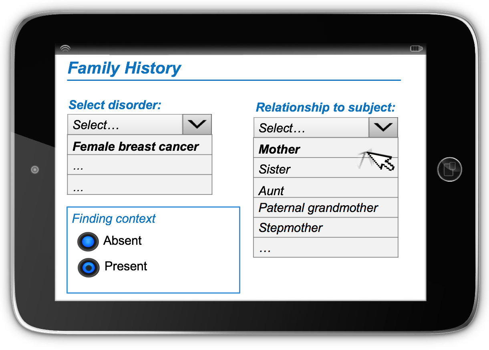
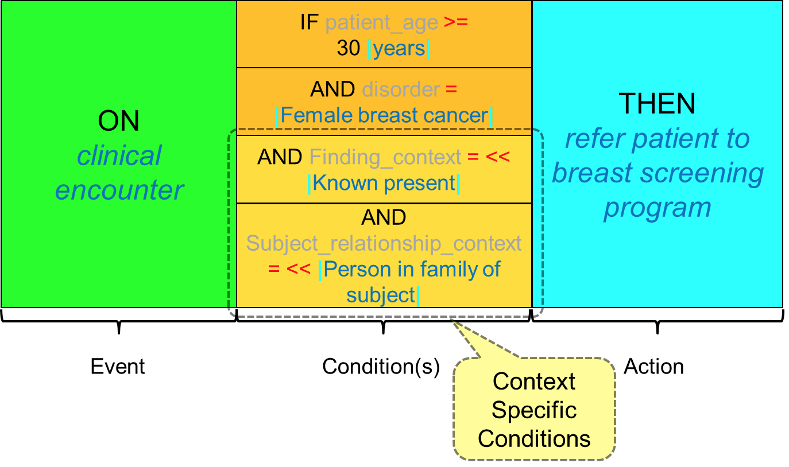

# 3.1.1. Context in CDS Rules

Context has been defined as the circumstances that form the setting for an event, statement, or idea, and in terms of which it can be fully understood. [1](https://confluence.ihtsdotools.org/display/DOCCDS/3.1.1.+Context+in+CDS+Rules#Footnote1 "Footnote: Click here to display the footnote") Contexts that modify the meaning of a diagnosis or procedure may include family history, past history, suspected diagnoses, planned procedures and procedures not done. It is important to understand the context of each statement in a health record, to determine whether or not it is appropriate to for a CDS rule to be applied. 

# Representing Context in a Health Record

Context can be expressed in a health record in a number of ways. Firstly, a precoordinated expression can be used in which the context is captured in the meaning of the concept. For example, [ 160303001 | Family history: Diabetes mellitus|](http://snomed.info/id/160303001 "160303001 | Family history: Diabetes mellitus |") . Alternatively, a postcoordinated expression can be used. This is where the meaning is expressed by combining codes in a structured way using [SNOMED CT Compositional Grammar](https://confluence.ihtsdotools.org/display/DOCSCG/Compositional+Grammar+-+Specification+and+Guide). For example: [ 281666001 |Family history of disorder|](http://snomed.info/id/281666001 "281666001 | Family history of disorder |") :  
[ 246090004 |Associated finding|](http://snomed.info/id/246090004 "246090004 | Associated finding |") =  [ 73211009 |Diabetes mellitus|](http://snomed.info/id/73211009 "73211009 | Diabetes mellitus |") A third way to express context is to use a context-specific section or field, such as a "Family history section", which captures the context in the meaning of the section or field name. Lastly, it is also possible to use two separate fields - one which captures the finding [ | Diabetes mellitus|](http://snomed.info/id/73211009 "73211009 | Diabetes mellitus |") , and the other which captures the context [ | Family history of disorder|](http://snomed.info/id/281666001 "281666001 | Family history of disorder |") . 

Table 3.1.1-1: Techniques for recording context in an EHR

Technique for Representing Context| Example  
---|---  
[Precoordinated](https://confluence.ihtsdotools.org/display/DOCGLOSS/Precoordinated "Glossary link: Precoordinated") as a single SNOMED CT concept identifier explicitly representing family history of diabetes mellitus.|  [ 160303001 | Family history: Diabetes mellitus|](http://snomed.info/id/160303001 "160303001 | Family history: Diabetes mellitus |")  
[Postcoordinated](https://confluence.ihtsdotools.org/display/DOCGLOSS/Postcoordinated "Glossary link: Postcoordinated") as a SNOMED CT expression that includes a concept representing a family history of disorder and specifies the diabetes mellitus as the disorder.|   
[ 281666001 |Family history of disorder|](http://snomed.info/id/281666001 "281666001 | Family history of disorder |") :  
[ 246090004 |Associated finding|](http://snomed.info/id/246090004 "246090004 | Associated finding |") =  [ 73211009 |Diabetes mellitus|](http://snomed.info/id/73211009 "73211009 | Diabetes mellitus |")  
A context specific family history section in the record structure| | Family History  
Record Section |  [ 73211009 | Diabetes mellitus|](http://snomed.info/id/73211009 "73211009 | Diabetes mellitus |")  
---|---  
  
A separate field in the record structure to indicate the context of the disorder recorded| | Disorder| Context  
---|---  
[ 73211009 | Diabetes mellitus|](http://snomed.info/id/73211009 "73211009 | Diabetes mellitus |") |  [ 281666001 | Family history of disorder|](http://snomed.info/id/281666001 "281666001 | Family history of disorder |")  
  
## False Positives and False Negatives

Considering context that is captured in either the terminology or the information structure is important when executing CDS rules.

  * Logic based purely on the presence or absence of codes, without considering the context implied by the information structure, may lead to CDS alerts being triggered unnecessarily (i.e. false positives).
  * Conversely, logic based purely on the presence or absence of codes, without considering context implied by the information structure, may lead to CDS alerts not being triggered when required (ie. false negatives).

### False Positive Example

In the following example, a CDS rule is triggered inappropriately (i.e. false positive):

  * A CDS rule is designed to display clinical practice guidelines for stage 1 chronic kidney disease when the code [ 431855005 | Chronic kidney disease stage 1|](http://snomed.info/id/431855005 "431855005 | Chronic kidney disease stage 1 |") is found in the EHR. A retrospective analysis of a false positive trigger reveals that the code was recorded in the _past history_ section of the health record. As this record indicates that the [ | Chronic kidney disease stage 1|](http://snomed.info/id/431855005 "431855005 | Chronic kidney disease stage 1 |") was part of the patient's [ | Past medical history|](http://snomed.info/id/417662000 "417662000 | Past medical history |") , the display of stage 1 chronic kidney disease guidelines was inappropriate.

### False Negative Example

In the following example, a CDS rule is not triggered when required (i.e. false negative):

  * A CDS rule is designed to display patient-focused, preventative educational material when the code [ 160303001 | Family history: Diabetes mellitus|](http://snomed.info/id/160303001 "160303001 | Family history: Diabetes mellitus |") is found in the EHR. This rule is implemented in an EHR system, which uses a _family history_ section to record the family history of disorders. Even though the SNOMED CT concept [ 73211009 | Diabetes mellitus|](http://snomed.info/id/73211009 "73211009 | Diabetes mellitus |") is recorded in the patient's family history, the CDS rule is not triggered as required.

# Default Context

When neither the SNOMED CT concept nor the surrounding health record explicitly states the context, a default context applies.

  

Table 3.1.1-2: Default context values alongside their corresponding attributes

  
| Attribute| Value  
---|---|---  
Clinical Findings|  [ 408729009 | Finding context|](http://snomed.info/id/408729009 "408729009 | Finding context |") |  [ 410515003 | Known present|](http://snomed.info/id/410515003 "410515003 | Known present |")  
[ 408732007 | Subject relationship context|](http://snomed.info/id/408732007 "408732007 | Subject relationship context |") |  [ 410604004 | Subject of record|](http://snomed.info/id/410604004 "410604004 | Subject of record |")  
[ 408731000 | Temporal context|](http://snomed.info/id/408731000 "408731000 | Temporal context |") |  [ 410512000 | Current or specified time|](http://snomed.info/id/410512000 "410512000 | Current or specified time |")  
Procedures|  [ 408730004 | Procedure context|](http://snomed.info/id/408730004 "408730004 | Procedure context |") |  [ 385658003 | Done|](http://snomed.info/id/385658003 "385658003 | Done |")  
[ 408732007 | Subject relationship context|](http://snomed.info/id/408732007 "408732007 | Subject relationship context |") |  [ 410604004 | Subject of record|](http://snomed.info/id/410604004 "410604004 | Subject of record |")  
[ 408731000 | Temporal context|](http://snomed.info/id/408731000 "408731000 | Temporal context |") |  [ 410512000 | Current or specified time|](http://snomed.info/id/410512000 "410512000 | Current or specified time |")  
  
For clinical findings, it is assumed that the finding is known to be present (as opposed to known to be absent), we assume that the finding is about the patient ( as opposed to someone else), and we assume that the finding occurred at either the present time or a time specified in the record structure ( as opposed to a general time in the past). 

# Data Entry with Context

The following diagram illustrates how additional context can be captured during the data entry process. The diagnosis (disorder) of [ 372064008 | Female breast cancer|](http://snomed.info/id/372064008 "372064008 | Female breast cancer |") is selected using the pick-list in the top left corner of the screen and then the context values are selected using the other radio button and pick-list. These context values for _relation to subject_ and _finding context_ must be considered when the conditions in this CDS rule are evaluated.

<figure><figcaption>
Figure 3.1.1-1: Capturing context during data entry
</figcaption></figure>

# Defining Context in Rules

It is important to always consider context when defining (and executing) the conditions in a CDS rule. If the default context applies to the condition, then it does not need to be explicitly stated in the CDS rule. However, care should be taken when testing the CDS condition against health records, to ensure that the recorded values share the same context as is required by the CDS rule. If a non-default context is required in a CDS rule, then the rule must explicitly state the context that is required. This context must also be appropriately checked when testing the CDS condition against health records. 

The following diagram illustrates a CDS rule, which explicitly states the context of a [ 372064008 | Female breast cancer|](http://snomed.info/id/372064008 "372064008 | Female breast cancer |") diagnosis that must be matched in order for the action to be triggered. In this example, the CDS condition requires that for patients over the age of 30 [ 258707000 | years|](http://snomed.info/id/258707000 "258707000 | years |") , a diagnosis of [ 372064008 | Female breast cancer|](http://snomed.info/id/372064008 "372064008 | Female breast cancer |") must be present, in a female family member of the subject, with genetic ties.

<figure><figcaption>
Figure 3.1.1-2: CDS rule with the context explicitly stated
</figcaption></figure>

The contextual selections in the data entry screen above would satisfy the conditions in this rule because the user has specified that the diagnosis of female breast cancer occurred in the mother of the subject. This can be seen in the postcoordinated expression below, which corresponds to the user's selections in the data entry screen: 

[ 372064008 |Female breast cancer|](http://snomed.info/id/372064008 "372064008 | Female breast cancer |") :  
[ 408729009 |Finding context|](http://snomed.info/id/408729009 "408729009 | Finding context |") =  [ 410515003 |Known present|](http://snomed.info/id/410515003 "410515003 | Known present |") ,  
[ 408732007 |Subject relationship context|](http://snomed.info/id/408732007 "408732007 | Subject relationship context |") =  [ 444301002 |Mother of subject|](http://snomed.info/id/444301002 "444301002 | Mother of subject |")   

Note that a selection of [ 65412001 | Stepmother|](http://snomed.info/id/65412001 "65412001 | Stepmother |") would not trigger the rule as this concept is not a descendant of [ 444148008 | Person in family of subject|](http://snomed.info/id/444148008 "444148008 | Person in family of subject |") . (Stepmother has no genetic relationship to the patient.)

* * *

Footnotes Ref | Notes  
---|---  
[1](https://confluence.ihtsdotools.org/display/DOCCDS/3.1.1.+Context+in+CDS+Rules#FootnoteMarker1-0 "Footnote: Click to return to reference in text") |  [https: //en.oxforddictionaries.com/definition/context](https://en.oxforddictionaries.com/definition/context). 
