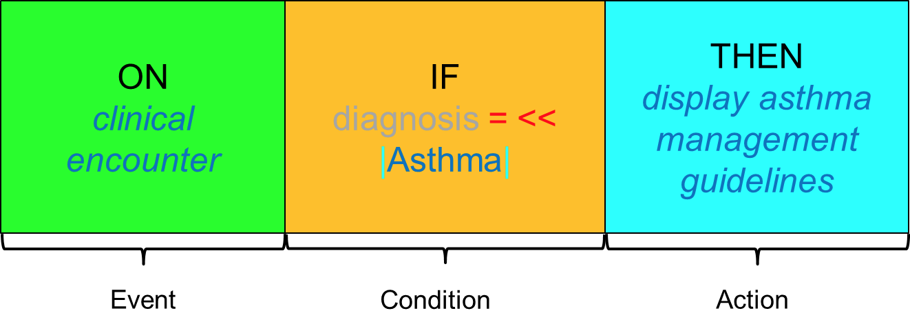

# 3.1.3. Rule Examples

In this section we present a number of examples of CDS rules, using the 'ON event IF condition THEN action' pattern described in section [3.1. Rules](3.1.-Rules_123897479.html).

# Asthma Diagnosis

This simple CDS rule was designed to be used during a clinical encounter. If the patient is diagnosed with asthma, the appropriate management guidelines are automatically displayed on the clinician's workstation.

<figure><figcaption>
Figure 3.1.3-1: This rule demonstrates the use of a single event, criterion, and action, an expression constraint in the criterion value, and use of the default context.
</figcaption></figure>

# Medication Order

This rule has been designed to be used when ordering a medication. If the patient is [ 77386006 | Pregnant|](http://snomed.info/id/77386006 "77386006 | Pregnant |") and the drug has an active ingredient of [ 372756006 | Warfarin|](http://snomed.info/id/372756006 "372756006 | Warfarin |") , the clinician will be alerted and the CDSS will suggest an alternative blood thinner which does not pose a risk for expectant mothers. 

<figure><figcaption>
Figure 3.1.3-2: This rule demonstrates the use of multiple criteria, multiple actions, expression constraints in the criterion value, and use of the default context.
</figcaption></figure>

Emergency Department

The following example is a CDS rule designed to be used in an Emergency Department setting, when a patient has presented in the ER with chest pain. In this scenario, the attending physician may order a [ 312468003 | Blood potassium measurement|](http://snomed.info/id/312468003 "312468003 | Blood potassium measurement |") . If the patient is currently taking a medication with an active ingredient of  [ 387461009 | Digoxin|](http://snomed.info/id/387461009 "387461009 | Digoxin |") , and the lab result is published indicating that the patient's potassium level is less than 3.0 mmol/L, the attending physician will be paged.

<figure><figcaption>
Table 3.1.3-1: This rule demonstrates the use of multiple criteria, expression constraints in the criterion value, a non-coded criterion with a mathematical operator, and use of the default context.
</figcaption></figure>

  

* * *
