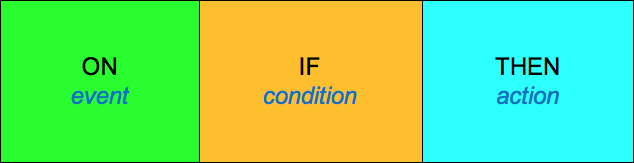

# 3.1. Rules

Clinical decision support rules play a key role in the overall delivery of CDS. CDS rules typically follow a common pattern, which has been modeled in several healthcare standards formalisms. The Event-Condition-Action[1](https://confluence.ihtsdotools.org/display/DOCCDS/3.1.+Rules#Footnote1 "Footnote: Click here to display the footnote") model, as used in the HL7 community, is described below.

# Event

A CDS event is the _clinical situation _ in which a decision support rule will be applied. First something must happen before the rule can be utilized. Examples of CDS events include: 

# Condition

A CDS condition defines the  _question(s) that must be answered_ to determine the outcome of the rule. Examples of conditions include:

# Action

The CDS action describes _what should be done_ if the condition evaluates to true. Examples of actions include:

# Event-Condition-Action Model

An informal representation or rule template which captures the Event-Condition-Action pattern is shown below. This pattern can be read as "ON event IF condition THEN action".

<figure><figcaption>
Figure 3.1-1: Event-Condition-Action rule template
</figcaption></figure>

Rules may reference both EHR data and reference data such as terminology to determine whether or not a specific condition is true. This topic will be explored in more detail in section [4\. Inference Engine](4.-Inference-Engine_123897580.html).

* * *

Footnotes Ref | Notes  
---|---  
[1](https://confluence.ihtsdotools.org/display/DOCCDS/3.1.+Rules#FootnoteMarker1-0 "Footnote: Click to return to reference in text") |  <http://hl7.org/fhir/2016Sep/cqif/cqif-knowledge-artifact-representation.html#event-condition-action-rule>
