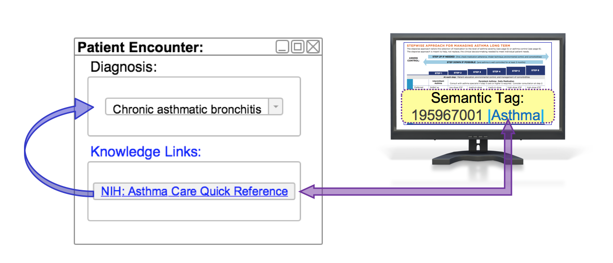

# 3.2.1. Guidelines with SNOMED CT

This section examines how clinical guidelines can be linked to SNOMED CT to enable the automated display of contextually relevant knowledge resources. We begin by reviewing how a guideline can be linked to a SNOMED CT concept using semantic tags. Next we will examine how SNOMED CT concepts can be associated with guidelines using a reference set. Lastly, we will look at the automated display of a contextually relevant guideline, based on the selection of a SNOMED CT concept in a data entry protocol.

# Linking Guidelines to SNOMED CT

One approach known as simple markup, involves the application of semantic tags using terminology codes (such as SNOMED CT concept identifiers) to free text clinical guidelines. When using SNOMED CT, concept identifiers (or expressions) are added as document metadata to the appropriate guideline or text within the guideline. For example, when applying semantic tags to asthma management guidelines, we might add the following concept identifiers, to enable the guideline to be linked to a patient's health record that includes a diagnosis of  [ 195967001 | Asthma|](http://snomed.info/id/195967001 "195967001 | Asthma |") , a regime of [ 406162001 | Asthma management|](http://snomed.info/id/406162001 "406162001 | Asthma management |") , or an assessment scale coded with [ 445531003 | Asthma control questionnaire|](http://snomed.info/id/445531003 "445531003 | Asthma control questionnaire |") (respectively):

Concept  
[ 195967001 | Asthma (disorder)|](http://snomed.info/id/195967001 "195967001 | Asthma \(disorder\) |")  
[ 406162001 | Asthma management (regime/therapy)|](http://snomed.info/id/406162001 "406162001 | Asthma management \(regime/therapy\) |")  
[ 445531003 | Asthma control questionnaire (assessment scale)|](http://snomed.info/id/445531003 "445531003 | Asthma control questionnaire \(assessment scale\) |")  
  
The diagram below depicts the process of tagging the SNOMED CT concepts mentioned above to an Asthma Management Guideline.[1](https://confluence.ihtsdotools.org/display/DOCCDS/3.2.1.+Guidelines+with+SNOMED+CT#Footnote1 "Footnote: Click here to display the footnote")

<figure><figcaption>
Figure 3.2.1-1: Asthma Management Guideline tagged with SNOMED CT concepts
</figcaption></figure>

This tagged resource may then be presented as reference material when a relevant clinical scenario arises. For example, the guidelines shown in [Figure 3.2.1-1](https://confluence.ihtsdotools.org/display/DOCCDS/3.2.1.+Guidelines+with+SNOMED+CT#Figure-asthma-management-guideline-tagged-with-snomed-ct-concepts "Asthma Management Guideline tagged with SNOMED CT concepts") could be presented upon the diagnosis of [ | Asthma|](http://snomed.info/id/195967001 "195967001 | Asthma |") . Additional details on the mechanics of this process are provided below in the [Selecting Relevant Guidelines](https://confluence.ihtsdotools.org/pages/viewpage.action?pageId=44106059#id-3.2.1.GuidelineswithSNOMEDCT-SelectingRelevantGuidelines) section below. 

# Linking SNOMED CT to Guidelines

SNOMED CT [Annotation Reference Sets](https://confluence.ihtsdotools.org/display/DOCRELFMT/5.2.1.6+DEPRECATED%3A+Annotation+Reference+Set) can be used as a mechanism to define, share, and distribute links from SNOMED CT components to appropriate guidelines. This approach involves defining one or more links to relevant guidelines (using a URL) as a string based annotation for each relevant concept. An example of this is shown in  [Table 3.2.1-1](https://confluence.ihtsdotools.org/display/DOCCDS/3.2.1.+Guidelines+with+SNOMED+CT#Table-concepts-which-refer-to-nih-asthma-care-quick-reference-guideline "Concepts which refer to NIH_ Asthma Care Quick Reference guideline"). In this example, the same clinical guideline is relevant to more than one SNOMED CT concept. 

Table 3.2.1-1: Concepts which refer to NIH: Asthma Care Quick Reference guideline

**refsetId**| **referencedComponentId**| **Annotation**  
---|---|---  
[ 719999999107 | Guideline annotation reference set|](http://snomed.org/fictid#719999999107 "\(eg:719999999107\)  | Guideline annotation reference set |") |  [ 195967001 | Asthma (disorder)|](http://snomed.info/id/195967001 "195967001 | Asthma \(disorder\) |") | <http://www.example.com/asthma_guideline>  
[ 719999999107 | Guideline annotation reference set|](http://snomed.org/fictid#719999999107 "\(eg:719999999107\)  | Guideline annotation reference set |") |  [ 406162001 | Asthma management (regime/therapy)|](http://snomed.info/id/406162001 "406162001 | Asthma management \(regime/therapy\) |") | <http://www.example.com/asthma_guideline>  
[ 719999999107 | Guideline annotation reference set|](http://snomed.org/fictid#719999999107 "\(eg:719999999107\)  | Guideline annotation reference set |") |  [ 445531003 | Asthma control questionnaire (assessment scale)|](http://snomed.info/id/445531003 "445531003 | Asthma control questionnaire \(assessment scale\) |") | <http://www.example.com/asthma_guideline>  
  
Another example use case is linking a specific clinical field, such as a diagnosis, to an appropriate clinical guideline. Given the more specific scope, it may be possible to avoid repeating the same guideline for multiple SNOMED CT concepts referenced by the reference set.  [Table 3.2.1-2](https://confluence.ihtsdotools.org/display/DOCCDS/3.2.1.+Guidelines+with+SNOMED+CT#Table-respiratory-diagnoses-linked-to-relevant-clinical-guidelines "Respiratory diagnoses linked to relevant clinical guidelines") below, shows an example in which disorder concepts are linked to appropriate clinical guidelines. 

Table 3.2.1-2: Respiratory diagnoses linked to relevant clinical guidelines

**refsetId**| **referencedComponentId**| **Annotation**  
---|---|---  
[ 719999999107 | Guideline annotation reference set|](http://snomed.org/fictid#719999999107 "\(eg:719999999107\)  | Guideline annotation reference set |") |  [ 195967001 | Asthma|](http://snomed.info/id/195967001 "195967001 | Asthma |") | <http://www.example.com/asthma_guideline>  
[ 719999999107 | Guideline annotation reference set|](http://snomed.org/fictid#719999999107 "\(eg:719999999107\)  | Guideline annotation reference set |") |  [ 32398004 | Bronchitis|](http://snomed.info/id/32398004 "32398004 | Bronchitis |") | <http://www.example.com/bronchitis_guideline>  
[ 719999999107 | Guideline annotation reference set|](http://snomed.org/fictid#719999999107 "\(eg:719999999107\)  | Guideline annotation reference set |") |  [ 13645005 | Chronic obstructive lung disease|](http://snomed.info/id/13645005 "13645005 | Chronic obstructive lung disease |") | <http://www.example.com/COPD_guideline>  
  
# Selecting Relevant Guidelines

EHR systems, designed to use clinical guidelines marked up with semantic tags, are able to display relevant guidelines to the user when a subtype (or self) of the semantic tag concept is recorded in the health record.

Below is a generic template that could be used in an EHR system to facilitate the display of an appropriate clinical guideline, when a relevant diagnosis is recorded.

IF diagnosis  = << [[ + $semanticTag]]  
THEN display clinical guideline  
  
For example, the above template could be used on a clinical guideline that has the semantic tag [ 195967001 | Asthma|](http://snomed.info/id/195967001 "195967001 | Asthma |") , generating the CDS rule:

IF diagnosis =  << [ 195967001 | Asthma|](http://snomed.info/id/195967001 "195967001 | Asthma |")   
THEN display NIH Asthma Care Quick Reference  
  
Using the above CDS rule, if a clinician selects a diagnosis of [ 195949008 | Chronic asthmatic bronchitis|](http://snomed.info/id/195949008 "195949008 | Chronic asthmatic bronchitis |") , the NIH Asthma Care Quick Reference would be displayed because [ 195949008 | Chronic asthmatic bronchitis|](http://snomed.info/id/195949008 "195949008 | Chronic asthmatic bronchitis |") is a subtype of [ 195967001 | Asthma|](http://snomed.info/id/195967001 "195967001 | Asthma |") .

This enables  _contextually relevant_ clinical knowledge to be presented to the user, based on the specific codes recorded in the patient's health record. The diagram below illustrates this scenario:

<figure><figcaption>
Figure 3.2.1-2: Upon entry of a specific diagnosis, a contextually relevant knowledge resource is presented on the user interface
</figcaption></figure>

  

* * *

Footnotes Ref | Notes  
---|---  
[1](https://confluence.ihtsdotools.org/display/DOCCDS/3.2.1.+Guidelines+with+SNOMED+CT#FootnoteMarker1-0 "Footnote: Click to return to reference in text") |  [Asthma Care Quick Reference used for demonstration purposes.](https://www.nhlbi.nih.gov/files/docs/guidelines/asthma_qrg.pdf)
