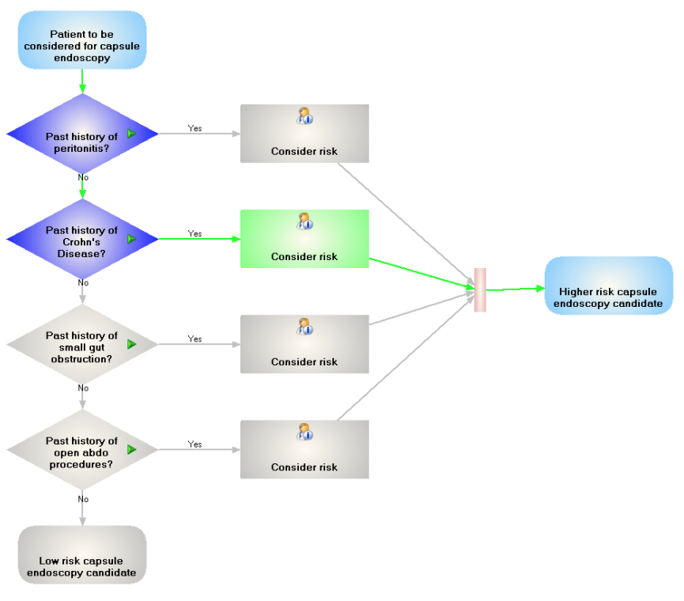

# 3.2.2. Standards for CDS Guidelines

This section presents some examples of standards used to represent CDS guidelines. Please note that this list is not complete, and other standards and formalisms for representing clinical guidelines do exist. 

# Guideline Interchange Format

The Guideline Interchange Format (GLIF) is a language for modeling and executing clinical practice guidelines.[1](https://confluence.ihtsdotools.org/display/DOCCDS/3.2.2.+Standards+for+CDS+Guidelines#Footnote1 "Footnote: Click here to display the footnote") GLIF uses GELLO, and therefore can make use of SNOMED CT within its language. Users of GLIF have the option of viewing GLIF code in a interactive flowchart to represent guidelines and present pop-up information and instructions. The following screenshot presents the "UI view" of a query / guideline structured in GLIF. This example uses SNOMED CT to answer the questions in the decision shapes:[2](https://confluence.ihtsdotools.org/display/DOCCDS/3.2.2.+Standards+for+CDS+Guidelines#Footnote2 "Footnote: Click here to display the footnote")

<figure><figcaption>
Figure 3.2.2-1: UI view of a query / guideline structured in GLIF
</figcaption></figure>

For more information about GLIF, please refer to <https://kb.medical-objects.com.au/display/PUB/GLIF>.

# Guideline Definition Language

The Guideline Definition Language (GDL)[3](https://confluence.ihtsdotools.org/display/DOCCDS/3.2.2.+Standards+for+CDS+Guidelines#Footnote3 "Footnote: Click here to display the footnote") is a syntax designed to express clinical logic as rule inputs and outputs. Discrete rules can be combined together to support simple or complex decision making. The specification which accompanies the GDL describes its status as "trial." One of the goals of the GDL is to be able to share CDS artifacts across languages and technical platforms. GDL artifacts can be applied to point of care (POC) decision support and in population health analytics. The GDL uses reference and archetype models from openEHR and in doing so supports information model references that are language independent. For example, it is possible to add language translations without changing the logical definitions in the rule. It is also possible to bind locally defined terms in the guideline to a single concept, multiple concepts, or reference set in any reference terminology as the language considers a reference terminology to be an external resource.

For more information on the Guideline Definition Language, please refer to <http://www.openehr.org/releases/CDS/latest/docs/GDL/GDL.html>.

* * *

Footnotes Ref | Notes  
---|---  
[1](https://confluence.ihtsdotools.org/display/DOCCDS/3.2.2.+Standards+for+CDS+Guidelines#FootnoteMarker1-0 "Footnote: Click to return to reference in text") |  <http://www.openclinical.org/gmm_glif.html>  
[2](https://confluence.ihtsdotools.org/display/DOCCDS/3.2.2.+Standards+for+CDS+Guidelines#FootnoteMarker2-0 "Footnote: Click to return to reference in text") |  Content and diagram provided by [Medical-Objects](https://www.medical-objects.com.au/).   
[3](https://confluence.ihtsdotools.org/display/DOCCDS/3.2.2.+Standards+for+CDS+Guidelines#FootnoteMarker3-0 "Footnote: Click to return to reference in text") |  <http://www.openehr.org/releases/CDS/latest/docs/GDL/GDL.html#_guideline_definition_language_gdl>
