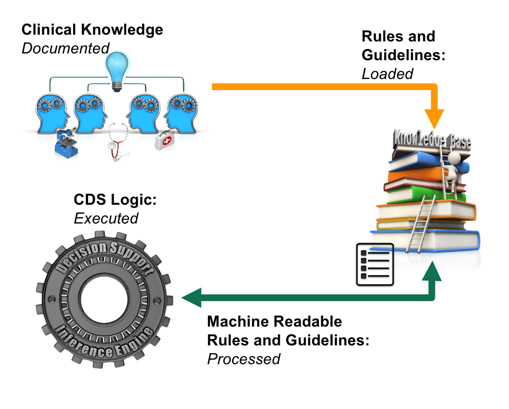

# Knowledge Base

The knowledge base can be thought of as the brains of a clinical decision support system. Clinical knowledge is what fuels the knowledge base. This knowledge is documented by the clinical experts in their respective domains. The knowledge is then loaded into the KB as knowledge artifacts and stored in a machine processable format. These artifacts are then made available to the [inference engine](../4-inference-engine.md) to execute the decision support logic. Knowledge artifacts may be updated when new clinical knowledge becomes available. In some CDSSs this is done using a specialized knowledge artifact management interface, which may support tasks such as rule creation, customization, and updating. In other cases, clinical knowledge artifacts are used from third party providers, who specialize in supporting CDSSs.

Types of CDS knowledge artifacts include:

* Decision support rules
* Clinical guidelines and care pathways
* Documentation templates
* Order sets

The characteristics of these knowledge artifacts are described in the section [Functional Areas](<../1 introduction/1.1-overview.md#functional-areas>).

The diagram below illustrates the key interactions with the knowledge base, as described above.

<figure><figcaption>
Knowledge base interactions
</figcaption></figure>

The topics below are presented in more detail in the following sections:

* [Rules](../3%20knowledge-base/3.1.-Rules_123897479.html)
* [Guidelines](../3%20knowledge-base/3.2.-Guidelines_123897540.html)
* [Substrate](../3%20knowledge-base/3.3.-Substrate_123897579.html)

***
