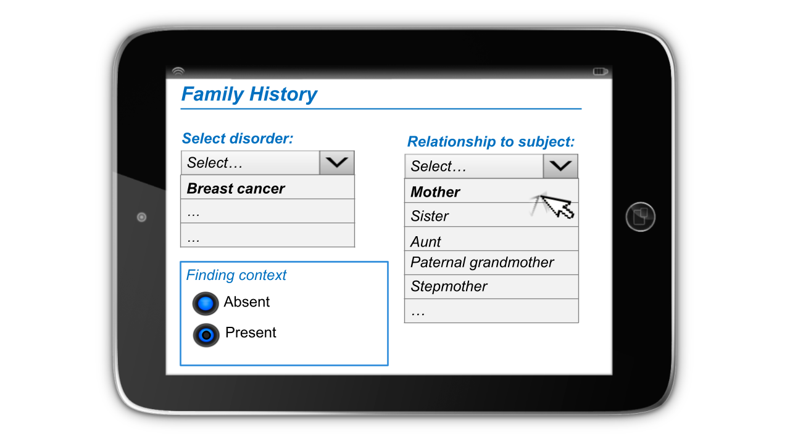
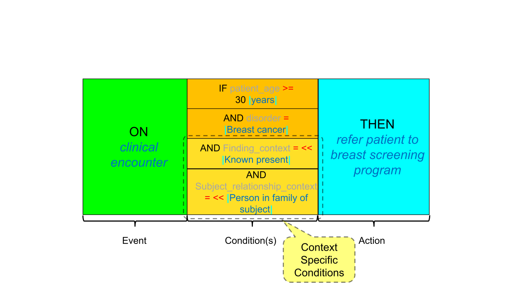
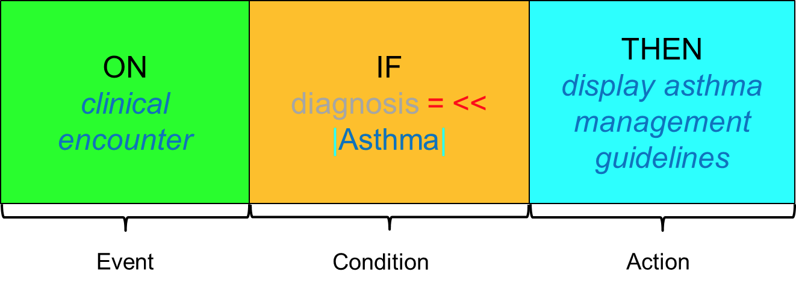
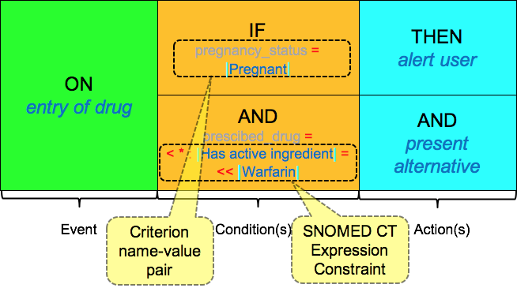
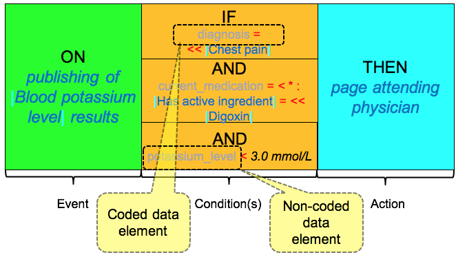
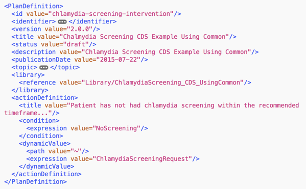

# Rules

Clinical decision support rules play a key role in the overall delivery of CDS. CDS rules typically follow a common pattern, which has been modeled in several healthcare standards formalisms. The Event-Condition-Action[^1] model, as used in the HL7 community, is described below.

### Event

A CDS event is the _clinical situation_ in which a decision support rule will be applied. First something must happen before the rule can be utilized. Examples of CDS events include:


* A clinician is prescribing a drug to a patient
* A nursing supervisor is reviewing a list of patients previously diagnosed with cancer
* A clinician is assessing a patient enrolled in a jurisdictional diabetes monitoring program


### Condition

A CDS condition defines the _question(s) that must be answered_ to determine the outcome of the rule. Examples of conditions include:


* Does the usual drug of choice for this patient's condition contain a substance to which the patient is allergic?
* Have any patients with a suspected cancer diagnosis NOT been referred to a specialist within 14 days of diagnosis?
* Has the patient with a previous diagnosis of diabetes type II NOT had HBA1C tested within the last 12 months?


### Action

The CDS action describes _what should be done_ if the condition evaluates to true. Examples of actions include:


* Alert the clinician and suggest a safe alternative medication
* Refer patients to an oncology specialist
* Order HBA1C test



### Event-Condition-Action Model

An informal representation or rule template which captures the Event-Condition-Action pattern is shown below. This pattern can be read as "ON event IF condition THEN action".

<figure><figcaption><p>Event-Condition-Action rule template</p></figcaption></figure>

Rules may reference both EHR data and reference data such as terminology to determine whether or not a specific condition is true. This topic will be explored in more detail in section [Inference Engine](../4-inference-engine.md).

## Context in CDS Rules

Context has been defined as the circumstances that form the setting for an event, statement, or idea, and in terms of which it can be fully understood. Contexts that modify the meaning of a diagnosis or procedure may include family history, past history, suspected diagnoses, planned procedures and procedures not done. It is important to understand the context of each statement in a health record, to determine whether or not it is appropriate to for a CDS rule to be applied.


When evaluating the condition within a CDS rule it is important to take account of context.

* For example, a rule that requires a _current diagnosis_ of diabetes should not trigger an action in response to a record that states that a patient has a _family history_ of diabetes.


### Representing Context in a Health Record

Context can be expressed in a health record in a number of ways. Firstly, a precoordinated expression can be used in which the context is captured in the meaning of the concept. For example, [160303001 <mark style="color:blue;">|</mark> Family history: Diabetes mellitus<mark style="color:blue;">|</mark>](http://snomed.info/id/160303001). Alternatively, a postcoordinated expression can be used. This is where the meaning is expressed by combining codes in a structured way using [SNOMED CT Compositional Grammar](https://app.gitbook.com/o/h8Z6qGxuQrzM9vbx5bPT/s/VgpC90r7t9DyATri97GG/). For example:

```
 
281666001 |Family history of disorder|:
246090004 |Associated finding|= 73211009 |Diabetes mellitus|
 
```

&#x20;A third way to express context is to use a context-specific section or field, such as a "Family history section", which captures the context in the meaning of the section or field name. Lastly, it is also possible to use two separate fields - one which captures the finding [<mark style="color:blue;">|</mark> Diabetes mellitus<mark style="color:blue;">|</mark>](http://snomed.info/id/73211009), and the other which captures the context [<mark style="color:blue;">|</mark> Family history of disorder<mark style="color:blue;">|</mark>](http://snomed.info/id/281666001).

Table: Techniques for recording context in an EHR

| Technique for Representing Context                                                                                                                                   | Example                                                                                                                                                                                                                                                                                                                                                                                                                                                                                                                                          |
| -------------------------------------------------------------------------------------------------------------------------------------------------------------------- | ------------------------------------------------------------------------------------------------------------------------------------------------------------------------------------------------------------------------------------------------------------------------------------------------------------------------------------------------------------------------------------------------------------------------------------------------------------------------------------------------------------------------------------------------ |
| **Precoordinated** as a single SNOMED CT concept identifier explicitly representing family history of diabetes mellitus.                                             | [160303001 <mark style="color:blue;">\|</mark> Family history: Diabetes mellitus<mark style="color:blue;">\|</mark>](http://snomed.info/id/160303001)                                                                                                                                                                                                                                                                                                                                                                                            |
| **Postcoordinated** as a SNOMED CT expression that includes a concept representing a family history of disorder and specifies the diabetes mellitus as the disorder. | <p><br></p><p><a href="http://snomed.info/id/281666001">281666001 <mark style="color:blue;">\|</mark>Family history of disorder<mark style="color:blue;">\|</mark></a> <mark style="color:red;">:</mark><br>    <a href="http://snomed.info/id/246090004">246090004 <mark style="color:blue;">\|</mark>Associated finding<mark style="color:blue;">\|</mark></a>  <mark style="color:red;">=</mark>  <a href="http://snomed.info/id/73211009">73211009 <mark style="color:blue;">\|</mark>Diabetes mellitus<mark style="color:blue;">|</mark></a></p> |
| A context specific family history section in the record structure                                                                                                    | <table data-header-hidden><thead><tr><th></th><th></th></tr></thead><tbody><tr><td><strong>Family History</strong><br><strong>Record Section</strong> </td><td><a href="http://snomed.info/id/73211009">73211009 <mark style="color:blue;">|</mark> Diabetes mellitus<mark style="color:blue;">|</mark></a></td></tr></tbody></table>                                                                                                                                                                                                            |
| A separate field in the record structure to indicate the context of the disorder recorded                                                                            | <table><thead><tr><th>Disorder</th><th>Context</th></tr></thead><tbody><tr><td><a href="http://snomed.info/id/73211009">73211009 <mark style="color:blue;">\|</mark> Diabetes mellitus<mark style="color:blue;">\|</mark></a></td><td><a href="http://snomed.info/id/281666001">281666001 <mark style="color:blue;">\|</mark> Family history of disorder<mark style="color:blue;">\|</mark></a></td></tr></tbody></table>                                                                                                                            |

### False Positives and False Negatives

Considering context that is captured in either the terminology or the information structure is important when executing CDS rules.

* Logic based purely on the presence or absence of codes, without considering the context implied by the information structure, may lead to CDS alerts being triggered unnecessarily (i.e. false positives).
* Conversely, logic based purely on the presence or absence of codes, without considering context implied by the information structure, may lead to CDS alerts not being triggered when required (ie. false negatives).

#### False Positive Example

In the following example, a CDS rule is triggered inappropriately (i.e. false positive):

* A CDS rule is designed to display clinical practice guidelines for stage 1 chronic kidney disease when the code [431855005 <mark style="color:blue;">|</mark> Chronic kidney disease stage 1<mark style="color:blue;">|</mark>](http://snomed.info/id/431855005) is found in the EHR. A retrospective analysis of a false positive trigger reveals that the code was recorded in the _past history_ section of the health record. As this record indicates that the [<mark style="color:blue;">|</mark> Chronic kidney disease stage 1<mark style="color:blue;">|</mark>](http://snomed.info/id/431855005) was part of the patient's [<mark style="color:blue;">|</mark> Past medical history<mark style="color:blue;">|</mark>](http://snomed.info/id/417662000), the display of stage 1 chronic kidney disease guidelines was inappropriate.

#### False Negative Example

In the following example, a CDS rule is not triggered when required (i.e. false negative):

* A CDS rule is designed to display patient-focused, preventative educational material when the code [160303001 <mark style="color:blue;">|</mark> Family history: Diabetes mellitus<mark style="color:blue;">|</mark>](http://snomed.info/id/160303001) is found in the EHR. This rule is implemented in an EHR system, which uses a _family history_ section to record the family history of disorders. Even though the SNOMED CT concept [73211009 <mark style="color:blue;">|</mark> Diabetes mellitus<mark style="color:blue;">|</mark>](http://snomed.info/id/73211009) is recorded in the patient's family history, the CDS rule is not triggered as required.

### Default Context

When neither the SNOMED CT concept nor the surrounding health record explicitly states the context, a default context applies.

Table: Default context values alongside their corresponding attributes

|                       | **Attribute**                                                                                                                                    | **Value**                                                                                                                                     |
| --------------------- | ------------------------------------------------------------------------------------------------------------------------------------------------ | --------------------------------------------------------------------------------------------------------------------------------------------- |
| **Clinical Findings** | [408729009 <mark style="color:blue;">\|</mark> Finding context<mark style="color:blue;">\|</mark>](http://snomed.info/id/408729009)              | [410515003 <mark style="color:blue;">\|</mark> Known present<mark style="color:blue;">\|</mark>](http://snomed.info/id/410515003)             |
|                       | [408732007 <mark style="color:blue;">\|</mark> Subject relationship context<mark style="color:blue;">\|</mark>](http://snomed.info/id/408732007) | [410604004 <mark style="color:blue;">\|</mark> Subject of record<mark style="color:blue;">\|</mark>](http://snomed.info/id/410604004)         |
|                       | [408731000 <mark style="color:blue;">\|</mark> Temporal context<mark style="color:blue;">\|</mark>](http://snomed.info/id/408731000)             | [410512000 <mark style="color:blue;">\|</mark> Current or specified time<mark style="color:blue;">\|</mark>](http://snomed.info/id/410512000) |
| **Procedures**        | [408730004 <mark style="color:blue;">\|</mark> Procedure context<mark style="color:blue;">\|</mark>](http://snomed.info/id/408730004)            | [385658003 <mark style="color:blue;">\|</mark> Done<mark style="color:blue;">\|</mark>](http://snomed.info/id/385658003)                      |
|                       | [408732007 <mark style="color:blue;">\|</mark> Subject relationship context<mark style="color:blue;">\|</mark>](http://snomed.info/id/408732007) | [410604004 <mark style="color:blue;">\|</mark> Subject of record<mark style="color:blue;">\|</mark>](http://snomed.info/id/410604004)         |
|                       | [408731000 <mark style="color:blue;">\|</mark> Temporal context<mark style="color:blue;">\|</mark>](http://snomed.info/id/408731000)             | [410512000 <mark style="color:blue;">\|</mark> Current or specified tim<mark style="color:blue;">e\|</mark>](http://snomed.info/id/410512000) |

For clinical findings, it is assumed that the finding is known to be present (as opposed to known to be absent), we assume that the finding is about the patient ( as opposed to someone else), and we assume that the finding occurred at either the present time or a time specified in the record structure ( as opposed to a general time in the past).

### Data Entry with Context

The following diagram illustrates how additional context can be captured during the data entry process. The diagnosis (disorder) of [254837009 <mark style="color:blue;">|</mark>Malignant neoplasm of breast<mark style="color:blue;">|</mark>](https://browser.ihtsdotools.org/?perspective=full\&conceptId1=254837009\&edition=MAIN\&release=\&languages=en) is selected using the pick-list in the top left corner of the screen and then the context values are selected using the other radio button and pick-list. These context values for _relation to subject_ and _finding context_ must be considered when the conditions in this CDS rule are evaluated.

<figure><figcaption><p>Capturing context during data entry</p></figcaption></figure>

## Defining Context in Rules

It is important to always consider context when defining (and executing) the conditions in a CDS rule. If the default context applies to the condition, then it does not need to be explicitly stated in the CDS rule. However, care should be taken when testing the CDS condition against health records, to ensure that the recorded values share the same context as is required by the CDS rule. If a non-default context is required in a CDS rule, then the rule must explicitly state the context that is required. This context must also be appropriately checked when testing the CDS condition against health records.

The following diagram illustrates a CDS rule, which explicitly states the context of a [254837009 <mark style="color:blue;">|</mark>Malignant neoplasm of breast<mark style="color:blue;">|</mark>](https://browser.ihtsdotools.org/?perspective=full\&conceptId1=254837009\&edition=MAIN\&release=\&languages=en) diagnosis that must be matched in order for the action to be triggered. In this example, the CDS condition requires that for patients over the age of 30 [258707000 <mark style="color:blue;">|</mark> years<mark style="color:blue;">|</mark>](http://snomed.info/id/258707000), a diagnosis of [254837009 <mark style="color:blue;">|</mark>Malignant neoplasm of breast<mark style="color:blue;">|</mark>](https://browser.ihtsdotools.org/?perspective=full\&conceptId1=254837009\&edition=MAIN\&release=\&languages=en) must be present, in a female family member of the subject, with genetic ties.

<figure><figcaption><p>CDS rule with the context explicitly stated</p></figcaption></figure>

The contextual selections in the data entry screen above would satisfy the conditions in this rule because the user has specified that the diagnosis of female breast cancer occurred in the mother of the subject. This can be seen in the postcoordinated expression below, which corresponds to the user's selections in the data entry screen:

[254837009 <mark style="color:blue;">|</mark>Malignant neoplasm of breast<mark style="color:blue;">|</mark>](https://browser.ihtsdotools.org/?perspective=full\&conceptId1=254837009\&edition=MAIN\&release=\&languages=en) <mark style="color:red;">:</mark>\
[408729009 <mark style="color:blue;">|</mark>Finding context<mark style="color:blue;">|</mark>](http://snomed.info/id/408729009) <mark style="color:red;">=</mark> [410515003 <mark style="color:blue;">|</mark>Known present<mark style="color:blue;">|</mark>](http://snomed.info/id/410515003) <mark style="color:red;">,</mark>\
[408732007 <mark style="color:blue;">|</mark>Subject relationship context<mark style="color:blue;">|</mark>](http://snomed.info/id/408732007) <mark style="color:red;">=</mark> [444301002 <mark style="color:blue;">|</mark>Mother of subject<mark style="color:blue;">|</mark>](http://snomed.info/id/444301002)

Note that a selection of [65412001 <mark style="color:blue;">|</mark> Stepmother<mark style="color:blue;">|</mark>](http://snomed.info/id/65412001) would not trigger the rule as this concept is not a descendant of [444148008 <mark style="color:blue;">|</mark> Person in family of subject<mark style="color:blue;">|</mark>](http://snomed.info/id/444148008). (Stepmother has no genetic relationship to the patient.)

## Rule Components and Criteria

The components and criteria within a CDS rule should also be considered when designing or implementing the rules. Some of the additional aspects of these considerations have been described below.

### Multi-Component CDS Rules

Multiple events, conditions, or actions may be associated with each CDS rule. For example, two separate actions defined in a medication allergy rule might be:

1. _Firstly_ to alert the user and;
2. _Secondly_ to suggest an alternative drug

Additional examples of complex rules, with multiple conditions and actions, are provided in the section [Rule Examples](3.1-rules.md#rule-examples).

### Criteria in CDS Conditions

Each CDS condition (or criterion) can be further subdivided into a "name-value" pair. The criterion name will typically map to a data element in the electronic health record, while the criterion value is compared with the data that populates this element in the patient's health record.

Table: Examples of criterion name-value pairs

<table><thead><tr><th width="186.01171875">Criterion Name</th><th>Criterion Value</th></tr></thead><tbody><tr><td>Pregnancy status</td><td><a href="http://snomed.info/id/77386006">77386006 <mark style="color:blue;">|</mark> Pregnant<mark style="color:blue;">|</mark></a></td></tr><tr><td>Drug prescribed</td><td><a href="http://snomed.info/id/85990009">85990009 <mark style="color:blue;">|</mark> Codeine<mark style="color:blue;">|</mark></a></td></tr><tr><td>Hematocrit result</td><td>41 <a href="http://snomed.info/id/118582008">118582008 <mark style="color:blue;">|</mark> %<mark style="color:blue;">|</mark></a></td></tr></tbody></table>

### Criteria Values

Some criteria may refer to the value of coded data elements, while others may refer to the value of non-coded data elements. When a criterion refers to a SNOMED CT encoded data element, the value may be a [SNOMED CT Expression Constraint](https://app.gitbook.com/o/h8Z6qGxuQrzM9vbx5bPT/s/sOJBD7YbxAy9bD1Ko9L9/) that defines the permitted subset of concepts that will satisfy this criteria.

Table: Examples of criteria which refer to coded data elements

| Criterion Name | Criterion Value                                                                                                                                                                                                                                                                                                                                                                                                                                                                                                                                                                                                               |
| -------------- | ----------------------------------------------------------------------------------------------------------------------------------------------------------------------------------------------------------------------------------------------------------------------------------------------------------------------------------------------------------------------------------------------------------------------------------------------------------------------------------------------------------------------------------------------------------------------------------------------------------------------------- |
| Condition      | <mark style="color:red;"><<</mark>  [195967001 <mark style="color:blue;">\|</mark> Asthma<mark style="color:blue;">\|</mark>](http://snomed.info/id/195967001)                                                                                                                                                                                                                                                                                                                                                                                                                                                                |
| Diagnosis      | <mark style="color:red;"><<</mark>  [29857009 <mark style="color:blue;">\|</mark> Chest pain<mark style="color:blue;">\|</mark>](http://snomed.info/id/29857009)                                                                                                                                                                                                                                                                                                                                                                                                                                                              |
| Procedure      | <p><mark style="color:red;">&#x3C;</mark>  <a href="http://snomed.info/id/71388002">71388002 <mark style="color:blue;">|</mark>Procedure<mark style="color:blue;">|</mark></a> <mark style="color:red;">:</mark><br>   <mark style="color:red;">&#x3C;&#x3C;</mark>  <a href="http://snomed.info/id/363704007">363704007 <mark style="color:blue;">|</mark>Procedure site<mark style="color:blue;">|</mark></a>  <mark style="color:red;">= &#x3C;&#x3C;</mark> <a href="http://snomed.info/id/20139000">20139000 <mark style="color:blue;">|</mark>Structure of respiratory system<mark style="color:blue;">|</mark></a></p> |

Criteria that refer to non-coded data elements may use operators that are valid for the given element's data type. For example, criterion that refer to numeric data elements may use standard mathematical operators to restrict the required value.

Table: Examples of non-coded data elements

| Criterion Name | Data Type | Operator | Value      | Units                                                                                                                      |
| -------------- | --------- | -------- | ---------- | -------------------------------------------------------------------------------------------------------------------------- |
| Wait time      | Quantity  | >        | 90         | [258703001 <mark style="color:blue;">\|</mark> days<mark style="color:blue;">\|</mark>](http://snomed.info/id/258703001)   |
| Lab result     | Quantity  | <=       | 7.5        | [258813002 <mark style="color:blue;">\|</mark> mmol/L<mark style="color:blue;">\|</mark>](http://snomed.info/id/258813002) |
| Birth date     | Date      | >=       | 1990/01/01 | n/a                                                                                                                        |

## Rule Examples

In this section we present a number of examples of CDS rules, using the 'ON event IF condition THEN action' pattern.

### Asthma Diagnosis

This simple CDS rule was designed to be used during a clinical encounter. If the patient is diagnosed with asthma, the appropriate management guidelines are automatically displayed on the clinician's workstation.

<figure><figcaption><p>This rule demonstrates the use of a single event, criterion, and action, an expression constraint in the criterion value, and use of the default context.</p></figcaption></figure>

### Medication Order

This rule has been designed to be used when ordering a medication. If the patient is [77386006 <mark style="color:blue;">|</mark> Pregnant<mark style="color:blue;">|</mark>](http://snomed.info/id/77386006) and the drug has an active ingredient of [372756006 <mark style="color:blue;">|</mark> Warfarin<mark style="color:blue;">|</mark>](http://snomed.info/id/372756006), the clinician will be alerted and the CDSS will suggest an alternative blood thinner which does not pose a risk for expectant mothers.

<figure><figcaption><p>This rule demonstrates the use of multiple criteria, multiple actions, expression constraints in the criterion value, and use of the default context.</p></figcaption></figure>

### Emergency Department

The following example is a CDS rule designed to be used in an Emergency Department setting, when a patient has presented in the ER with chest pain. In this scenario, the attending physician may order a [312468003 <mark style="color:blue;">|</mark> Blood potassium measurement<mark style="color:blue;">|</mark>](http://snomed.info/id/312468003). If the patient is currently taking a medication with an active ingredient of [387461009 <mark style="color:blue;">|</mark> Digoxin<mark style="color:blue;">|</mark>](http://snomed.info/id/387461009), and the lab result is published indicating that the patient's potassium level is less than 3.0 mmol/L, the attending physician will be paged.

<figure><figcaption><p>This rule demonstrates the use of multiple criteria, expression constraints in the criterion value, a non-coded criterion with a mathematical operator, and use of the default context.</p></figcaption></figure>

## Standards for CDS Rules

This section presents some examples of standards used to represent CDS rules. Please note that this list is not exhaustive, and other established and emerging standards for rule representation do exist.

### Expression Constraint Language

The [SNOMED CT expression constraint language](https://app.gitbook.com/o/h8Z6qGxuQrzM9vbx5bPT/s/sOJBD7YbxAy9bD1Ko9L9/) (ECL) provides a computable way of intensionally defining a set of clinical meanings represented in SNOMED CT. For example, the expression constraint below represents the set of lung disorders that have an associated morphology that is a type of edema.

<mark style="color:red;"><</mark> [19829001 <mark style="color:blue;">|</mark>Disorder of lung<mark style="color:blue;">|</mark>](http://snomed.info/id/19829001) <mark style="color:red;">:</mark>\
[116676008 <mark style="color:blue;">|</mark>Associated morphology<mark style="color:blue;">|</mark>](http://snomed.info/id/116676008) <mark style="color:red;">= <<</mark> [79654002 <mark style="color:blue;">|</mark>Edema<mark style="color:blue;">|</mark>](http://snomed.info/id/79654002)

When executed against a specific SNOMED CT edition, an expression constraint will return the set of concepts that match the given constraint. Expression constraints can also be used to query over precoordinated and postcoordinated expressions recorded in EHRs.

SNOMED CT expression constraints provide a standard way of referring to intensionally defined sets of SNOMED CT concepts (or expressions) that are required to test CDS rule criterion. Examples of CDS rules that use SNOMED CT expression constraints can be found in [Rule Examples](3.1-rules.md#rule-examples).

For more information about expression constraints, please refer to [SNOMED CT Expression Constraint Language](https://app.gitbook.com/o/h8Z6qGxuQrzM9vbx5bPT/s/sOJBD7YbxAy9bD1Ko9L9/).

### Arden Syntax

The Arden Syntax is a widely-used and mature markup language for representing, sharing, and processing clinical knowledge, which makes it suitable in the application of expressing rules for use in decision support. The syntax has a long history, but is currently maintained by HL7 International. One of the advantages of the ARDEN syntax is improved human readability which is achieved by its resemblance to natural language. This in turn makes ARDEN code easier for non-technical audiences to interpret.

[When used in CDS, Arden code can be embedded in independent files called medical logic modules (MLMs)](#user-content-fn-2)[^2]. The improved readability of Arden syntax makes it easier for a clinician to validate the clinical accuracy of any given MLM. MLMs have been widely used and libraries of these modules are available. It is also worth noting that the Arden syntax does not define how it should be integrated within an electronic health record or how an application should use it.

For more information on the Arden Syntax, please refer to the [HL7 Implementation Guide for Arden Syntax, Release 1](http://www.hl7.org/implement/standards/product_brief.cfm?product_id=371).

## FHIR CDS Resource

PlanDefinition[^3] is a general FHIR resource which can be used to represent a range of CDS artifacts such as rules, order sets, and protocols. [According to the HL7 FHIR specification, a resource contains a set of structured data items that conform to the definition of the resource type and can be used to exchange and/or store data to satisfy a wide range of clinical and administrative healthcare information needs](#user-content-fn-4)[^4]. PlanDefinition is currently defined as a draft resource within FHIR's [Clinical Reasoning](http://build.fhir.org/clinicalreasoning-module.html) module. The Clinical Reasoning module is a draft of the Clinical Quality Framework Implementation Guide (or FHIR-Based Clinical Quality Framework). The guidance in this module is prepared as a Universal Realm Specification, which means it is designed to be used Internationally.

The PlanDefinition resource can be used to represent a rule using the Event-Condition-Action pattern. This pattern is defined within the actionDefinition element of the PlanDefinition resource. ["A single, top-level actionDefinition represents the overall rule, with the triggerDefinition element used to specify the triggering event(s), the condition element used to specify the applicable condition for the rule, and the actionDefinition itself describing the action to be performed.](#user-content-fn-5)[^5]" The PlanDefinition resource is used to describe series, sequences, or groups of actions to be taken, while the ActivityDefinition resource is used to define each specific step or activity to be performed. An example of an XML instance of a PlanDefinition resource that encapsulates a Chlamydia Screening rule is shown below.

<figure><figcaption><p>Example PlanDefinition XML instance</p></figcaption></figure>

For more information on this FHIR resource, please refer to [http://build.fhir.org/plandefinition.html](http://build.fhir.org/plandefinition.html) or [http://build.fhir.org/clinicalreasoning-module.html](http://build.fhir.org/clinicalreasoning-module.html).

[^1]: [http://hl7.org/fhir/2016Sep/cqif/cqif-knowledge-artifact-representation.html#event-condition-action-rule](http://hl7.org/fhir/2016Sep/cqif/cqif-knowledge-artifact-representation.html#event-condition-action-rule)

[^2]: The Arden Syntax standard for clinical decision support: Experiences and directions, Samwald et. al

[^3]: [http://build.fhir.org/plandefinition.html](http://build.fhir.org/plandefinition.html)

[^4]: [https://www.hl7.org/fhir/resource.html](https://www.hl7.org/fhir/resource.html)

[^5]: [e](http://build.fhir.org/cqif/cqif-knowledge-artifact-representation.html#event-condition-action-rule)


<a href="https://docs.google.com/forms/d/e/1FAIpQLScTmbZIf0UEQwYDkY27EEWBkaiYkHSbR0_9DmFrMLXoQLyL7Q/viewform?usp=pp_url&entry.1767247133=CDS+Guide&entry.670899847=Rules" class="button primary">Provide Feedback</a>
