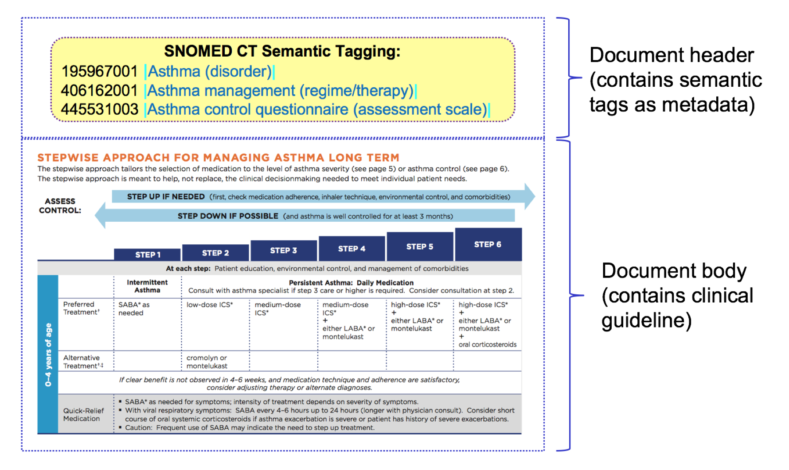
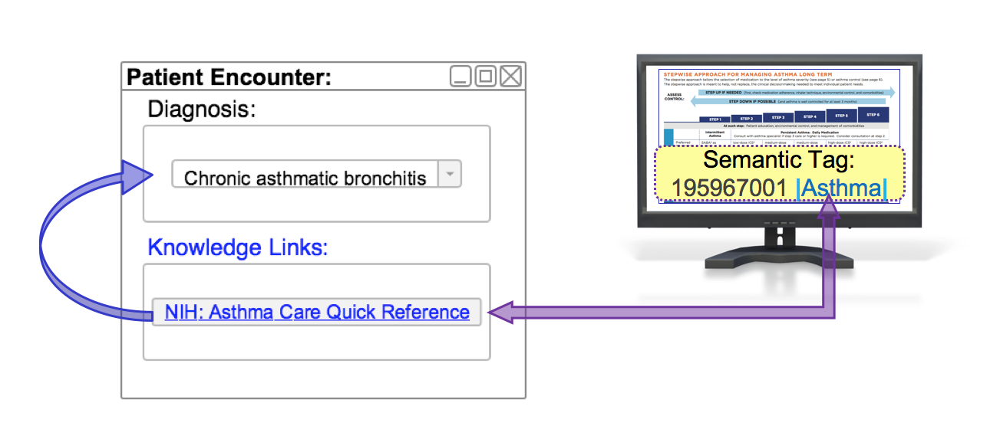
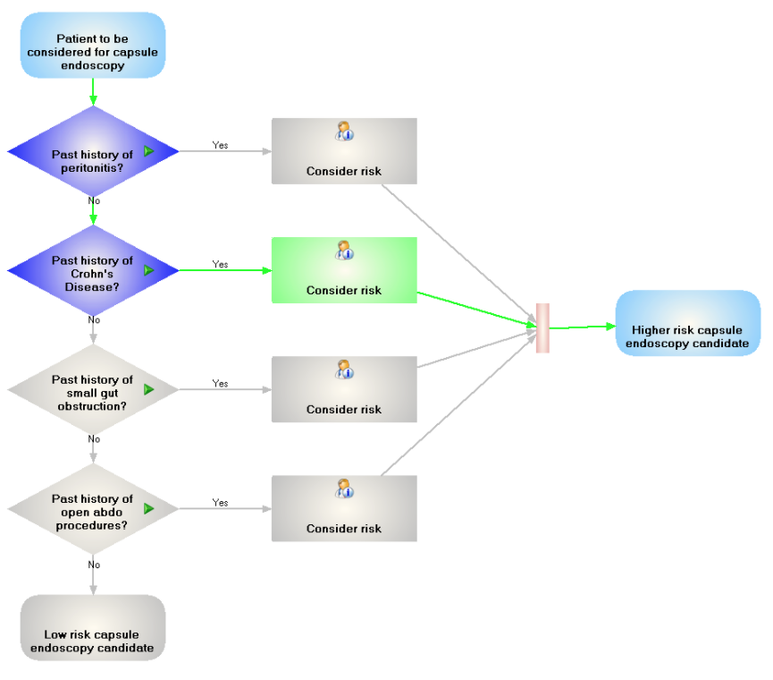

# Guidelines

The two main approaches to preparing clinical guidelines for use in CDS are to use simple markup (also referred to as "semantic tagging"), and to use a standard guideline representation language.

Simple guideline markup involves annotating free-text clinical guidelines using terminology codes that represent its meaning. This enables relevant guidelines to be retrieved based on specific codes recorded in a patient's health record. For more information on this approach, please refer to [Guidelines with SNOMED CT](3.2-guidelines.md#guidelines-with-snomed-ct).

An alternative approach is to use a standard guideline representation languages to formally define each guideline. Some examples of standard guideline representation languages, such as the Guideline Definition Language (GDL) and the Guideline Interchange Format (GLIF) are presented in the section [Standards for CDS Guidelines](3.2-guidelines.md#standards-for-cds-guidelines).

***

## Guidelines with SNOMED CT

This section examines how clinical guidelines can be linked to SNOMED CT to enable the automated display of contextually relevant knowledge resources. We begin by reviewing how a guideline can be linked to a SNOMED CT concept using semantic tags. Next we will examine how SNOMED CT concepts can be associated with guidelines using a reference set. Lastly, we will look at the automated display of a contextually relevant guideline, based on the selection of a SNOMED CT concept in a data entry protocol.

### Linking Guidelines to SNOMED CT

One approach known as simple markup, involves the application of semantic tags using terminology codes (such as SNOMED CT concept identifiers) to free text clinical guidelines. When using SNOMED CT, concept identifiers (or expressions) are added as document metadata to the appropriate guideline or text within the guideline. For example, when applying semantic tags to asthma management guidelines, we might add the following concept identifiers, to enable the guideline to be linked to a patient's health record that includes a diagnosis of [195967001 <mark style="color:blue;">|</mark> Asthma<mark style="color:blue;">|</mark>](http://snomed.info/id/195967001), a regime of [406162001 <mark style="color:blue;">|</mark> Asthma management<mark style="color:blue;">|</mark>](http://snomed.info/id/406162001), or an assessment scale coded with [445531003 <mark style="color:blue;">|</mark> Asthma control questionnaire<mark style="color:blue;">|</mark>](http://snomed.info/id/445531003) (respectively):

| Concept                                                                                                                                                             |
| ------------------------------------------------------------------------------------------------------------------------------------------------------------------- |
| [195967001 <mark style="color:blue;">\|</mark> Asthma (disorder)<mark style="color:blue;">\|</mark>](http://snomed.info/id/195967001)                               |
| [406162001 <mark style="color:blue;">\|</mark> Asthma management (regime/therapy)<mark style="color:blue;">\|</mark>](http://snomed.info/id/406162001)              |
| [445531003 <mark style="color:blue;">\|</mark> Asthma control questionnaire (assessment scale)<mark style="color:blue;">\|</mark>](http://snomed.info/id/445531003) |

The diagram below depicts the process of tagging the SNOMED CT concepts mentioned above to an [Asthma Management Guideline](#user-content-fn-1)[^1].

<figure><figcaption>
 Asthma Management Guideline tagged with SNOMED CT concepts
</figcaption></figure>

This tagged resource may then be presented as reference material when a relevant clinical scenario arises. For example, the guidelines shown in the image above could be presented upon the diagnosis of [<mark style="color:blue;">|</mark> Asthma<mark style="color:blue;">|</mark>](http://snomed.info/id/195967001). Additional details on the mechanics of this process are provided below in the [Selecting Relevant Guidelines](3.2-guidelines.md#id-3.2.1.guidelineswithsnomedct-selectingrelevantguidelinesselectingrelevantguidelines) section below.

## Linking SNOMED CT to Guidelines

SNOMED CT Annotation Reference Sets can be used as a mechanism to define, share, and distribute links from SNOMED CT components to appropriate guidelines. This approach involves defining one or more links to relevant guidelines (using a URL) as a string based annotation for each relevant concept. An example of this is shown in the table below. In this example, the same clinical guideline is relevant to more than one SNOMED CT concept.

Table: Concepts which refer to NIH: Asthma Care Quick Reference guideline

| refsetId                                                                                                                                               | referencedComponentId                                                                                                                                               | Annotation                                                                          |
| ------------------------------------------------------------------------------------------------------------------------------------------------------ | ------------------------------------------------------------------------------------------------------------------------------------------------------------------- | ----------------------------------------------------------------------------------- |
| <mark style="color:red;">719999999107</mark> <mark style="color:blue;">\|</mark> Guideline annotation reference set<mark style="color:blue;">\|</mark> | [195967001 <mark style="color:blue;">\|</mark> Asthma (disorder)<mark style="color:blue;">\|</mark>](http://snomed.info/id/195967001)                               | [http://www.example.com/asthma\_guideline](http://www.example.com/asthma_guideline) |
| <mark style="color:red;">719999999107</mark> <mark style="color:blue;">\|</mark> Guideline annotation reference set<mark style="color:blue;">\|</mark> | [406162001 <mark style="color:blue;">\|</mark> Asthma management (regime/therapy)<mark style="color:blue;">\|</mark>](http://snomed.info/id/406162001)              | [http://www.example.com/asthma\_guideline](http://www.example.com/asthma_guideline) |
| <mark style="color:red;">719999999107</mark> <mark style="color:blue;">\|</mark> Guideline annotation reference set<mark style="color:blue;">\|</mark> | [445531003 <mark style="color:blue;">\|</mark> Asthma control questionnaire (assessment scale)<mark style="color:blue;">\|</mark>](http://snomed.info/id/445531003) | [http://www.example.com/asthma\_guideline](http://www.example.com/asthma_guideline) |

Another example use case is linking a specific clinical field, such as a diagnosis, to an appropriate clinical guideline. Given the more specific scope, it may be possible to avoid repeating the same guideline for multiple SNOMED CT concepts referenced by the reference set. The table below, shows an example in which disorder concepts are linked to appropriate clinical guidelines.

Table: Respiratory diagnoses linked to relevant clinical guidelines

| refsetId                                                                                                                                               | referencedComponentId                                                                                                                              | Annotation                                                                                  |
| ------------------------------------------------------------------------------------------------------------------------------------------------------ | -------------------------------------------------------------------------------------------------------------------------------------------------- | ------------------------------------------------------------------------------------------- |
| <mark style="color:red;">719999999107</mark> <mark style="color:blue;">\|</mark> Guideline annotation reference set<mark style="color:blue;">\|</mark> | [195967001 <mark style="color:blue;">\|</mark> Asthma<mark style="color:blue;">\|</mark>](http://snomed.info/id/195967001)                         | [http://www.example.com/asthma\_guideline](http://www.example.com/asthma_guideline)         |
| <mark style="color:red;">719999999107</mark> <mark style="color:blue;">\|</mark> Guideline annotation reference set<mark style="color:blue;">\|</mark> | [32398004 <mark style="color:blue;">\|</mark> Bronchitis<mark style="color:blue;">\|</mark>](http://snomed.info/id/32398004)                       | [http://www.example.com/bronchitis\_guideline](http://www.example.com/bronchitis_guideline) |
| <mark style="color:red;">719999999107</mark> <mark style="color:blue;">\|</mark> Guideline annotation reference set<mark style="color:blue;">\|</mark> | [13645005 <mark style="color:blue;">\|</mark> Chronic obstructive lung disease<mark style="color:blue;">\|</mark>](http://snomed.info/id/13645005) | [http://www.example.com/COPD\_guideline](http://www.example.com/COPD_guideline)             |

## Selecting Relevant Guidelines 

EHR systems, designed to use clinical guidelines marked up with semantic tags, are able to display relevant guidelines to the user when a subtype (or self) of the semantic tag concept is recorded in the health record.

Below is a generic template that could be used in an EHR system to facilitate the display of an appropriate clinical guideline, when a relevant diagnosis is recorded.

| 
<mark style="color:blue;">IF</mark> diagnosis <mark style="color:red;">= &#x3C;&#x3C;</mark> [[ + $semanticTag]] <mark style="color:blue;">THEN</mark>  <mark style="color:red;">display</mark> clinical guideline
 |
| ---------------------------------------------------------------------------------------------------------------------------------------------------------------------------------------------------------------------------- |

For example, the above template could be used on a clinical guideline that has the semantic tag [195967001 <mark style="color:blue;">|</mark> Asthma<mark style="color:blue;">|</mark>](http://snomed.info/id/195967001), generating the CDS rule:

| 
<mark style="color:blue;">IF</mark> diagnosis <mark style="color:red;">= &#x3C;&#x3C;</mark> <a href="http://snomed.info/id/195967001">195967001 | Asthma|</a> <mark style="color:blue;">THEN</mark> <mark style="color:red;">display</mark> NIH Asthma Care Quick Reference
 |
| -------------------------------------------------------------------------------------------------------------------------------------------------------------------------------------------------------------------------------------------------------------------------------------- |

Using the above CDS rule, if a clinician selects a diagnosis of [195949008 <mark style="color:blue;">|</mark> Chronic asthmatic bronchitis<mark style="color:blue;">|</mark>](http://snomed.info/id/195949008), the NIH Asthma Care Quick Reference would be displayed  because [195949008 <mark style="color:blue;">|</mark> Chronic asthmatic bronchitis<mark style="color:blue;">|</mark>](http://snomed.info/id/195949008) is a subtype of [195967001 <mark style="color:blue;">|</mark> Asthma<mark style="color:blue;">|</mark>](http://snomed.info/id/195967001).

This enables _contextually relevant_ clinical knowledge to be presented to the user, based on the specific codes recorded in the patient's health record. The diagram below illustrates this scenario:

<figure><figcaption>
Upon entry of a specific diagnosis, a contextually relevant knowledge resource is presented on the user interface
</figcaption></figure>

## Standards for CDS Guidelines

This section presents some examples of standards used to represent CDS guidelines. Please note that this list is not complete, and other standards and formalisms for representing clinical guidelines do exist.

### Guideline Interchange Format

The [Guideline Interchange Format (GLIF)](#user-content-fn-2)[^2] is a language for modeling and executing clinical practice guidelines. GLIF uses GELLO, and therefore can make use of SNOMED CT within its language. Users of GLIF have the option of viewing GLIF code in a interactive flowchart to represent guidelines and present pop-up information and instructions. The following screenshot presents the "UI view" of a query / guideline structured in GLIF. [This example uses SNOMED CT to answer the questions in the decision shapes:](#user-content-fn-3)[^3]

<figure><figcaption>
 UI view of a query / guideline structured in GLIF
</figcaption></figure>

For more information about GLIF, please refer to [https://kb.medical-objects.com.au/display/PUB/GLIF](https://kb.medical-objects.com.au/display/PUB/GLIF).

### Guideline Definition Language

The [Guideline Definition Language (GDL)](#user-content-fn-4)[^4] is a syntax designed to express clinical logic as rule inputs and outputs. Discrete rules can be combined together to support simple or complex decision making. The specification which accompanies the GDL describes its status as "trial." One of the goals of the GDL is to be able to share CDS artifacts across languages and technical platforms. GDL artifacts can be applied to point of care (POC) decision support and in population health analytics. The GDL uses reference and archetype models from openEHR and in doing so supports information model references that are language independent. For example, it is possible to add language translations without changing the logical definitions in the rule. It is also possible to bind locally defined terms in the guideline to a single concept, multiple concepts, or reference set in any reference terminology as the language considers a reference terminology to be an external resource.

For more information on the Guideline Definition Language, please refer to [http://www.openehr.org/releases/CDS/latest/docs/GDL/GDL.html](http://www.openehr.org/releases/CDS/latest/docs/GDL/GDL.html).

***

[^1]: [Asthma Care Quick Reference used for demonstration purposes.](https://www.nhlbi.nih.gov/files/docs/guidelines/asthma_qrg.pdf)

[^2]: [http://www.openclinical.org/gmm\_glif.html](http://www.openclinical.org/gmm_glif.html)

[^3]: Content and diagram provided by [Medical-Objects](https://www.medical-objects.com.au/).

[^4]: [http://www.openehr.org/releases/CDS/latest/docs/GDL/GDL.html#\_guideline\_definition\_language\_gdl](http://www.openehr.org/releases/CDS/latest/docs/GDL/GDL.html#_guideline_definition_language_gdl)

<a href="https://docs.google.com/forms/d/e/1FAIpQLScTmbZIf0UEQwYDkY27EEWBkaiYkHSbR0_9DmFrMLXoQLyL7Q/viewform?usp=pp_url&entry.1767247133=CDS+Guide&entry.670899847=Guidelines" class="button primary">Provide Feedback</a>
