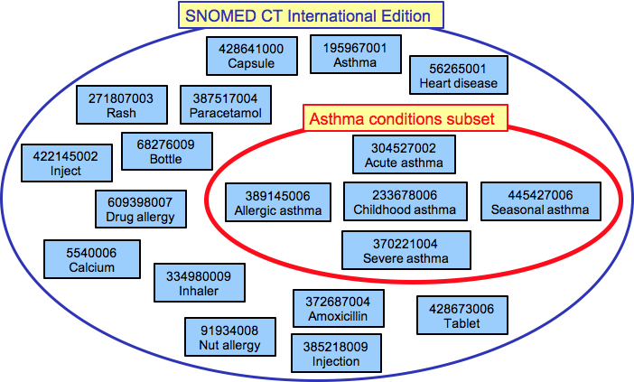
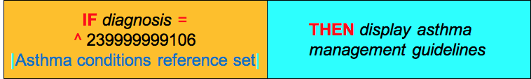

# 4.1.1. Reasoning with Subsets

# Overview

A subset is defined in mathematics as a set whose members are all contained in another set. A SNOMED CT [Subset](https://confluence.ihtsdotools.org/display/DOCRFSPG/2.1.+Subset) typically refers to a collection of components that all come from the same edition of SNOMED CT. This is depicted in the diagram below.

<figure><figcaption>
Figure 4.1.1-1: A subset of concepts related to the diagnosis of asthma is selected from the International Edition of SNOMED CT
</figcaption></figure>

A SNOMED CT subset may be defined [extensionally](https://confluence.ihtsdotools.org/display/DOCGLOSS/extensionally "Glossary link: extensionally"), by enumerating all of the components in the set or [intensionally](https://confluence.ihtsdotools.org/display/DOCGLOSS/intensional "Glossary link: intensional"), by defining a query written using the [Expression Constraint Language - Specification and Guide](https://confluence.ihtsdotools.org/display/DOCECL/Expression+Constraint+Language+-+Specification+and+Guide).

Extensionally and intensionally defined subsets can both be represented as SNOMED CT reference sets, which support versioning and traceability. For more information about reference sets, please refer to the [Practical Guide to Reference Sets](https://confluence.ihtsdotools.org/display/DOCRFSPG/Practical+Guide+to+Reference+Sets). For additional information on using subsets in queries, please refer to [6.1 Subsets](https://confluence.ihtsdotools.org/display/DOCANLYT/6.1+Subsets) in [Data Analytics with SNOMED CT](https://confluence.ihtsdotools.org/display/DOCANLYT/Data+Analytics+with+SNOMED+CT).

# Example

This section presents a simple example of a CDS rule defined using a SNOMED CT subset, and explains how this rule could be executed by the CDS inference engine.

## CDS Rule

The diagram below shows a simple CDS rule based on the IF-condition-THEN-action pattern. This rule uses a SNOMED CT subset to define the set of diagnoses that should trigger the display of the asthma management guidelines. It can be read as follows - "IF the diagnosis is a member of the Asthma conditions reference set THEN display the asthma management guidelines".

<figure><figcaption>
Figure 4.1.1-2: CDS rule which uses fictitious "Asthma conditions ref subset" in its definition
</figcaption></figure>

## Execution of Rule

When executing this rule, the inference engine checks the given diagnosis for membership in the [ 239999999106 | Asthma conditions reference set|](http://snomed.org/fictid#239999999106 "\(eg:239999999106\)  | Asthma conditions reference set |") . The associated SNOMED CT subset is defined extensionally using a simple type reference set, and its members can be queried using a standard SNOMED CT terminology service.

The diagram below illustrates the process followed by the inference engine in executing the CDS condition in the above rule, when the clinician selects a diagnosis of [ 370220003 | Occasional asthma|](http://snomed.info/id/370220003 "370220003 | Occasional asthma |") . The inference engine checks if this concept is a member of the [ 239999999106 | Asthma conditions reference set|](http://snomed.org/fictid#239999999106 "\(eg:239999999106\)  | Asthma conditions reference set |") , and determines that it is not a member. As a result, the condition evaluates to false, and the action is not triggered.

<figure><figcaption>
Figure 4.1.1-3: The inference engine compares the diagnosis entered against a predefined Asthma Conditions Subset
</figcaption></figure>

  

* * *
