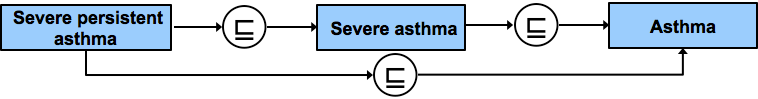
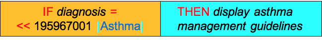
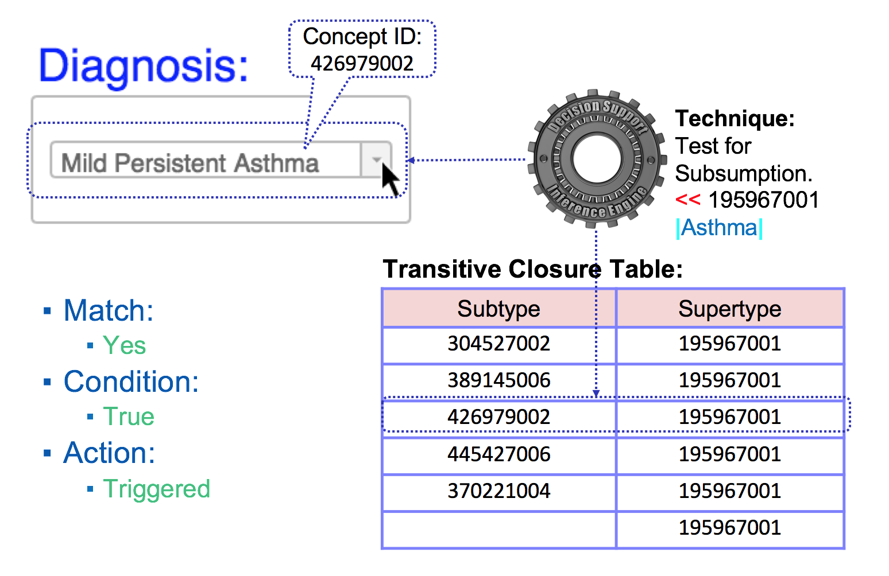

# 4.1.2-reasoning-using-subsumption

## 4.1.2. Reasoning using Subsumption

## Overview

One of the fundamental benefits of SNOMED CT is its built-in polyhierarchy that specifies which concepts are subtypes of others. This hierarchy facilitates the automated grouping of health records which have been encoded using SNOMED CT. The [116680003 | is a|](http://snomed.info/id/116680003) relationships in SNOMED CT form the basis of its subtype hierarchy.

For example, [54441004 | Fracture of shaft of femur|](http://snomed.info/id/54441004) has an [116680003 | is a|](http://snomed.info/id/116680003) relationship to [71620000 | Fracture of femur|](http://snomed.info/id/71620000) , and therefore (as the diagram below illustrates), the concept [54441004 | Fracture of shaft of femur|](http://snomed.info/id/54441004) is subsumed by [71620000 | Fracture of femur|](http://snomed.info/id/71620000) .[1](https://confluence.ihtsdotools.org/display/DOCCDS/4.1.2.+Reasoning+using+Subsumption#Footnote1)

<figure><figcaption>
Figure 4.1.2-1: Example of subsumption
</figcaption></figure>

This also means that if a patient has a [54441004 | Fracture of shaft of femur|](http://snomed.info/id/54441004) , then it is implied (i.e. it is also true) that they have a [71620000 | Fracture of femur|](http://snomed.info/id/71620000) . We can use this principal to aggregate health records that have been encoded with SNOMED CT. By selecting any code that is a subtype of [71620000 | Fracture of femur|](http://snomed.info/id/71620000) , we are selecting all the codes that imply that [71620000 | Fracture of femur|](http://snomed.info/id/71620000) is true (given the appropriate context).

When testing for subsumption, we must also consider the transitivity of the [116680003 | is a|](http://snomed.info/id/116680003) relationship. For example, the diagram below indicates that [426656000 | Severe persistent asthma|](http://snomed.info/id/426656000) is a subtype of [370221004 | Severe asthma|](http://snomed.info/id/370221004) which is a subtype of [195967001 | Asthma|](http://snomed.info/id/195967001) . Therefore [426656000 | Severe persistent asthma|](http://snomed.info/id/426656000) is also a subtype of [195967001 | Asthma|](http://snomed.info/id/195967001) .

<figure><figcaption>
Figure 4.1.2-2: Example of subsumption and transitivity
</figcaption></figure>

As previously suggested in the section [1.4. SNOMED CT Features](../../4%20inference-engine/4.1%20reasoning-with-snomed-ct/1.4.-SNOMED-CT-Features_123897451.html), the hierarchical relationships of SNOMED CT can be leveraged to enable clinical decision support. More specifically, we can apply [subsumption testing](https://confluence.ihtsdotools.org/display/DOCGLOSS/Subsumption+test) to make additional determinations. For additional information on subsumption, please refer to [6.2 Subsumption](https://confluence.ihtsdotools.org/display/DOCANLYT/6.2+Subsumption)in [Data Analytics with SNOMED CT](https://confluence.ihtsdotools.org/display/DOCANLYT/Data+Analytics+with+SNOMED+CT).

## Example

### CDS Rule

The diagram below shows a simple CDS rule based on the IF-condition-THEN-action pattern. This rule uses the _descendant or self_ operator (<<) from the [Expression Constraint Language - Specification and Guide](https://confluence.ihtsdotools.org/display/DOCECL/Expression+Constraint+Language+-+Specification+and+Guide) to check if the diagnosis is in the set of concepts that includes [195967001 | Asthma|](http://snomed.info/id/195967001) and all of its subtypes.

<figure><figcaption>
Figure 4.1.2-3: CDS rule defined using subsumption
</figcaption></figure>

### Execution of Rule

When executing this rule, the inference engine tests if the given diagnosis is subsumed by the concept [195967001 | Asthma|](http://snomed.info/id/195967001) . This subsumption testing can be performed using a range of approaches, including using a [7.5.2 Transitive closure implementation](../../pages/createpage.action). A transitive closure table facilitates rapid testing of all possible [116680003 | is a|](http://snomed.info/id/116680003) relationships, and provides a very effective way of testing concept subsumption in relational databases.

The diagram below illustrates the process followed by the inference engine in executing the CDS condition in the above rule, when the clinician selects a diagnosis of [426979002 | Mild persistent asthma|](http://snomed.info/id/426979002) . The inference engine checks if this concept is a subtype of [195967001 | Asthma|](http://snomed.info/id/195967001) , and determines that it is. As a result, the condition evaluates to true, and the action is triggered.

<figure><figcaption>
Figure 4.1.2-4: The inference engine checks if the diagnosis entered is a subtype of |Asthma|
</figcaption></figure>

***

| Footnotes Ref                                                                                               | Notes                                                                                                                         |
| ----------------------------------------------------------------------------------------------------------- | ----------------------------------------------------------------------------------------------------------------------------- |
| [1](https://confluence.ihtsdotools.org/display/DOCCDS/4.1.2.+Reasoning+using+Subsumption#FootnoteMarker1-0) | Diagram uses notation from [Diagramming Guideline](https://confluence.ihtsdotools.org/display/DOCDIAG/Diagramming+Guideline). |
