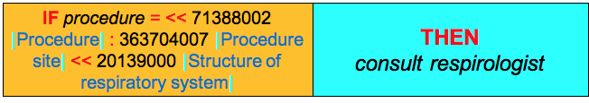

# 4.1.3. Reasoning using Defining Relationships

# Overview

In addition to the subtype relationships in SNOMED CT, attribute relationships may be used to support the definition of concepts. Only the relationships that are necessary (i.e. always true) are used as defining relationships in SNOMED CT. This is because these are the ones that produce reliable and consistent inferences. For example:

<figure><figcaption>
Figure 4.1.3-1: Concept definition consisting of subtype (blue arrows) and defining (green arrows) relationships
</figcaption></figure>

The green arrows in the diagram above show that the concept [ 22298006 | myocardial infarction|](http://snomed.info/id/22298006 "22298006 | myocardial infarction |") has two necessary attribute relationships that represent a characteristic of the meaning of the concept. It always has an [ 116676008 | associated morphology|](http://snomed.info/id/116676008 "116676008 | associated morphology |") of [ 55641003 | infarct|](http://snomed.info/id/55641003 "55641003 | infarct |") , and it always has a [ 363698007 | finding site|](http://snomed.info/id/363698007 "363698007 | finding site |") of [ 74281007 | myocardium structure|](http://snomed.info/id/74281007 "74281007 | myocardium structure |") . The blue arrows in the diagram above are used to indicate the subtype relationships.

The full definition of a concept consists of both the defining subtype relationships and the defining attribute relationships. There are over 50 attributes in SNOMED CT which can each be used as the "type" of a defining relationship, including [ 246075003 | causative agent|](http://snomed.info/id/246075003 "246075003 | causative agent |") , [ 260686004 | method|](http://snomed.info/id/260686004 "260686004 | method |") , and [ 272741003 | laterality|](http://snomed.info/id/272741003 "272741003 | laterality |") .

The [SNOMED CT Concept Model](https://confluence.ihtsdotools.org/display/DOCGLOSS/SNOMED+CT+Concept+Model "Glossary link: SNOMED CT Concept Model") provides rules about how these attributes can be used to define concepts from different hierarchies. The [SNOMED CT Machine Readable Concept Model](https://confluence.ihtsdotools.org/display/DOCMRCM/SNOMED+CT+Machine+Readable+Concept+Model) (MRCM) represents these rules in a form that can be read by a computer and applied to test that CDS criterion comply with these rules. 

As previously suggested in section [1.4. SNOMED CT Features](1.4.-SNOMED-CT-Features_123897451.html), the defining relationships of SNOMED CT can be leveraged to support CDS. For additional information on using SNOMED CT defining relationships in queries, please refer to [6.3 Using Defining Relationships](https://confluence.ihtsdotools.org/display/DOCANLYT/6.3+Using+Defining+Relationships) of [Data Analytics with SNOMED CT](https://confluence.ihtsdotools.org/display/DOCANLYT/Data+Analytics+with+SNOMED+CT).

# Example

## CDS Rule

The diagram below shows a simple CDS rule based on the IF-condition-THEN-action pattern. This rule uses attribute refinements in the [SNOMED CT Expression Constraint Language](http://snomed.org/ecl) to define the set of procedures with a [ 71388002 | Procedure site|](http://snomed.info/id/71388002 "71388002 | Procedure site |") that is a type of [ 20139000 | Structure of the respiratory system|](http://snomed.info/id/20139000 "20139000 | Structure of the respiratory system |") .

<figure><figcaption>
Figure 4.1.3-2: CDS rule which uses a defining relationship in its definition
</figcaption></figure>

Using attribute refinements in the CDS rule criteria facilitates richer expressivity and specificity in the rules. For example, we can restrict pharmaceutical/biological products based on their active ingredients, procedures based on their methods, and disorders based on their finding sites.

## Execution of Rule

When executing this rule, the inference engine must process the defining relationships of each [ 71388002 | Procedure|](http://snomed.info/id/71388002 "71388002 | Procedure |") concept to determine which ones have a [ 363704007 | Procedure site|](http://snomed.info/id/363704007 "363704007 | Procedure site |") that is a type of [ 20139000 | Structure of respiratory system|](http://snomed.info/id/20139000 "20139000 | Structure of respiratory system |") . These relationships are distributed as part of SNOMED CT's [Release Format 2](https://confluence.ihtsdotools.org/display/DOCGLOSS/Release+Format+2 "Glossary link: Release Format 2") relationship file, which can be searched by a terminology service to discover relationships that match the given attribute refinement.

The diagram below illustrates the process followed by the inference engine in executing the CDS condition in the above rule, when the clinician selects the therapy [ 229308003 | Intermittent continuous positive airway pressure|](http://snomed.info/id/229308003 "229308003 | Intermittent continuous positive airway pressure |") . Once the inference engine has found the defining relationships whose source is [ 229308003 | Intermittent continuous positive airway pressure|](http://snomed.info/id/229308003 "229308003 | Intermittent continuous positive airway pressure |") and whose type is [ 363704007 | Procedure site|](http://snomed.info/id/363704007 "363704007 | Procedure site |") , it determines whether the destination of these relationships is either [ 20139000 | Structure of respiratory system|](http://snomed.info/id/20139000 "20139000 | Structure of respiratory system |") or a subtype of [ 20139000 | Structure of respiratory system|](http://snomed.info/id/20139000 "20139000 | Structure of respiratory system |") (e.g. using a [transitive closure](https://confluence.ihtsdotools.org/display/DOCGLOSS/transitive+closure "Glossary link: transitive closure") table). Since the given procedure has a [ 363704007 | Procedure site|](http://snomed.info/id/363704007 "363704007 | Procedure site |") equal to [ 20139000 | Structure of respiratory system|](http://snomed.info/id/20139000 "20139000 | Structure of respiratory system |") , the condition in the rule evaluates to true, and the action is triggered.

<figure><figcaption>
Figure 4.1.3-3: The inference engine checks if the diagnosis entered has a defining relationship which states that the |Procedure site| is |Structure of respiratory system| or a subtype.
</figcaption></figure>

  

* * *
