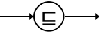

# 4.1.4-reasoning-with-description-logic

## 4.1.4. Reasoning with Description Logic

## Overview

Description logic (DL) reasoners can apply additional logic-based techniques to assist with clinical decision support reasoning. Two of the DL techniques supported by SNOMED CT have been briefly described below.

It is also worth pointing out that DL can be applied over the terminology or to the terminology in combination with the record structure. For more information on this topic, please refer to sections [6.4 Description Logic Over Terminology](https://confluence.ihtsdotools.org/display/DOCANLYT/6.4+Description+Logic+Over+Terminology) and [6.5 Description Logic Over Terminology and Structure](https://confluence.ihtsdotools.org/display/DOCANLYT/6.5+Description+Logic+Over+Terminology+and+Structure) in the guide [Data Analytics with SNOMED CT](https://confluence.ihtsdotools.org/display/DOCANLYT/Data+Analytics+with+SNOMED+CT).

## Expression Subsumption

SNOMED CT supports the use of postcoordinated expressions to define additional clinical meanings beyond the standard precoordinated concepts. Postcoordinated expressions are comprised of two or more concepts, and are structured in accordance with the [compositional grammar](https://confluence.ihtsdotools.org/display/DOCGLOSS/compositional+grammar). A simple example of a postcoordinated expression is:

[399963005 |Abrasion|](http://snomed.info/id/399963005) :\
[363698007 |Finding site|](http://snomed.info/id/363698007) = [67269001 |Skin structure of ankle|](http://snomed.info/id/67269001)

This can be read as "an abrasion with a finding site of skin of ankle".

When postcoordinated expressions are used to capture and record clinical meaning in a health record, the CDS inference engine may need to be able to test if one expression subsumes another to execute the CDS rules. For example, it would be reasonable to conclude that the first expression listed below, subsumes the second expression if you were aware that [40196000 | Mild pain|](http://snomed.info/id/40196000) is subsumed by [22253000 | Pain|](http://snomed.info/id/22253000) .

[373572006 |Clinical finding absent|](http://snomed.info/id/373572006) :\
[246090004 |Associated finding|](http://snomed.info/id/246090004) = [22253000 |Pain|](http://snomed.info/id/22253000) |

<figure><figcaption>
<a href="http://snomed.info/id/246090004">246090004 |Associated finding|</a> = <a href="http://snomed.info/id/40196000">40196000 |Mild pain|</a>
</figcaption></figure>

\| [373572006 |Clinical finding absent|](http://snomed.info/id/373572006) :\
\---|---|---

However, many expressions are much more complex than this and may involve multiple focus concepts, attribute groups, and nesting as examples. There are a couple of methods which can be utilized to determine if one expression subsumes another. The first process, which is a manual process, involves [12.4.2 Normalize Expression](../../pages/createpage.action) the expressions , comparing the primitive focus concepts, and then comparing the defining attributes. The other is an automated process which can be used to compare expressions for subsumption. Expressions can be imported into a description logic classifier and classified in the same way as SNOMED CT concept definitions, which tests for subsumption in the process.

## Property Chaining

The transitive nature of the [116680003 | is a|](http://snomed.info/id/116680003) attribute allows us to make subtype inferences. This [topic](https://confluence.ihtsdotools.org/pages/editpage.action?pageId=34865699#ReasoningwithDescriptionLogic-transitivity) was explored in the section on [Reasoning using Subsumption](../../4%20inference-engine/4.1%20reasoning-with-snomed-ct/4.1.2.-Reasoning-using-Subsumption_123897601.html). In some cases, different types of attribute relationships may be related to one another in such a way that additional inferences are possible. For example (using fictitious concepts) if Lucy [619999999100 | Has sister|](http://snomed.org/fictid#619999999100) Beth, and Beth [629999999107 | Has daughter|](http://snomed.org/fictid#629999999107) Jane, then Lucy [639999999109 | Has niece|](http://snomed.org/fictid#639999999109) Jane. The chain from [619999999100 | Has sister|](http://snomed.org/fictid#619999999100) to [629999999107 | Has daughter|](http://snomed.org/fictid#629999999107) implies [639999999109 | Has niece|](http://snomed.org/fictid#639999999109) . This rule can be expressed as:

[619999999100 | Has sister|](http://snomed.org/fictid#619999999100) | o| [629999999107 | Has daughter|](http://snomed.org/fictid#629999999107) | →| [639999999109 | Has niece|](http://snomed.org/fictid#639999999109)\
\---|---|---|---|---

At present, the only property chain recognized in the International Edition of SNOMED CT is from [| Direct substance|](http://snomed.org/fictid) to [| Active ingredient|](http://snomed.org/fictid) and can be expressed as such:

[363701004 | Direct substance|](http://snomed.info/id/363701004) | o| [127489000 | Has active ingredient|](http://snomed.info/id/127489000) | →| [363701004 | Direct substance|](http://snomed.info/id/363701004)\
\---|---|---|---|---

This can be used to provide a link from product administration (as part of a procedure) to substance administration. Additional property chains can be added at the local implementation level, if required.

***
