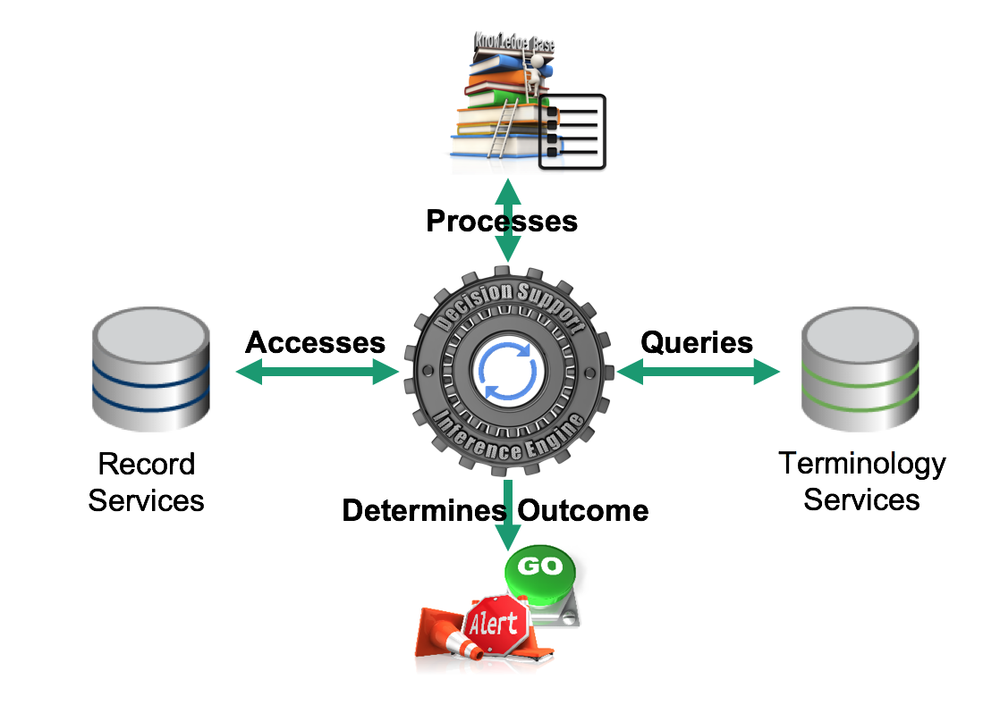

# 4. Inference Engine

At the heart of a clinical decision support system, the inference engine uses inputs from the user, the record services, and the terminology services to process the machine readable rules, guidelines, or CDS artifacts. It is the job of the inference engine to establish if the CDS conditions have been met and determine the appropriate outcome. It does this by executing queries over the health records and terminology, to test the CDS conditions defined in the CDS rules. Note that it is the [communications mechanism](5.-Communications_123897660.html) which handles the action defined in the CDS rules, but the inference engine determines whether or not the action should be carried out.

The diagram below illustrates the key inference engine interactions described above:

<figure><figcaption>
Figure 4-1: Inference engine key interactions
</figcaption></figure>

The following topics , which relate to the inference engine, are explored in the following sections:

  * [4.1. Reasoning with SNOMED CT](4.1.-Reasoning-with-SNOMED-CT_123897584.html)
  * [4.2. Accessing Clinical Records](4.2.-Accessing-Clinical-Records_123897646.html)
  * [4.3. Accessing Terminology](4.3.-Accessing-Terminology_123897656.html)

* * *
