# Inference Engine

At the heart of a clinical decision support system, the inference engine uses inputs from the user, the record services, and the terminology services to process the machine readable rules, guidelines, or CDS artifacts. It is the job of the inference engine to establish if the CDS conditions have been met and determine the appropriate outcome. It does this by executing queries over the health records and terminology, to test the CDS conditions defined in the CDS rules. Note that it is the [communications mechanism](5-communications.md) which handles the action defined in the CDS rules, but the inference engine determines whether or not the action should be carried out.

The diagram below illustrates the key inference engine interactions described above:

<figure>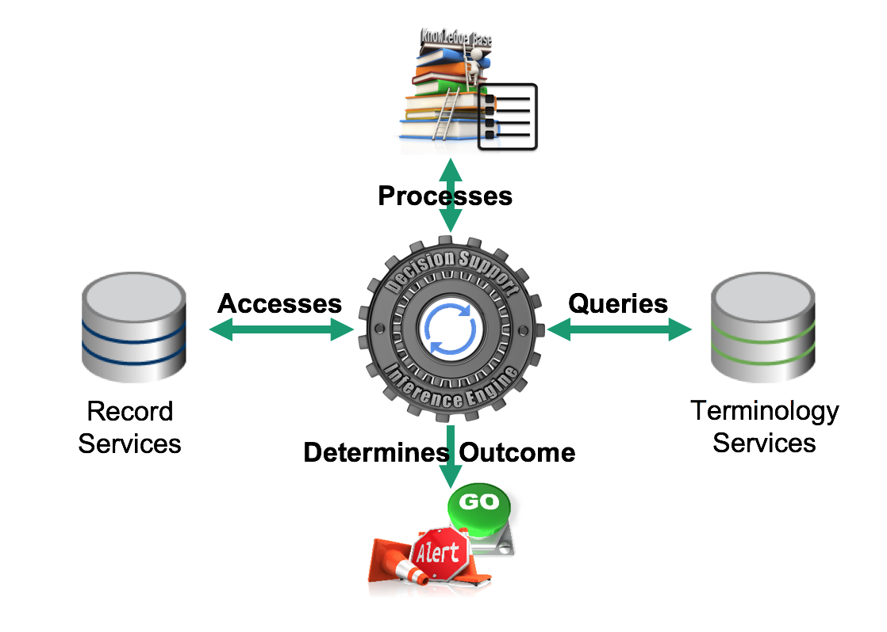<figcaption><p>Inference engine key interactions</p></figcaption></figure>

The following topics , which relate to the inference engine, are explored in the following sections:

* Reasoning with SNOMED CT
* Accessing Clinical Records
* Accessing Terminology

## Reasoning with SNOMED CT

[Features](<1 introduction/1.1-overview.md#snomed-ct-features>) of SNOMED CT can be used in a range of techniques which may then be applied to clinical decision support. For example, these techniques can help to execute decision support logic by assisting the inference engine in evaluating the trigger conditions defined in CDS rules.

This section describes these SNOMED CT techniques with respect to CDS by first providing an overview of the technique, and then presenting an example of how the inference engine can apply the technique to execute a specific CDS rule.

The following SNOMED CT techniques can be used by the CDS inference engine:

### Reasoning with Subsets

A subset is defined in mathematics as a set whose members are all contained in another set. A SNOMED CT [Subset](https://app.gitbook.com/s/qOI2v58ZsXOoklmwBOk4/2-subsets-value-sets-and-reference-sets/2.1-subset) typically refers to a collection of components that all come from the same edition of SNOMED CT. This is depicted in the diagram below.

<figure>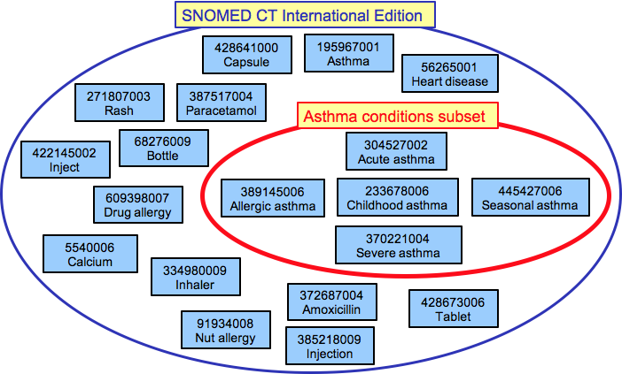<figcaption><p>A subset of concepts related to the diagnosis of asthma is selected from the International Edition of SNOMED CT</p></figcaption></figure>

A SNOMED CT subset may be defined **extensionally**, by enumerating all of the components in the set or **intensionally**, by defining a query written using the [Expression Constraint Language](https://app.gitbook.com/o/h8Z6qGxuQrzM9vbx5bPT/s/sOJBD7YbxAy9bD1Ko9L9/).

Extensionally and intensionally defined subsets can both be represented as SNOMED CT reference sets, which support versioning and traceability. For more information about reference sets, please refer to the [SNOMED CT Reference Set Guide](https://app.gitbook.com/o/h8Z6qGxuQrzM9vbx5bPT/s/qOI2v58ZsXOoklmwBOk4/). For additional information on using subsets in queries, please refer to [Subsets](https://app.gitbook.com/s/uKngFry3XF9A8phdXFe8/6-snomed-ct-analytic-techniques/6.1-subsets) in the [SNOMED CT Data Analytics Guide](https://app.gitbook.com/o/h8Z6qGxuQrzM9vbx5bPT/s/uKngFry3XF9A8phdXFe8/).

#### Example

This section presents a simple example of a CDS rule defined using a SNOMED CT subset, and explains how this rule could be executed by the CDS inference engine.

#### CDS Rule

The diagram below shows a simple CDS rule based on the IF-condition-THEN-action pattern. This rule uses a SNOMED CT subset to define the set of diagnoses that should trigger the display of the asthma management guidelines. It can be read as follows - "IF the diagnosis is a member of the Asthma conditions reference set THEN display the asthma management guidelines".

<figure>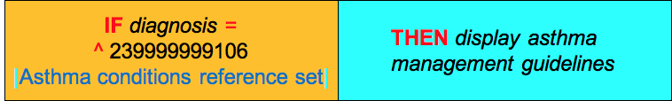<figcaption><p>CDS rule which uses fictitious "Asthma conditions ref subset" in its definition</p></figcaption></figure>

#### Execution of Rule

When executing this rule, the inference engine checks the given diagnosis for membership in the <mark style="color:red;">239999999106</mark> <mark style="color:blue;">|</mark> Asthma conditions reference set<mark style="color:blue;">|</mark>. The associated SNOMED CT subset is defined extensionally using a simple type reference set, and its members can be queried using a standard SNOMED CT terminology service.

The diagram below illustrates the process followed by the inference engine in executing the CDS condition in the above rule, when the clinician selects a diagnosis of 370220003 <mark style="color:blue;">|</mark> Occasional asthma<mark style="color:blue;">|.</mark> The inference engine checks if this concept is a member of the <mark style="color:red;">239999999106</mark> <mark style="color:blue;">|</mark> Asthma conditions reference set<mark style="color:blue;">|</mark>, and determines that it is not a member. As a result, the condition evaluates to false, and the action is not triggered.

<figure>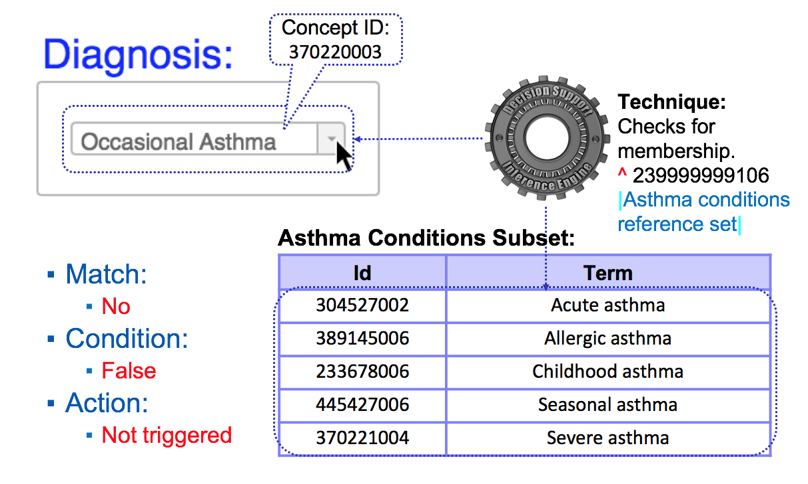<figcaption><p>The inference engine compares the diagnosis entered against a predefined Asthma Conditions Subset</p></figcaption></figure>

### Reasoning using Subsumption

One of the fundamental benefits of SNOMED CT is its built-in polyhierarchy that specifies which concepts are subtypes of others. This hierarchy facilitates the automated grouping of health records which have been encoded using SNOMED CT. The 116680003 <mark style="color:blue;">|</mark> is a<mark style="color:blue;">|</mark> relationships in SNOMED CT form the basis of its subtype hierarchy.

For example, 54441004 <mark style="color:blue;">|</mark> Fracture of shaft of femur<mark style="color:blue;">|</mark> has an 116680003 <mark style="color:blue;">|</mark> is a<mark style="color:blue;">|</mark> relationship to 71620000 <mark style="color:blue;">|</mark> Fracture of femur<mark style="color:blue;">|</mark>, and therefore (as the diagram[^1] below illustrates), the concept 54441004 <mark style="color:blue;">|</mark> Fracture of shaft of femur<mark style="color:blue;">|</mark> is subsumed by 71620000 <mark style="color:blue;">|</mark> Fracture of femur<mark style="color:blue;">|</mark> .

<figure>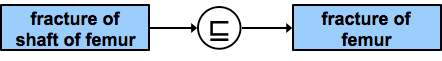<figcaption><p>Example of subsumption</p></figcaption></figure>

This also means that if a patient has a 54441004 <mark style="color:blue;">|</mark> Fracture of shaft of femur<mark style="color:blue;">|</mark>, then it is implied (i.e. it is also true) that they have a 71620000 <mark style="color:blue;">|</mark> Fracture of femur<mark style="color:blue;">|</mark>. We can use this principal to aggregate health records that have been encoded with SNOMED CT. By selecting any code that is a subtype of 71620000 <mark style="color:blue;">|</mark> Fracture of femur<mark style="color:blue;">|</mark>, we are selecting all the codes that imply that 71620000 <mark style="color:blue;">|</mark> Fracture of femur<mark style="color:blue;">|</mark> is true (given the appropriate context).

When testing for subsumption, we must also consider the transitivity of the 116680003 <mark style="color:blue;">|</mark> is a<mark style="color:blue;">|</mark> relationship. For example, the diagram below indicates that 426656000 <mark style="color:blue;">|</mark> Severe persistent asthma<mark style="color:blue;">|</mark> is a subtype of 370221004 <mark style="color:blue;">|</mark> Severe asthma<mark style="color:blue;">|</mark> which is a subtype of 195967001 <mark style="color:blue;">|</mark> Asthma<mark style="color:blue;">|</mark>. Therefore 426656000 <mark style="color:blue;">|</mark> Severe persistent asthma<mark style="color:blue;">|</mark> is also a subtype of 195967001 <mark style="color:blue;">|</mark> Asthma<mark style="color:blue;">|</mark>.

<figure>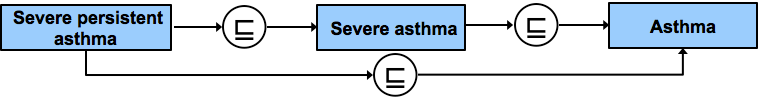<figcaption><p>Example of subsumption and transitivity</p></figcaption></figure>

As previously suggested in the section [SNOMED CT Features](<1 introduction/1.1-overview.md#snomed-ct-features>), the hierarchical relationships of SNOMED CT can be leveraged to enable clinical decision support. More specifically, we can apply subsumption testing to make additional determinations. For additional information on subsumption, please refer to [Subsumption](https://app.gitbook.com/s/uKngFry3XF9A8phdXFe8/6-snomed-ct-analytic-techniques/6.2-subsumption) in the [SNOMED CT Data Analytics Guide](https://app.gitbook.com/o/h8Z6qGxuQrzM9vbx5bPT/s/uKngFry3XF9A8phdXFe8/).

#### Example

#### CDS Rule

The diagram below shows a simple CDS rule based on the IF-condition-THEN-action pattern. This rule uses the _descendant or self_ operator (<<) from the [Expression Constraint Language](https://app.gitbook.com/o/h8Z6qGxuQrzM9vbx5bPT/s/sOJBD7YbxAy9bD1Ko9L9/) to check if the diagnosis is in the set of concepts that includes 195967001 <mark style="color:blue;">|</mark> Asthma<mark style="color:blue;">|</mark> and all of its subtypes.

<figure>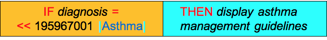<figcaption><p>CDS rule defined using subsumption</p></figcaption></figure>

#### Execution of Rule

When executing this rule, the inference engine tests if the given diagnosis is subsumed by the concept 195967001 <mark style="color:blue;">|</mark> Asthma<mark style="color:blue;">|</mark>. This subsumption testing can be performed using a range of approaches, including using a transitive closure implementation. A transitive closure table facilitates rapid testing of all possible 116680003 <mark style="color:blue;">|</mark> is a<mark style="color:blue;">|</mark> relationships, and provides a very effective way of testing concept subsumption in relational databases.

The diagram below illustrates the process followed by the inference engine in executing the CDS condition in the above rule, when the clinician selects a diagnosis of 426979002 <mark style="color:blue;">|</mark> Mild persistent asthma<mark style="color:blue;">|</mark>. The inference engine checks if this concept is a subtype of 195967001 <mark style="color:blue;">|</mark> Asthma<mark style="color:blue;">|</mark>, and determines that it is. As a result, the condition evaluates to true, and the action is triggered.

<figure>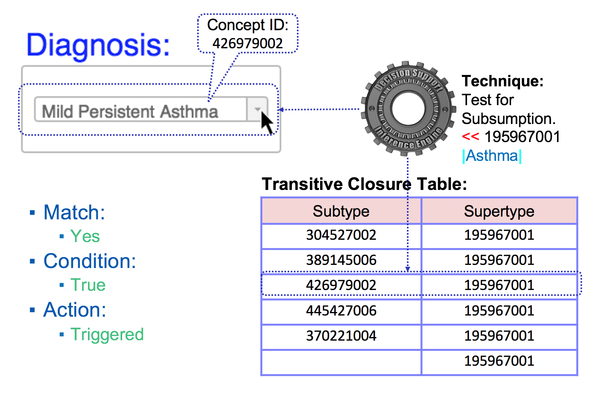<figcaption><p>The inference engine checks if the diagnosis entered is a subtype of |Asthma|</p></figcaption></figure>

### Reasoning Using Defining Relationships

In addition to the subtype relationships in SNOMED CT, attribute relationships may be used to support the definition of concepts. Only the relationships that are necessary (i.e. always true) are used as defining relationships in SNOMED CT. This is because these are the ones that produce reliable and consistent inferences. For example:

<figure>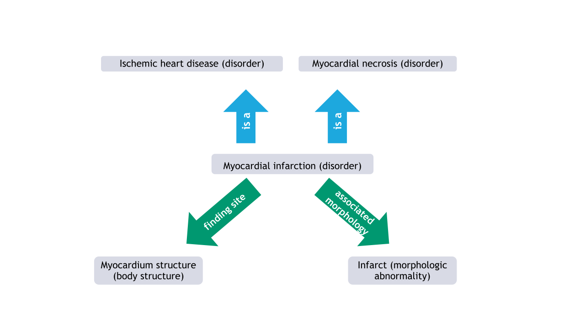<figcaption><p>Concept definition consisting of subtype (blue arrows) and defining (green arrows) relationships</p></figcaption></figure>

The <mark style="color:green;">green</mark> arrows in the diagram above show that the concept 22298006 <mark style="color:blue;">|</mark> myocardial infarction<mark style="color:blue;">|</mark> has two necessary attribute relationships that represent a characteristic of the meaning of the concept. It always has an 116676008 <mark style="color:blue;">|</mark> associated morphology<mark style="color:blue;">|</mark> of 55641003 <mark style="color:blue;">|</mark> infarct<mark style="color:blue;">|</mark>, and it always has a 363698007 <mark style="color:blue;">|</mark> finding site<mark style="color:blue;">|</mark> of 74281007 <mark style="color:blue;">|</mark> myocardium structure<mark style="color:blue;">|</mark>. The <mark style="color:blue;">blue</mark> arrows in the diagram above are used to indicate the subtype relationships.

The full definition of a concept consists of both the defining subtype relationships and the defining attribute relationships. There are over 50 attributes in SNOMED CT which can each be used as the "type" of a defining relationship, including 246075003 <mark style="color:blue;">|</mark> causative agent<mark style="color:blue;">|</mark>, 260686004 <mark style="color:blue;">|</mark> method<mark style="color:blue;">|</mark>, and 272741003 <mark style="color:blue;">|</mark> laterality<mark style="color:blue;">|</mark>.

The SNOMED CT Concept Model provides rules about how these attributes can be used to define concepts from different hierarchies. The [SNOMED CT Machine Readable Concept Model](https://app.gitbook.com/o/h8Z6qGxuQrzM9vbx5bPT/s/wLJPOzgAQsSAYr6nhvCl/) (MRCM) represents these rules in a form that can be read by a computer and applied to test that CDS criterion comply with these rules.

As previously suggested in the section [SNOMED CT Features](<1 introduction/1.1-overview.md#snomed-ct-features>), the defining relationships of SNOMED CT can be leveraged to support CDS. For additional information on using SNOMED CT defining relationships in queries, please refer to [Using Defining Relationships](https://app.gitbook.com/s/uKngFry3XF9A8phdXFe8/6-snomed-ct-analytic-techniques/6.3-using-defining-relationships) of [SNOMED CT Data Analytics Guide](https://app.gitbook.com/o/h8Z6qGxuQrzM9vbx5bPT/s/uKngFry3XF9A8phdXFe8/).

#### Example

#### CDS Rule

The diagram below shows a simple CDS rule based on the IF-condition-THEN-action pattern. This rule uses attribute refinements in the [SNOMED CT Expression Constraint Language](http://snomed.org/ecl) to define the set of procedures with a 71388002 <mark style="color:blue;">|</mark> Procedure site<mark style="color:blue;">|</mark> that is a type of 20139000 <mark style="color:blue;">|</mark> Structure of the respiratory system<mark style="color:blue;">|</mark>.

<figure>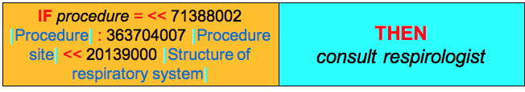<figcaption><p>CDS rule which uses a defining relationship in its definition</p></figcaption></figure>

Using attribute refinements in the CDS rule criteria facilitates richer expressivity and specificity in the rules. For example, we can restrict pharmaceutical/biological products based on their active ingredients, procedures based on their methods, and disorders based on their finding sites.

### Execution of Rule

When executing this rule, the inference engine must process the defining relationships of each 71388002 <mark style="color:blue;">|</mark> Procedure<mark style="color:blue;">|</mark> concept to determine which ones have a 363704007 <mark style="color:blue;">|</mark> Procedure site<mark style="color:blue;">|</mark> that is a type of 20139000 <mark style="color:blue;">|</mark> Structure of respiratory system<mark style="color:blue;">|</mark>. These relationships are distributed as part of SNOMED CT's Release Format 2 relationship file, which can be searched by a terminology service to discover relationships that match the given attribute refinement.

The diagram below illustrates the process followed by the inference engine in executing the CDS condition in the above rule, when the clinician selects the therapy 386565009 <mark style="color:blue;">|</mark>Postural drainage therapy<mark style="color:blue;">|</mark>. Once the inference engine has found the defining relationships whose source is 386565009 <mark style="color:blue;">|</mark>Postural drainage therapy<mark style="color:blue;">|</mark> and whose type is 363704007 <mark style="color:blue;">|</mark> Procedure site<mark style="color:blue;">|</mark>, it determines whether the destination of these relationships is either 20139000 <mark style="color:blue;">|</mark> Structure of respiratory system<mark style="color:blue;">|</mark> or a subtype of 20139000 <mark style="color:blue;">|</mark> Structure of respiratory system<mark style="color:blue;">|</mark> (e.g. using a transitive closure table). Since the given procedure has a 363704007 <mark style="color:blue;">|</mark> Procedure site<mark style="color:blue;">|</mark> equal to 20139000 <mark style="color:blue;">|</mark> Structure of respiratory system<mark style="color:blue;">|</mark>, the condition in the rule evaluates to true, and the action is triggered.

<figure>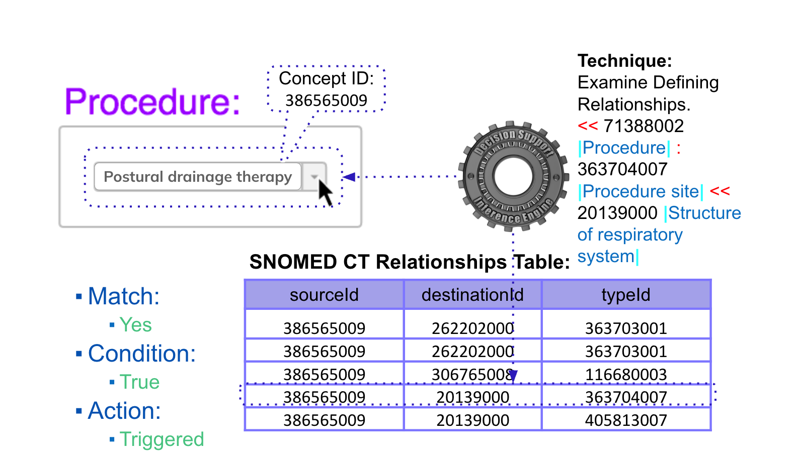<figcaption><p>The inference engine checks if the diagnosis entered has a defining relationship which states that the |Procedure site| is |Structure of respiratory system| or a subtype.</p></figcaption></figure>

### Reasoning with Description Logic

Description logic (DL) reasoners can apply additional logic-based techniques to assist with clinical decision support reasoning. Two of the DL techniques supported by SNOMED CT have been briefly described below.

It is also worth pointing out that DL can be applied over the terminology or to the terminology in combination with the record structure. For more information on this topic, please refer to sections [Description Logic Over Terminology](https://app.gitbook.com/s/uKngFry3XF9A8phdXFe8/6-snomed-ct-analytic-techniques/6.4-description-logic-over-terminology) and [Description Logic Over Terminology and Structure](https://app.gitbook.com/s/uKngFry3XF9A8phdXFe8/6-snomed-ct-analytic-techniques/6.5-description-logic-over-terminology-and-structure) in the [SNOMED CT Data Analytics Guide](https://app.gitbook.com/o/h8Z6qGxuQrzM9vbx5bPT/s/uKngFry3XF9A8phdXFe8/).

#### Expression Subsumption

SNOMED CT supports the use of postcoordinated expressions to define additional clinical meanings beyond the standard precoordinated concepts. Postcoordinated expressions are comprised of two or more concepts, and are structured in accordance with the compositional grammar. A simple example of a postcoordinated expression is:

```

399963005 |Abrasion|:
363698007 |Finding site| = 67269001 |Skin structure of ankle|

```

This can be read as "an abrasion with a finding site of skin of ankle".

When postcoordinated expressions are used to capture and record clinical meaning in a health record, the CDS inference engine may need to be able to test if one expression subsumes another to execute the CDS rules. For example, it would be reasonable to conclude that the first expression listed below, subsumes the second expression if you were aware that 40196000 <mark style="color:blue;">|</mark> Mild pain<mark style="color:blue;">|</mark> is subsumed by 22253000 <mark style="color:blue;">|</mark> Pain<mark style="color:blue;">|</mark>.

<table data-header-hidden><thead><tr><th width="448.37109375"></th><th width="179.8046875"></th><th width="483.58984375"></th></tr></thead><tbody><tr><td>373572006 <mark style="color:blue;">|</mark>Clinical finding absent<mark style="color:blue;">|</mark> <mark style="color:red;">:</mark><br>246090004 <mark style="color:blue;">|</mark>Associated finding<mark style="color:blue;">|</mark> <mark style="color:red;">=</mark> 22253000 <mark style="color:blue;">|</mark>Pain<mark style="color:blue;">|</mark></td><td><div><figure><figcaption></figcaption></figure></div></td><td>373572006 <mark style="color:blue;">|</mark>Clinical finding absent<mark style="color:blue;">|</mark> <mark style="color:red;">:</mark><br>246090004 <mark style="color:blue;">|</mark>Associated finding<mark style="color:blue;">|</mark> <mark style="color:red;">=</mark> 40196000 <mark style="color:blue;">|</mark>Mild pain<mark style="color:blue;">|</mark></td></tr></tbody></table>

However, many expressions are much more complex than this and may involve multiple focus concepts, attribute groups, and nesting as examples. There are a couple of methods which can be utilized to determine if one expression subsumes another. The first process, which is a manual process, involves normalizing the expressions, comparing the primitive focus concepts, and then comparing the defining attributes. The other is an automated process which can be used to compare expressions for subsumption. Expressions can be imported into a description logic classifier and classified in the same way as SNOMED CT concept definitions, which tests for subsumption in the process.

#### Property Chaining

The transitive nature of the 116680003 <mark style="color:blue;">|</mark> is a<mark style="color:blue;">|</mark> attribute allows us to make subtype inferences. This topic was explored in the section on [Reasoning using Subsumption](4-inference-engine.md#reasoning-using-subsumption). In some cases, different types of attribute relationships may be related to one another in such a way that additional inferences are possible. For example (using fictitious concepts) if Lucy <mark style="color:red;">619999999100</mark> <mark style="color:blue;">|</mark> Has sister<mark style="color:blue;">|</mark> Beth, and Beth <mark style="color:red;">629999999107</mark> <mark style="color:blue;">|</mark> Has daughter<mark style="color:blue;">|</mark> Jane, then Lucy <mark style="color:red;">639999999109</mark> <mark style="color:blue;">|</mark> Has niece<mark style="color:blue;">|</mark> Jane. The chain from <mark style="color:red;">619999999100</mark> <mark style="color:blue;">|</mark> Has sister<mark style="color:blue;">|</mark> to <mark style="color:red;">629999999107</mark> <mark style="color:blue;">|</mark> Has daughter<mark style="color:blue;">|</mark> implies <mark style="color:red;">639999999109</mark> <mark style="color:blue;">|</mark> Has niece<mark style="color:blue;">|</mark>. This rule can be expressed as:

<table data-header-hidden><thead><tr><th width="237.50390625"></th><th width="40"></th><th width="270.2265625"></th><th width="54.08203125"></th><th width="243.43359375"></th></tr></thead><tbody><tr><td><mark style="color:red;">619999999100</mark> <mark style="color:blue;">|</mark> Has sister<mark style="color:blue;">|</mark></td><td>o</td><td><mark style="color:red;">629999999107</mark> <mark style="color:blue;">|</mark> Has daughter<mark style="color:blue;">|</mark></td><td>→</td><td><mark style="color:red;">639999999109</mark> <mark style="color:blue;">|</mark> Has niece<mark style="color:blue;">|</mark></td></tr></tbody></table>

At present, the only property chain recognized in the International Edition of SNOMED CT is from <mark style="color:blue;">|</mark> Direct substance<mark style="color:blue;">|</mark> to <mark style="color:blue;">|</mark> Active ingredient<mark style="color:blue;">|</mark> and can be expressed as such:

<table data-header-hidden><thead><tr><th width="252.62890625"></th><th width="40"></th><th width="284.11328125"></th><th width="43.140625"></th><th width="272.13671875"></th></tr></thead><tbody><tr><td>363701004 <mark style="color:blue;">|</mark> Direct substance<mark style="color:blue;">|</mark></td><td>o</td><td>127489000 <mark style="color:blue;">|</mark> Has active ingredient<mark style="color:blue;">|</mark></td><td>→</td><td>363701004 <mark style="color:blue;">|</mark> Direct substance<mark style="color:blue;">|</mark></td></tr></tbody></table>

This can be used to provide a link from product administration (as part of a procedure) to substance administration. Additional property chains can be added at the local implementation level, if required.

## Accessing Clinical Records

This section describes the approaches that inference engines use to access EHR records for CDS. The CDS rules that an inference engine executes typically include references to EHR records and terminology. There are two general approaches to accessing health records from these CDS artifacts. The first is the direct access approach, in which a reference to the physical store is used. A simple example of this would be a reference to a patient diagnosis in a database table. The other approach is to base the CDS references on a common logical information model, and then map this to one or more physical datastores, as required. This approach enables a more standardized approach to the development of CDS rules and other artifacts. These two approaches are described in more detail below, along with some of the advantages, challenges, and examples. Please note that standards for accessing clinical records will be discussed in section [Standards for Accessing Clinical Records](4-inference-engine.md#standards-for-accessing-clinical-records). Approaches to access the terminology which will be discussed in section [Accessing Terminology](4-inference-engine.md#accessing-terminology).

#### Direct Access

Perhaps the most obvious approach to accessing health records is to use direct references to the locations in the clinical record store that will be used in a CDS rule. Many consider this the more common approach for point of care (POC) decision support today. For example, the pointers within a CDS rule could be expressed to reference a schema, table, and column in an SQL database. This approach requires a detailed knowledge of how the EHR data is stored to achieve an appropriate outcome from CDS tools. The challenge with this approach is that it can be more difficult to share CDS artifacts across institutions that may use different physical data stores.

#### Logical Model

The logical model approach aims to standardize all references to EHR data, by specifying a common logical information model upon which all CDS rules are defined. This enables CDS rules to be shared and reused in different physical implementations. However, an additional transformation is usually required for each physical EHR store, to convert the logical references into physical ones. Examples of the logical model approach are presented in section **Standards for Accessing Clinical Records**.

### Standards for Accessing Clinical Records

This section presents some examples of standards for accessing clinical records. Please note that this list is not complete, and other standards and formalisms for accessing clinical records do exist.

#### Clinical Information Modeling Initiative

[The HL7 Clinical Information Modeling Initiative (CIMI) is an HL7 International working group, which aims to improve the interoperability of healthcare systems by providing a shared open library of implementable clinical information models](#user-content-fn-2)[^2]. CIMI clinical models, which are defined using computable formalisms such as the Archetype Definition Language (ADL) and Archetype Modeling Language (AML), are based on a common reference model using a common set of data types. CIMI models also have formal bindings to standard terminologies, including SNOMED CT and LOINC. SNOMED CT has been selected as the primary reference terminology for CIMI's clinical models. A number of CDS efforts within HL7 International are expected to use CIMI clinical models as the basis for referencing clinical data within CDS artifacts. For more information on CIMI please refer to [Clinical Information Modeling Initiative (opencimi.org)](http://opencimi.org/) and [Clinical Information Modeling Initiative (HL7 work group)](http://www.hl7.org/Special/Committees/cimi/index.cfm).

#### Quality Information and Clinical Knowledge model

The [Quality Improvement Core](#user-content-fn-3)[^3] (QICore) Implementation Guide is a U.S. realm-specific CDS initiative that references a logical model called the Quality Information and Clinical Knowledge ([QUICK](http://hl7.org/fhir/us/qicore/2016Sep/quick/)) model. The QUICK model (which is expected to be aligned with CIMI formalisms) will provide a uniform way for clinical decision support and quality measures in the U.S. to refer to clinical data. The QUICK logical model is defined as a series of QICore specific FHIR profiles. It provides a way for applications to access data using FHIR interfaces. Several of these QICore profiles have bindings to SNOMED CT value sets in their definition. For example, the Condition model (shown below) binds a 'SNOMED CT Body Structure' value set to the data element 'bodySite'.

<figure>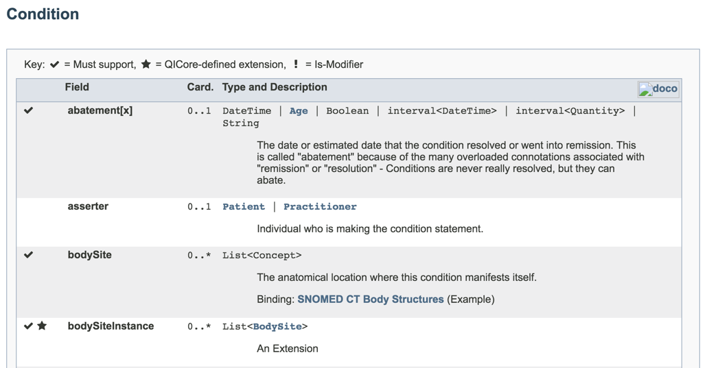<figcaption><p>QUICK Conditions model</p></figcaption></figure>

The QUICK logical model provides the basis upon which the FHIR RESTful interfaces refer to clinical data in a CDS service. For more information on QICore please refer to [Quality Improvement Core (QI-Core) Implementation Guide](http://hl7.org/fhir/us/qicore/2016Sep/).

#### Virtual Medical Record

The Virtual Medical Record (vMR) for CDS is an HL7 standard, which describes a standardized “virtual interface” for CDSSs to refer to the data in clinical records. The vMR logical data model is based on the HL7 V3 RIM (Reference Information Model). [Developing CDS rules can be time-consuming and costly. Hence, the key goal of the vMR is to provide a simplified common information model upon which sharable CDS resources can be developed](#user-content-fn-4)[^4]. [To implement the vMR, each EHR system must create a virtual interface that exposes its clinical data in the standardized vMR format, to facilitate shared CDS logic working across multiple EHR systems](#user-content-fn-5)[^5]. An example of an expression, written in terms of the HL7 vMR, which could be used in a CDS rule, is shown below. This expression asserts that a patient has a condition of 195967001 <mark style="color:blue;">|</mark> Asthma<mark style="color:blue;">|</mark> that has a status of 55561003 <mark style="color:blue;">|</mark> Active<mark style="color:blue;">|</mark>.

Example from HL7 Version 3 Standard: Clinical Decision Support; Virtual Medical Record (vMR) Logical Model, Release 2

vMR expression example

```javascript

clinicalstatement[xsi:type=“vmr:Problem” and

/templateId[root=“2.16.840.1.113883.3.1829.11.7.2.5”] and

/conditionCode[codeSystem=“2.16.840.1.113883.6.96” and code=“195967001”] and

/conditionEffectiveTime[/low[value<=“20130814”]] and

/conditionStatus[codeSystem=“2.16.840.1.113883.6.96” and code=“55561003”]

] 
```

The vMR's data model includes clinical findings, problems, allergies, adverse advents and patient history. The vMR was also optimized to permit CDS languages such as [GELLO](4-inference-engine.md#gello) to reference a standard model of clinical data. For more information about the HL7 vMR please refer to the [HL7 Version 3 Standard: Clinical Decision Support; Virtual Medical Record (vMR) Logical Model, Release 2](http://www.hl7.org/implement/standards/product_brief.cfm?product_id=338).

#### GELLO

GELLO[^6] is an object-oriented programming language that can be used to support access to health record data in CDS. It has been adopted by ANSI and HL7 as a language used in CDS and GELLO Release 2 now part of the HL7 v3 product suite.

GELLO provides a standardized interface and query language for accessing data in health information systems. Expressions can also be defined to compare data values and attributes. These values and attributes can then be used in decision support knowledge resources such as rules and guidelines. GELLO works hand in hand with the [Virtual Medical Record](4-inference-engine.md#virtual-medical-record) (vMR). A major advantage of this approach is that GELLO code can be used in different environments where health data is stored using a variety of formats and technologies.

Using GELLO with the vMR ensures that the code does not alter the physical medical record. It can also be used to answer complex queries and to query a reference terminology such as SNOMED CT. The example screen shot below illustrates how SNOMED CT refinements can be used in a GELLO expression:

<figure>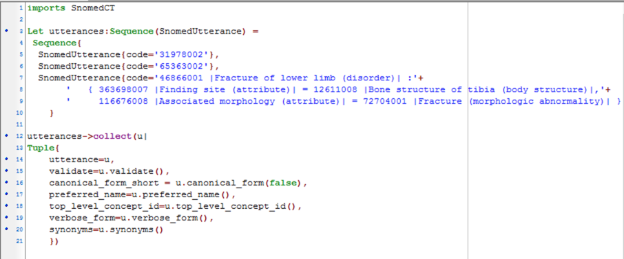<figcaption><p>GELLO expression using SNOMED CT refinement</p></figcaption></figure>

For more information about GELLO, please refer to [HL7 Version 3 Standard: GELLO, A Common Expression Language, Release 2](http://www.hl7.org/implement/standards/product_brief.cfm?product_id=5) or [http://gello.org](http://gello.org/).

## Accessing Terminology

As references to terminology codes may exist in both health records and CDS artifacts, the inference engine needs to be able to access terminology services to execute CDS logic. Furthermore, to maximize the benefits of using SNOMED CT, additional terminology operations, such as finding descendants of a concept and finding the value of a defining relationship, can be used. For example, a CDS rule may refer to all the descendants of 56265001 <mark style="color:blue;">|</mark> Heart disease<mark style="color:blue;">|</mark> to ensure that a specific cardiology CDS rule is applied to all applicable diagnoses. Similarly, a CDS rule may need to find all the active ingredients in a medication, to ensure that a contra-indication does not occur.

This section discusses some of the options that a CDS inference engine can use to access terminology content.

### Terminology Services

As discussed in section [EHR System Architecture](2-logical-architecture.md#ehr-system-architecture), terminology services are those services required to load, update, access and make effective use of terminology content. Terminology services provide important functions to CDSSs, such as term searching (i.e. synonyms), definitional and reference set querying, and retrieval of map data. It is also useful if Terminology Services support the execution of the [Expression Constraint Language](https://app.gitbook.com/o/h8Z6qGxuQrzM9vbx5bPT/s/sOJBD7YbxAy9bD1Ko9L9/), as this is a standardized way of representing terminology queries in CDS rules. For more information on Terminology services, please refer to the [SNOMED CT Terminology Services Guide](https://app.gitbook.com/o/h8Z6qGxuQrzM9vbx5bPT/s/t4wRQcj6gyQPunraJrP0/).

### SNOMED CT APIs

An application programming interface (API) for a SNOMED CT enabled terminology server can be used to execute SNOMED CT searches and queries. The principle benefit of using a terminology server API is the reusability. Other systems are able to access terminology services without having to re-implement their functionality. Another key benefit is that the internal workings of the solution can be modified, improved, upgraded without impacting the external interfaces. For example, SNOMED CT can be updated, without necessitating any changes to the external systems which use terminology services. A number of commercial terminology servers offer proprietary APIs that enable SNOMED CT search and query. [These include Dataline’s SnAPI solution and B2i’s Snow Owl Terminology Server](#user-content-fn-7)[^7]. The following diagram depicts how the individual terminology services interact with the terminology store:

<figure>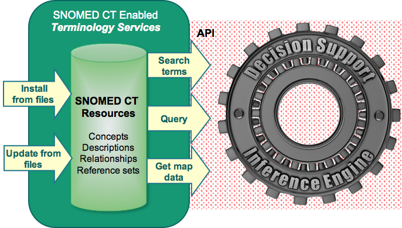<figcaption><p>Terminology services and terminology store interactions</p></figcaption></figure>

Services that load the terminology data into the server, either for installation or updating are illustrated on the left, while services which search and query over the installed terminology content are depicted on the right. The diagram also shows how the services depicted on the right could be made available to other services and components such as a CDS inference engine through the use of an API.

### Standardized Terminology APIs

Standardized APIs for terminology services are also available. For example, HL7's specification for a [FHIR Terminology Service](#user-content-fn-8)[^8], which is described as a service that lets healthcare applications make use of codes, code systems, and value sets without having to become experts in the fine details of terminology. The services provided include code lookup and validation, value set expansion, subsumption testing, and maintaining a transitive closure table. HL7 has also published Common Terminology Services 2 (CTS2) which provides a standardized API that supports access to terminology servers which may contain a variety of code systems, including SNOMED CT.

***

<a href="https://docs.google.com/forms/d/e/1FAIpQLScTmbZIf0UEQwYDkY27EEWBkaiYkHSbR0_9DmFrMLXoQLyL7Q/viewform?usp=pp_url&#x26;entry.1767247133=CDS+Guide&#x26;entry.670899847=Inference%20Engine" class="button primary">Provide Feedback</a>

[^1]: Diagram uses notation from [Diagramming Guideline](https://app.gitbook.com/o/h8Z6qGxuQrzM9vbx5bPT/s/M5YwUfVkVdFLDT6IXbBg/)

[^2]: [http://www.hl7.org/Special/Committees/cimi/overview.cfm](http://www.hl7.org/Special/Committees/cimi/overview.cfm)

[^3]: [http://hl7.org/fhir/us/qicore/2016Sep/index.html](http://hl7.org/fhir/us/qicore/2016Sep/index.html)

[^4]: HL7 Decision Support Service (DSS) and Virtual Medical Record (vMR) Standards, and OpenCDS Open-Source Implementation presentation, Kawamoto

[^5]: [http://www.hl7.org/implement/standards/product\_brief.cfm?product\_id=338](http://www.hl7.org/implement/standards/product_brief.cfm?product_id=338)

[^6]: [https://kb.medical-objects.com.au/display/PUB/GELLO](https://kb.medical-objects.com.au/display/PUB/GELLO)

[^7]: [http://snomed.org/analytics](http://snomed.org/analytics)

[^8]: [http://hl7.org/fhir/terminology-module.html](http://hl7.org/fhir/terminology-module.html)
