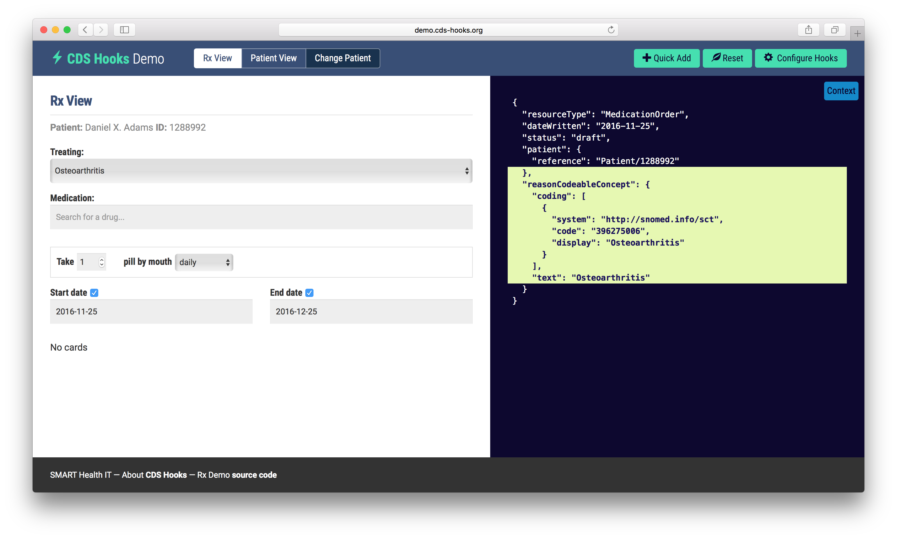

# 5.1. Standards for CDS Communications

An example of a standard which relates to CDS communications is provided below.

# CDS Hooks

CDS Hooks is a relatively new CDS initiative which aims to automate the launching of applications that assist with decision support. CDS Hooks are designed around the premise of a clinician initiating a triggering activity within the EHR. When the triggering activity occurs, the EHR automatically sends a notification in real time to a decision support service (DSS).[1](https://confluence.ihtsdotools.org/display/DOCCDS/5.1.+Standards+for+CDS+Communications#Footnote1 "Footnote: Click here to display the footnote") This notification is considered the "hook" to the decision support logic. An example of a triggering activity would be a clinician writing a prescription. Some pre-defined hooks have already been developed and new hooks can be defined and added to the catalogue as required. Once the DSS is aware of the specific event, it may generate a response in the form of a "card" to be displayed in the UI of the EHR. An example of an "information" card might be one that contains pricing data about a proposed drug. The DSS could then propose a more cost effective "suggestion" card as an alternative. The other type of card the DSS may offer is an "app link" card which, as the names suggests, provides a link to an external application that can assist with further decision support. This architecture eliminates the need for the user to be aware of specific decision support applications that may be useful. The final outcome or choice, initiated by the app link card process, can then be automatically transferred to the appropriate field(s) in the EHR. A clinician has the option to accept or decline any suggestions present in the card. References to external knowledge resources may also be present in CDS Hooks cards.

The screen shot[2](https://confluence.ihtsdotools.org/display/DOCCDS/5.1.+Standards+for+CDS+Communications#Footnote2 "Footnote: Click here to display the footnote") below captures part of a CDS hook. Note that the condition the clinician is treating is represented using the SNOMED CT code for [ 396275006 | Osteoarthritis|](http://snomed.info/id/396275006 "396275006 | Osteoarthritis |") .

<figure><figcaption>
Figure 5.1-1: CDS Hooks demonstration tool
</figcaption></figure>

For more information about CDS Hooks, please refer to <http://cds-hooks.org/>.

* * *

Footnotes Ref | Notes  
---|---  
[1](https://confluence.ihtsdotools.org/display/DOCCDS/5.1.+Standards+for+CDS+Communications#FootnoteMarker1-0 "Footnote: Click to return to reference in text") |  [HL7](http://www.hl7.org/implement/standards/product_brief.cfm?product_id=12) definition of DSS: "A Decision Support Service takes in patient data as the input and provides back patient-specific assessments and recommendations."  
[2](https://confluence.ihtsdotools.org/display/DOCCDS/5.1.+Standards+for+CDS+Communications#FootnoteMarker2-0 "Footnote: Click to return to reference in text") |  Screen shot from [CDS Hooks Demo](http://demo.cds-hooks.org/)
