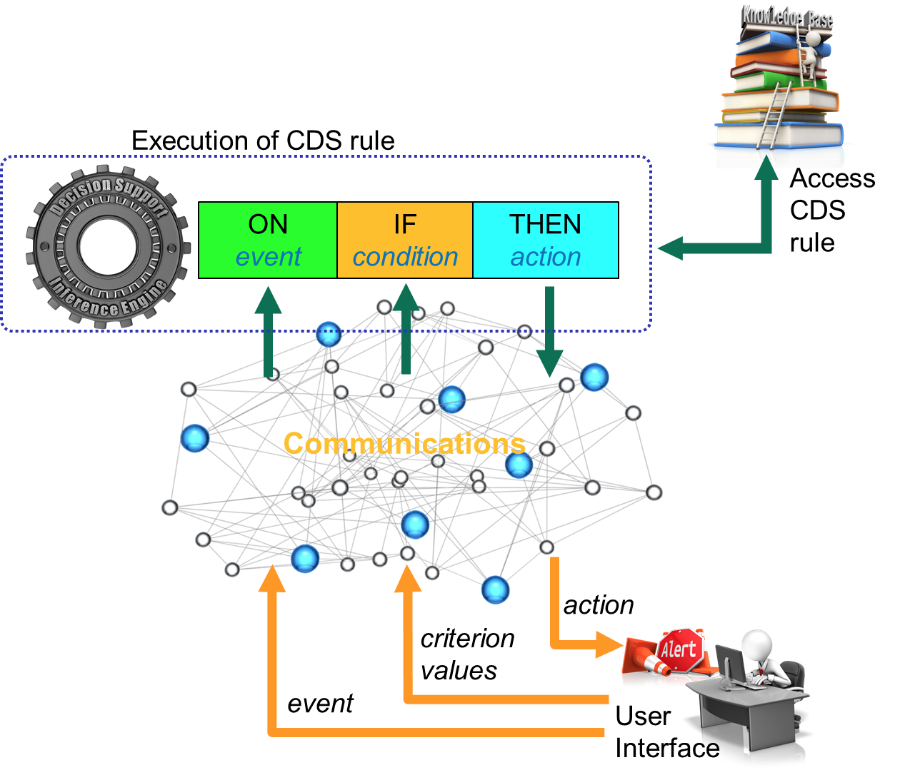

# 5. Communications

## Overview

The purpose of the communications mechanism is to handle CDS communications into and out of the system. Examples of user inputs include entry of clinical data, and the selection of a proposed drug, order set, or treatment regime. Examples of outputs include CDS interventions such as alerts, guidelines, diagnostic refinements, and smart forms. These outputs are typically delivered to the u ser interface. SNOMED CT has limited involvement in the communications mechanism of CDS as most of the codes and features will be used by the knowledge base and inference engine. That being said, it is possible that SNOMED CT terms are used at the user interface level as part of the data entry process. For more information on using SNOMED CT to support data entry, please refer to the [SNOMED CT Search and Data Entry Guide](https://confluence.ihtsdotools.org/display/DOCSEARCH/SNOMED+CT+Search+and+Data+Entry+Guide). SNOMED CT can also be used in the CDSS outputs. For example, using the relevant terms in the alert messages, populating smart forms with SNOMED CT codes, or linking terms in CDS guidelines to other appropriate clinical knowledge sources. 

The figure below depicts the key interactions of the CDS communications mechanism.

<figure><figcaption>
Figure 5-1: Communications key interactions
</figcaption></figure>

Once the inference engine has determined that an intervention is appropriate, the communications mechanism takes over and handles its delivery. Conversely, user inputs are also delivered into the CDSS by the communications mechanism. Note that guidelines or knowledge resources may reference externally hosted content, which may be accessed by the user via a link. An example of this would be a PubMed[1](https://confluence.ihtsdotools.org/display/DOCCDS/5.+Communications#Footnote1 "Footnote: Click here to display the footnote") citation for biomedical literature.

Note that the diagram also shows how the internal CDSS communications (associated with the external inputs and outputs) are related to the components of the CDS rule. The communication 'inputs' feed into the event (from "ON event") and the condition (from "IF condition") components of the rules, while the 'outputs' are the result of the action (from "THEN action") that is performed if the event occurs and condition is true. 

## Example

The following screenshot[2](https://confluence.ihtsdotools.org/display/DOCCDS/5.+Communications#Footnote2 "Footnote: Click here to display the footnote") was generated from an EHR with CDS capabilities. This illustrates what a typical CDS intervention may look like.

<figure><figcaption>
Figure 5-2: User Interface depicting CDS intervention which links to knowledge resource
</figcaption></figure>

Note that the contents of this alert have been magnified for the purpose of this illustration. Characteristics of this alert include:

  * It appears at the top of the screen using fonts and colors that help to distinguish it from other content. (Alerts, by design, are intended to be noticed.)
  * It includes mechanisms to process the intervention as appropriate (e.g. to acknowledge, accept or discard the alert). In this case, the alert my be closed (by clicking the X) or the suggestion to order a lab test may be accepted (by clicking on "order a lab").
  * It provides a link to applicable reference information (as illustrated above by the PubMed[3](https://confluence.ihtsdotools.org/display/DOCCDS/5.+Communications#Footnote3 "Footnote: Click here to display the footnote") screenshot.)

  * It includes an option to "minimize notifications". This option allows the user to minimize the number of alerts displayed, by selecting the types of alerts they wish to receive in their user preferences.

## Alert Fatigue

Alert fatigue[4](https://confluence.ihtsdotools.org/display/DOCCDS/5.+Communications#Footnote4 "Footnote: Click here to display the footnote") is an unwanted side effect of CDS. Alert fatigue occurs when clinicians become overwhelmed by or desensitized to CDS alerts because of their sheer number, intrusive nature, or non-relevance to a clinical situation. The danger of alert fatigue is that the clinician will miss something important as a result. Strategies are required to minimize alert fatigue. Some of the interesting ideas proposed by thought leaders in CDS include:

  * Increasing the specificity of alerts;
  * Allowing users to customize CDS alerts by types of interventions
  * Using a human factors approach to designing alerts

SNOMED CT is able to help with the first two items above. Firstly, it can be used to increase the specificity of the CDS conditions that trigger the alerts. And secondly, it can be used to distinguish between different types of interventions to enable customization to occur. Please refer to [False Positives and False Negatives](3.1.1.-Context-in-CDS-Rules_123897485.html#id-3.1.1.ContextinCDSRules-FalsePositivesAndFalseNegatives) in the section Context in CDS Rules for more information on minimizing alert fatigue.

* * *

Footnotes Ref | Notes  
---|---  
[1](https://confluence.ihtsdotools.org/display/DOCCDS/5.+Communications#FootnoteMarker1-0 "Footnote: Click to return to reference in text") |  <https://www.ncbi.nlm.nih.gov/pubmed/>  
[2](https://confluence.ihtsdotools.org/display/DOCCDS/5.+Communications#FootnoteMarker2-0 "Footnote: Click to return to reference in text") |  Screenshot provided by [Practice Fusion](http://www.practicefusion.com/electronic-health-record-ehr/).   
[3](https://confluence.ihtsdotools.org/display/DOCCDS/5.+Communications#FootnoteMarker3-0 "Footnote: Click to return to reference in text") |  <https://www.ncbi.nlm.nih.gov/pmc/articles/PMC3534745/>  
[4](https://confluence.ihtsdotools.org/display/DOCCDS/5.+Communications#FootnoteMarker4-0 "Footnote: Click to return to reference in text") |  Uses content from: <https://psnet.ahrq.gov/primers/primer/28/alert-fatigue>
