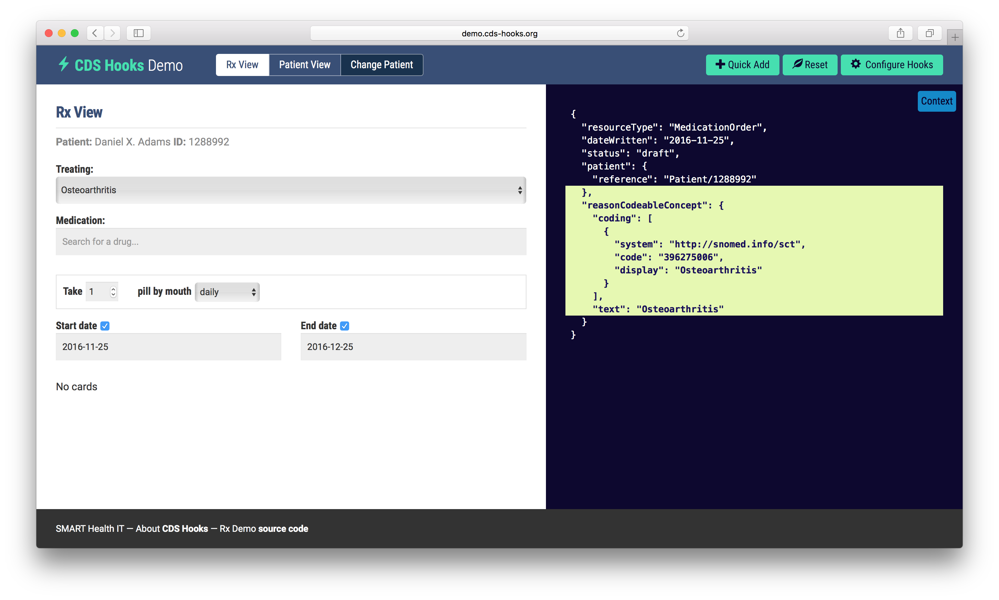

# Communications

## Overview

The purpose of the communications mechanism is to handle CDS communications into and out of the system. Examples of user inputs include entry of clinical data, and the selection of a proposed drug, order set, or treatment regime. Examples of outputs include CDS interventions such as alerts, guidelines, diagnostic refinements, and smart forms. These outputs are typically delivered to the u ser interface. SNOMED CT has limited involvement in the communications mechanism of CDS as most of the codes and features will be used by the knowledge base and inference engine. That being said, it is possible that SNOMED CT terms are used at the user interface level as part of the data entry process. For more information on using SNOMED CT to support data entry, please refer to the [SNOMED CT Search and Data Entry Guide](https://app.gitbook.com/o/h8Z6qGxuQrzM9vbx5bPT/s/CEAcChvWjWEu16YmwNrz/). SNOMED CT can also be used in the CDSS outputs. For example, using the relevant terms in the alert messages, populating smart forms with SNOMED CT codes, or linking terms in CDS guidelines to other appropriate clinical knowledge sources.

The figure below depicts the key interactions of the CDS communications mechanism.

<figure><figcaption>
Communications key interactions
</figcaption></figure>

Once the inference engine has determined that an intervention is appropriate, the communications mechanism takes over and handles its delivery. Conversely, user inputs are also delivered into the CDSS by the communications mechanism. Note that guidelines or knowledge resources may reference externally hosted content, which may be accessed by the user via a link. An example of this would be a PubMed[^1] citation for biomedical literature.

Note that the diagram also shows how the internal CDSS communications (associated with the external inputs and outputs) are related to the components of the CDS rule. The communication 'inputs' feed into the event (from "ON event") and the condition (from "IF condition") components of the rules, while the 'outputs' are the result of the action (from "THEN action") that is performed if the event occurs and condition is true.

## Example

The following screenshot[^2] was generated from an EHR with CDS capabilities. This illustrates what a typical CDS intervention may look like.

<figure><figcaption>
User Interface depicting CDS intervention which links to knowledge resource
</figcaption></figure>

Note that the contents of this alert have been magnified for the purpose of this illustration. Characteristics of this alert include:

* It appears at the top of the screen using fonts and colors that help to distinguish it from other content. (Alerts, by design, are intended to be noticed.)
* It includes mechanisms to process the intervention as appropriate (e.g. to acknowledge, accept or discard the alert). In this case, the alert my be closed (by clicking the X) or the suggestion to order a lab test may be accepted (by clicking on "order a lab").
* It provides a link to applicable reference information ([as illustrated above by the PubMed screenshot](#user-content-fn-3)[^3].)
* It includes an option to "minimize notifications". This option allows the user to minimize the number of alerts displayed, by selecting the types of alerts they wish to receive in their user preferences.

## Alert Fatigue

[Alert fatigue](#user-content-fn-4)[^4] is an unwanted side effect of CDS. Alert fatigue occurs when clinicians become overwhelmed by or desensitized to CDS alerts because of their sheer number, intrusive nature, or non-relevance to a clinical situation. The danger of alert fatigue is that the clinician will miss something important as a result. Strategies are required to minimize alert fatigue. Some of the interesting ideas proposed by thought leaders in CDS include:

* Increasing the specificity of alerts;
* Allowing users to customize CDS alerts by types of interventions
* Using a human factors approach to designing alerts

SNOMED CT is able to help with the first two items above. Firstly, it can be used to increase the specificity of the CDS conditions that trigger the alerts. And secondly, it can be used to distinguish between different types of interventions to enable customization to occur. Please refer to [False Positives and False Negatives](3-knowledge-base/3.1-rules.md#false-positives-and-false-negatives) in the section Context in CDS Rules for more information on minimizing alert fatigue.

***

## Standards for CDS Communications

An example of a standard which relates to CDS communications is provided below.

### CDS Hooks

CDS Hooks is a relatively new CDS initiative which aims to automate the launching of applications that assist with decision support. CDS Hooks are designed around the premise of a clinician initiating a triggering activity within the EHR. When the triggering activity occurs, the EHR automatically sends a notification in real time to a decision support service (DSS[^5]). This notification is considered the "hook" to the decision support logic. An example of a triggering activity would be a clinician writing a prescription. Some pre-defined hooks have already been developed and new hooks can be defined and added to the catalogue as required. Once the DSS is aware of the specific event, it may generate a response in the form of a "card" to be displayed in the UI of the EHR. An example of an "information" card might be one that contains pricing data about a proposed drug. The DSS could then propose a more cost effective "suggestion" card as an alternative. The other type of card the DSS may offer is an "app link" card which, as the names suggests, provides a link to an external application that can assist with further decision support. This architecture eliminates the need for the user to be aware of specific decision support applications that may be useful. The final outcome or choice, initiated by the app link card process, can then be automatically transferred to the appropriate field(s) in the EHR. A clinician has the option to accept or decline any suggestions present in the card. References to external knowledge resources may also be present in CDS Hooks cards.

The [screen shot](#user-content-fn-6)[^6] below captures part of a CDS hook. Note that the condition the clinician is treating is represented using the SNOMED CT code for 396275006 <mark style="color:blue;">|</mark> Osteoarthritis<mark style="color:blue;">|</mark>.

<figure><figcaption>
CDS Hooks demonstration tool
</figcaption></figure>

For more information about CDS Hooks, please refer to [http://cds-hooks.org/](http://cds-hooks.org/).

<a href="https://docs.google.com/forms/d/e/1FAIpQLScTmbZIf0UEQwYDkY27EEWBkaiYkHSbR0_9DmFrMLXoQLyL7Q/viewform?usp=pp_url&#x26;entry.1767247133=CDS+Guide&#x26;entry.670899847=Communications" class="button primary">Provide Feedback</a>

[^1]: [https://www.ncbi.nlm.nih.gov/pubmed/](https://www.ncbi.nlm.nih.gov/pubmed/)

[^2]: Screenshot provided by [Practice Fusion](http://www.practicefusion.com/electronic-health-record-ehr/).

[^3]: [https://www.ncbi.nlm.nih.gov/pmc/articles/PMC3534745/](https://www.ncbi.nlm.nih.gov/pmc/articles/PMC3534745/)

[^4]: Uses content from: [https://psnet.ahrq.gov/primers/primer/28/alert-fatigue](https://psnet.ahrq.gov/primers/primer/28/alert-fatigue)

[^5]: [HL7](http://www.hl7.org/implement/standards/product_brief.cfm?product_id=12) definition of DSS: "A Decision Support Service takes in patient data as the input and provides back patient-specific assessments and recommendations."

[^6]: Screen shot from [CDS Hooks Demo](http://demo.cds-hooks.org/)
