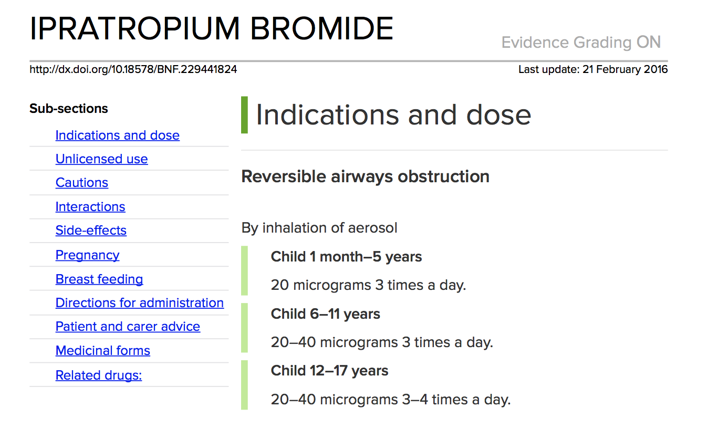

# british-national-formulary

## British National Formulary

## Overview

The BNF is used by a wide range of health professionals including pharmacists, General Practitioners (GPs), Dentists, and specialists in hospitals and in private practice. The publication is used in 129 countries around the world and is available in print and online via MedicinesComplete.[1](https://confluence.ihtsdotools.org/display/DOCCDS/British+National+Formulary#Footnote1) The BNF has commenced work on mapping content to SNOMED CT to strengthen their ontology and support integration with other systems. Adopting SNOMED CT is also in line with the [National Health Service](http://www.nhs.uk/NHSEngland/thenhs/about/Pages/overview.aspx) (NHS) implementation of SNOMED CT.

## Contents of the BNF

BNF reference material is published in electronic format as the [BNF Online](https://www.bnf.org/products/bnf-online/) via the MedicinesComplete platform. This subscription-based content includes information on drugs including indications, dosages, contraindications and advice on disease management. Identifiers from the NHS [dictionary of medicines and devices](http://dmd.medicines.org.uk/DesktopDefault.aspx?tabid=2) (dm+d) are currently represented in the BNF for drugs and preparations. In addition, the BNF uses internal identifiers for content (e.g. a drug monograph). The hierarchical structure for all content is organized by therapeutic use and drug classification. The therapeutic use hierarchy is then organized by body systems (e.g. cardiovascular system) at its top level. Drug monographs, and drug class monographs are listed underneath relevant therapeutic uses and organized in the body system hierarchy. These monographs contain the indications, contraindications, side-effects, medicinal forms, and other information specific to a particular drug or drug class.

<figure><figcaption>
Figure 1: Fragment of drug monograph for ipratropium bromide
</figcaption></figure>

## Future Plans

BNF Publications have begun to explore how SNOMED CT could be introduced to achieve a range of benefits. Mapping from drugs in the BNF to concepts in the dm+d SNOMED CT extension has been completed. All drugs are associated with one or more Virtual Therapeutic Moiety (VTM) if available, or Virtual Medicinal Product (VMP) if no VTM is available. All medicinal products are associated with the appropriate Actual Medicinal Product (AMP). Because SNOMED CT drug product concepts have defining relationships to their corresponding active ingredients (in the [105590001 | Substance|](http://snomed.info/id/105590001) hierarchy), a map from the BNF to substances is not required. For example, an _aspirin + codeine_ product in the BNF will be mapped to [412096001 | Aspirin + codeine (product)|](http://snomed.info/id/412096001) , and this concept has two [127489000 | Has active ingredient|](http://snomed.info/id/127489000) relationships - one to [105590001 | Aspirin (substance)|](http://snomed.info/id/105590001) and the other to [387494007 | Codeine|](http://snomed.info/id/387494007) . Similarly, work has commenced to map indications, side effects, and procedures to concepts in the [404684003 | Clinical finding|](http://snomed.info/id/404684003) and [71388002 | Procedure|](http://snomed.info/id/71388002) hierarchies.

The BNF is also working on an initiative to make use of standardized terms, which will supplement the free text fields used within the content. Indications are now being entered in a controlled vocabulary which makes use of drop down lists mapped to SNOMED CT subsets. This will result in more consistency to fields where the free text is drawn from [Summary of Product Characteristics](https://en.wikipedia.org/wiki/Summary_of_Product_Characteristics) (SPC) material. A similar project is planned for side-effects. Once the aforementioned mappings and standardized terms have been implemented, SNOMED CT codes will be added as metadata to the appropriate BNF content. This will subsequently enable clinical decision support to be implemented using SNOMED CT by 3rd party vendors. A 2014 public consultation proposal published by the [National Institute for Health and Care Excellence](https://www.nice.org.uk/about) (NICE) acknowledged that "the huge increase in the use of technology such as clinical decision support as well as online and mobile digital devices, offers an unparalleled opportunity to build on the BNF’s valued position in prescribing and enhance its potential". [2](https://confluence.ihtsdotools.org/display/DOCCDS/British+National+Formulary#Footnote2)

***

| Footnotes Ref                                                                                       | Notes                                                                                                                                                                                                                                                                                             |
| --------------------------------------------------------------------------------------------------- | ------------------------------------------------------------------------------------------------------------------------------------------------------------------------------------------------------------------------------------------------------------------------------------------------- |
| [1](https://confluence.ihtsdotools.org/display/DOCCDS/British+National+Formulary#FootnoteMarker1-0) | [https://www.medicinescomplete.com/about/](https://www.medicinescomplete.com/about/) \[ [a](https://confluence.ihtsdotools.org/display/DOCCDS/British+National+Formulary#FootnoteMarker1-0) [b](https://confluence.ihtsdotools.org/display/DOCCDS/British+National+Formulary#FootnoteMarker1-1) ] |
| [2](https://confluence.ihtsdotools.org/display/DOCCDS/British+National+Formulary#FootnoteMarker2-0) | [https://www.fpm.org.uk/policypublications/nicebnfcons](https://www.fpm.org.uk/policypublications/nicebnfcons)                                                                                                                                                                                    |
