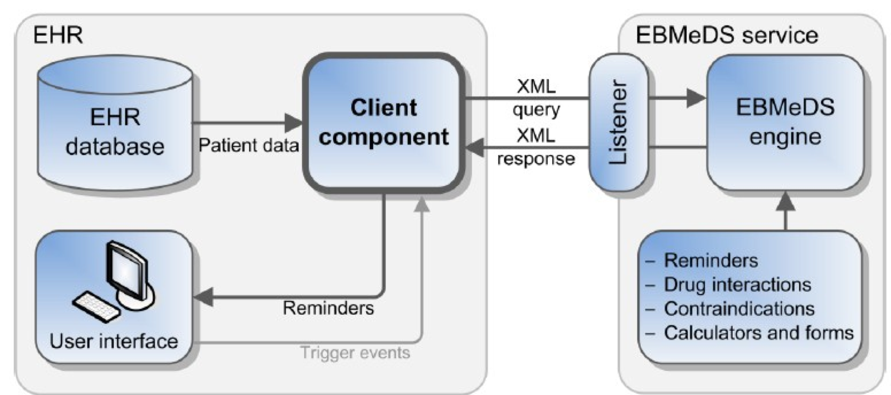

# ebmpracticenet

## EBMPracticeNet

## Overview

EBMPracticeNet is a consortium of Belgian organizations whose mission is to develop a national online knowledge base of clinical practice guidelines based on evidence-based medicine (EBM). The project is funded by RIZIV-INAMI, the Belgian national health insurer. The consortium acknowledges that clinical decision support systems play a vital role in the implementation of evidence-based medicine. EBMPracticeNet is very active in the development, evaluation, and distribution of evidence based CDS knowledge, mainly for use in primary care settings. Their users include family physicians, nurses, physical therapists, occupational therapists, pharmacists, speech therapists, patients, and eventually dentists. Clinicians will access the system through their EHRs with an [Infobutton](http://www.hl7.org/implement/standards/product_brief.cfm?product_id=208) (called "EvidenceLinker") which links coded diagnoses to relevant guidelines on the platform. The consortium is in the process of conducting an analysis to compare several terminologies to gauge which may be best suited for using encoded health records from a primary care setting with CDS services. An early version of the analysis report has identified SNOMED CT as the terminology with the most comprehensive coverage and best suited to unambiguously describe the concept.

## Technology

The EBMPracticeNet consortium hosts a platform of clinical practice guidelines. Seventy five of these are from Belgium, and an additional 1000 international guidelines have been developed by [Duodecim](../../Duodecim_123897735.html), the Finnish developers of EBM guidelines. The knowledge resources from Duodecim have been translated from its language of origin into both Dutch and French, and localized for Belgium using a variant of the [ADAPTE](http://www.g-i-n.net/document-store/working-groups-documents/adaptation/adapte-resource-toolkit-guideline-adaptation-2-0.pdf) framework. Currently all guidelines are accessible through the EHR using the EvidenceLinker, which suggests relevant guidelines based on the coded diagnosis. The EvidenceLinker currently uses ICPC-2 codes for this linkage. Additionally, EBMPracticeNet uses Duodecim’s [EBMeDS](https://confluence.ihtsdotools.org/display/WIPCDS/Duodecim#EBMeDS) as the engine in their clinical decision support system, which is currently in the pilot phase. A depiction of the architecture is shown below.

<figure><figcaption>
Figure 1: EBMeDS architecture
</figcaption></figure>

## SNOMED CT

All EBMPracticeNet guidelines are associated with metadata which includes the relevant diagnosis codes for the ICPC-2 and ICD-10 classification systems. Mapping work is being considered that would add the appropriate SNOMED CT codes to this metadata. The SNOMED CT codes could then be used to link diagnoses to relevant clinical guidelines using EvidenceLinker. This EvidenceLinker feature is already available in all commercially available EHR systems in Belgium, which will help to facilitate rapid deployment. The CDSS engine, EBMeDS, has been designed to process SNOMED CT encoded health records.

***

| Footnotes Ref                                                                           | Notes                                                                                                                                                                                                              |
| --------------------------------------------------------------------------------------- | ------------------------------------------------------------------------------------------------------------------------------------------------------------------------------------------------------------------ |
| [1](https://confluence.ihtsdotools.org/display/DOCCDS/EBMPracticeNet#FootnoteMarker1-0) | [EBMPracticeNet: A Bilingual National Electronic Point-Of-Care Project for Retrieval of Evidence-Based Clinical Guideline Information and Decision Support](https://www.ncbi.nlm.nih.gov/pmc/articles/PMC3713937/) |
