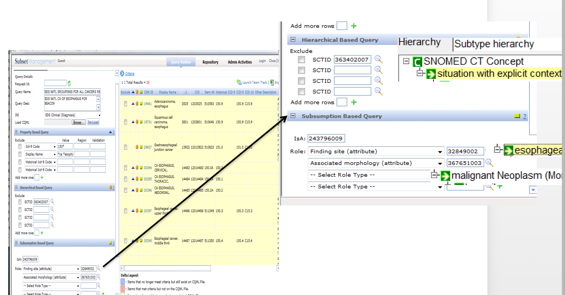
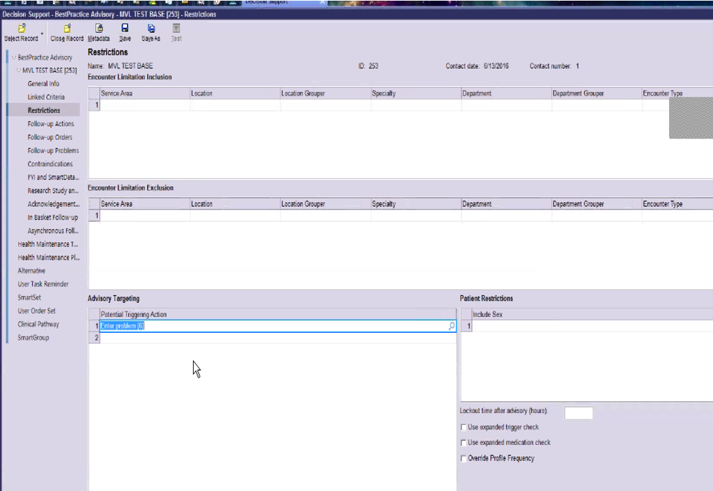
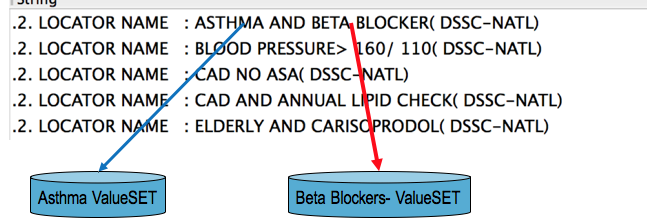

# Kaiser Permanente


[Founded in 1945, Kaiser Permanente is one of the nation’s largest not-for-profit health plans, serving more than 11.3 million members, with headquarters in Oakland, California](#user-content-fn-1)[^1]. The (Kaiser Permanente HealthConnect ) system facilitates communication between our members and health professionals to help make getting well and staying healthy easy and convenient. [It improves member safety and quality of care by providing access to comprehensive patient information and the latest best practice research in one place](#user-content-fn-2)[^2]. \\

For more information please visit [https://healthy.kaiserpermanente.org/](https://healthy.kaiserpermanente.org/).


## Overview

Kaiser Permanente (KP) has a long history with SNOMED CT, dating back to the 1990s when they collaborated with the College of American Pathologists (CAP) on the development of SNOMED RT (Reference Terminology). KP was also one of the first healthcare organizations to implement a SNOMED CT enabled health record (EHR). [KP HealthConnect](https://share.kaiserpermanente.org/total-health/connectivity/) (KPHC), [Kaiser Permanente's enterprise electronic medical record, was developed by Epic and hosts the records of over 10 million patients](#user-content-fn-3)[^3]. KPHC uses a set of clinician and patient friendly terminologies, collectively known as the Convergent Medical Terminology (CMT), [with SNOMED CT as its core reference terminology](#user-content-fn-4)[^4]. KP has made their contributions to SNOMED CT available to the broader community by donating CMT to SNOMED International and the US National Library of Medicine (NLM).

## KP HealthConnect

KP loads SNOMED CT in its native RF2 format into the HealthConnect EMR system. The EMR "Chart Search" functionality can execute a global search for diagnoses, procedures, and laboratory results against a given patient. All patient encounters that match the resulting criteria are displayed to the clinician. This provides a global summary of all encounters which relate to a given condition. This function takes advantage of the hierarchical structure of SNOMED CT. KP also maps the "clinician friendly" terms used in the EMR to SNOMED CT to meet [Meaningful Use](https://www.healthit.gov/providers-professionals/meaningful-use-definition-objectives) and Health Information Exchange reporting requirements.

## Value Sets

Value sets are an integral part of terminology management services at Kaiser Permanente. Value set identification, development, deployment, and maintenance is performed using a custom tool developed within KP. This "Subset Management" tool utilizes the native ontological structure of SNOMED CT and adds KPHC local terminology as additional artifacts within the terminology model. The formal concept definitions of SNOMED CT are used to define and generate the required value sets. The "CMT Query" tool also uses the hierarchy of SNOMED CT and description logic reasoning to identify value sets of clinician friendly terms used in patient clinical encounters. These value sets are also used within KPHC to drive business intelligence (including CDS), support workflow, and enable data reporting and analytics. As shown in the screen shot below, the queries used to define value sets leverage SNOMED CT defining relationships, such as those using the attributes 363698007 <mark style="color:blue;">|</mark> Finding site<mark style="color:blue;">|</mark> and 116676008 <mark style="color:blue;">|</mark> Associated morphology<mark style="color:blue;">|</mark>.

<figure><figcaption>
KP Query Tool enables subset management using SNOMED CT's hierarchy and defining relationships
</figcaption></figure>

## Clinical Decision Support

KP uses the native functions provided by Epic to define and maintain CDS rules. This accounts for all criteria used in the rules, such as inclusions and exclusions. A screen shot of the tool used to define these criteria is shown below.

<figure><figcaption>
KP uses Epic's built-in functions to define CDS rules (in this case a best practice advisory).
</figcaption></figure>

Clinical decision support at Kaiser Permanente leverages the value sets developed by their CMT team. For example, a CDS rule which uses value sets associated with 195967001 <mark style="color:blue;">|</mark> Asthma<mark style="color:blue;">|</mark> and 33252009 <mark style="color:blue;">|</mark> beta-blocker<mark style="color:blue;">|</mark> drugs is used to trigger an alert when specific conditions are met in the patient encounter, diagnosis, or problem list. The diagram below shows the associated value sets used in this rule.

<figure><figcaption>
An example of an alert that uses SNOMED CT value sets in business intelligence and CDS at KP
</figcaption></figure>

***

<a href="https://docs.google.com/forms/d/e/1FAIpQLScTmbZIf0UEQwYDkY27EEWBkaiYkHSbR0_9DmFrMLXoQLyL7Q/viewform?usp=pp_url&#x26;entry.1767247133=CDS+Guide&#x26;entry.670899847=Kaiser%20Permanente" class="button primary">Provide Feedback</a>

[^1]: [https://share.kaiserpermanente.org/article/fast-facts-about-kaiser-permanente/](https://share.kaiserpermanente.org/article/fast-facts-about-kaiser-permanente/)

[^2]: [https://share.kaiserpermanente.org/total-health/connectivity/](https://share.kaiserpermanente.org/total-health/connectivity/)

[^3]: [https://share.kaiserpermanente.org/total-health/connectivity](https://share.kaiserpermanente.org/total-health/connectivity/)

[^4]: [https://www.nlm.nih.gov/research/umls/cmt/cmt\_faq.html#q1](https://www.nlm.nih.gov/research/umls/cmt/cmt_faq.html#q1)
