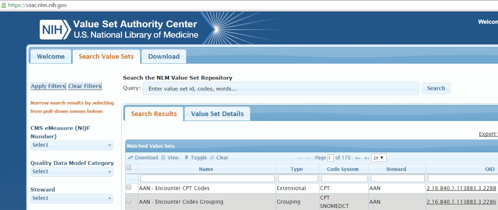

# national-institutes-of-health-intramural-research-program

## National Institutes of Health: Intramural Research Program

## Overview

The [National Institutes of Health](https://www.nih.gov/) (NIH) is a federally sponsored biomedical research program in the United States. The NIH is made up of 27 separate institutes and centers.[2](https://confluence.ihtsdotools.org/display/DOCCDS/National+Institutes+of+Health%3A+Intramural+Research+Program#Footnote2) The [Intramural Research Program's](https://irp.nih.gov/about-us/what-is-the-irp) (IRP) programs are embedded in 24 of the NIH Institutes. [3](https://confluence.ihtsdotools.org/display/DOCCDS/National+Institutes+of+Health%3A+Intramural+Research+Program#Footnote3) One of those institutes, the [National Library of Medicine](https://www.nlm.nih.gov/) (NLM) is the world's largest biomedical library and the SNOMED CT National Release Center for the United States. The NLM curates an extensive collection of medical knowledge in various formats which is used by millions of people around the world. Across the IRP, some of their Principal Investigators (PIs) use SNOMED CT in their research. A selection of the Intramural Research Program's initiatives which relate to SNOMED CT and CDS, are briefly described below.

## Value Set Authority Center

[4](https://confluence.ihtsdotools.org/display/DOCCDS/National+Institutes+of+Health%3A+Intramural+Research+Program#Footnote4) The [Value Set Authority Center](https://vsac.nlm.nih.gov/) (VSAC), managed by the NLM, is a service designed to maintain and distribute the value sets defined in [electronic Clinical Quality Measures](https://ecqi.healthit.gov/ecqms) (eCQMs). Each VSAC value set consists of codes and terms from clinical vocabularies such as SNOMED CT, RxNorm, LOINC and ICD-10-CM . Value sets derived from SNOMED CT are used to support the calculation of data quality measures which in turn provide feedback to clinicians about the quality of care. Note that VSAC is a project administered by NLM, but the actual data quality computations are done at individual healthcare sites.

<figure><figcaption>
Figure 1: VSAC NLM Value Set Repository
</figcaption></figure>

## Medline Plus Connect

[Medline Plus Connect](https://medlineplus.gov/connect/overview.html) is an [Infobutton](http://www.hl7.org/implement/standards/product_brief.cfm?product_id=208) resource which accepts requests for information on diagnoses (problem codes), medications, and lab tests, and returns related information from [MedlinePlus](https://medlineplus.gov/). The API is available as a web [application](https://medlineplus.gov/connect/application.html) or as a web [service](https://medlineplus.gov/connect/service.html), which can be integrated with an EHR. MedlinePlus accepts SNOMED CT problem codes as input and provides CDS in the form of _targeted information prescription_. The example below shows how the Medline Plus Connect request and response are structured. Note that the response includes the title and link of the matched topic and may include synonyms, attribution acknowledgements, and related links.

Figure 2: MedlinePlus Infobutton Manager: request and response

The requests conform to the [HL7 Context-Aware Knowledge Retrieval (Infobutton) Knowledge Request URL-Based Implementation Guide](http://wiki.hl7.org/index.php?title=Product_Infobutton#Product_Name_-_HL7_V3_IG:_URL-Based_Implementations_of_the_Context-Aware_Information_Retrieval_.28Infobutton.29). A screen shot of the application's response to a request for information on [| Asthma|](http://snomed.info/id/195967001) is provided below:

<figure><figcaption>
Figure 3: MedlinePlus Connect web application response to request for information on problem code 195967001 | Asthma (disorder) |
</figcaption></figure>

## Observational Health Data Sciences and Informatics (OHDSI)

Some NLM researchers also participate in external projects which utilize SNOMED CT. One such project is [OHDSI](http://ohdsi.org/). This collaborative uses SNOMED CT to integrate diagnostic data. This semantic data integration is then used by research studies which in some cases serves as input into the authoring of CDS knowledge artifacts.

One of the programs related to OHDSI is [Innovation in Medical Evidence Development and Surveillance](http://imeds.reaganudall.org/) (IMEDS), which includes a number of projects led by NIH researchers, such as:

* [NIH Investigators](http://imeds.reaganudall.org/sites/default/files/IMEDS%20Lab%20Request_NIH_May%202014%20.pdf)
* [Ferdinand Dhombres (NIH)](http://imeds.reaganudall.org/sites/default/files/IMEDS%20Lab%20Proposal_Dhombres.pdf)

***

| Footnotes Ref                                                                                                                         | Notes                                                                                                                         |
| ------------------------------------------------------------------------------------------------------------------------------------- | ----------------------------------------------------------------------------------------------------------------------------- |
| [1](https://confluence.ihtsdotools.org/display/DOCCDS/National+Institutes+of+Health%3A+Intramural+Research+Program#FootnoteMarker1-0) | [https://irp.nih.gov/about-us/what-is-the-irp](https://irp.nih.gov/about-us/what-is-the-irp)                                  |
| [2](https://confluence.ihtsdotools.org/display/DOCCDS/National+Institutes+of+Health%3A+Intramural+Research+Program#FootnoteMarker2-0) | [https://en.wikipedia.org/wiki/National\_Institutes\_of\_Health](https://en.wikipedia.org/wiki/National_Institutes_of_Health) |
| [3](https://confluence.ihtsdotools.org/display/DOCCDS/National+Institutes+of+Health%3A+Intramural+Research+Program#FootnoteMarker3-0) | [https://www.irp.nih.gov/about-us/our-programs](https://www.irp.nih.gov/about-us/our-programs)                                |
| [4](https://confluence.ihtsdotools.org/display/DOCCDS/National+Institutes+of+Health%3A+Intramural+Research+Program#FootnoteMarker4-0) | Based on content from [https://vsac.nlm.nih.gov/](https://vsac.nlm.nih.gov/)                                                  |
