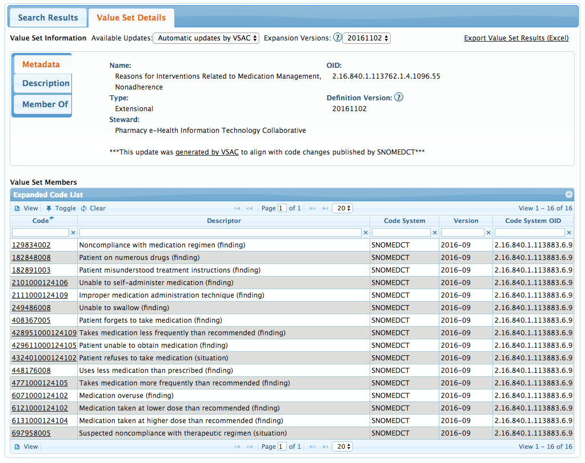

# Pharmacy Health Information Technology Collaborative


[The Pharmacy HIT Collaborative is a coalition of nine professional pharmacy associations and additional members representing the pharmacy profession in all matters related to health information technology](#user-content-fn-1)[^1]. A primary focus of the Pharmacy HIT Collaborative is "[to assure the meaningful use of standardized electronic health records (EHR) that supports safe, efficient, and effective medication use, continuity of care, and provide access to the patient-care services of pharmacists with other members of the interdisciplinary patient care team](#user-content-fn-2)[^2]."\\

For more information please visit [http://www.pharmacyhit.org/](http://www.pharmacyhit.org/).


## Overview

The Pharmacy Health Information Technology Collaborative (PHIT Collaborative) is a body of pharmaceutical organizations which operates in the United States and was formed in 2010. As the name suggests, they focus on the pharmacists providing patient care services and assess how information technology can be used to support their processes and workflows. Health information technology standards and clinical terminology are used to promote interoperability and to support their strategy of collecting, documenting, and preparing information for sharing with other service providers. Much of the work the PHIT Collaborative does is guided by the [Centers for Medicare & Medicaid Services](https://www.cms.gov/medicare/prescription-drug-coverage/prescriptiondrugcovcontra/mtm.html) (CMS) medication therapy management regulations and [Meaningful Use](https://www.healthit.gov/providers-professionals/meaningful-use-definition-objectives) (MU) reporting requirements.

## Use of SNOMED CT

The PHIT collaborative has been working towards the standardization of clinical pharmacy documentation which includes the use of SNOMED CT to record events such as a 404684003 <mark style="color:blue;">|</mark> Clinical finding<mark style="color:blue;">|</mark>, 71388002 <mark style="color:blue;">|</mark> Procedure<mark style="color:blue;">|</mark>, or 243796009 <mark style="color:blue;">|</mark> Situation with explicit context<mark style="color:blue;">|</mark>. This has resulted in a number of SNOMED CT value sets being published in the [National Library of Medicine](https://www.nlm.nih.gov/) (NLM) [Value Set Authority Center](https://vsac.nlm.nih.gov/) (VSAC), such as the one shown in the figure below.

<figure><figcaption>
Pharmacy HIT Collaborative value set for "Reasons for Interventions Related to Medication Management, Nonadherence"
</figcaption></figure>

A major benefit of using SNOMED CT in clinical pharmacy documentation is that SNOMED CT supports the calculation of [electronic Clinical Quality Measures](https://ecqi.healthit.gov/ecqms#eCQMs) (eCQMs). This ensures that pharmacists are included in the overall measurement of quality in the US health care system and more recently, outcomes-based payment models.

## CDS Use Cases

In addition to improved interoperability and calculation of eCQMs, the standardization of clinical pharmacy documentation can help to enable decision support and the Pharmacy HIT Collaborative is looking at some potential scenarios. One of the central components of pharmacy documentation includes identification of drug therapy problems. Once a medication problem has been identified, a pharmacist can intervene to optimize a patient medication regimen. But in some US jurisdictions, the direction to adjust a medication must come from the prescribing physician. Clinical decision support could be a huge benefit in these cases by acting on the recommendations of a pharmacist. More specifically, CDS could be used to help identify drug therapy issues, to propose actions, and to notify prescribers.

Using clinical decision support in the documentation of medication adverse reactions, allergies, intolerances and interactions could also benefit pharmacists and their patients. For example, SNOMED CT concepts subsumed by 62014003 <mark style="color:blue;">|</mark> Adverse reaction caused by drug<mark style="color:blue;">|</mark> and 272141005 <mark style="color:blue;">|</mark> Severities<mark style="color:blue;">|</mark> could be used to document adverse reactions . When prescribers are managing medication regimens, improved clinical decision support alerts could provide a mechanism to outline the risk of prescribing a medication based on past experience.

Medication outcomes could also be documented using SNOMED CT. For example, SNOMED CT could be used to document the outcomes of a patient who is involved in clinical trials for a new medication. Lack of an adverse reaction may have multiple explanations, including that the patient may not be adherent to the medication due to cost or the inconvenience of frequent administrations. Documenting the reason why a therapy failed could provide useful information for future prescribing events.

<a href="https://docs.google.com/forms/d/e/1FAIpQLScTmbZIf0UEQwYDkY27EEWBkaiYkHSbR0_9DmFrMLXoQLyL7Q/viewform?usp=pp_url&#x26;entry.1767247133=CDS+Guide&#x26;entry.670899847=Pharmacy%20Health%20Information%20Technology%20Collaborative" class="button primary">Provide Feedback</a>

[^1]: [http://www.pharmacyhit.org/index.php/news-releases/2016-archive/november-2016-press-release](http://www.pharmacyhit.org/index.php/news-releases/2016-archive/november-2016-press-release)

[^2]: [http://www.pharmacyhit.org/](http://www.pharmacyhit.org/)
