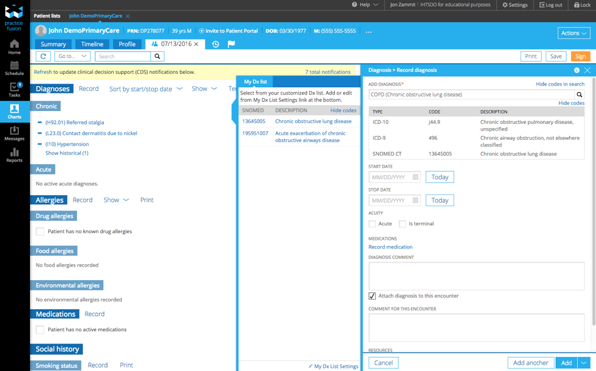
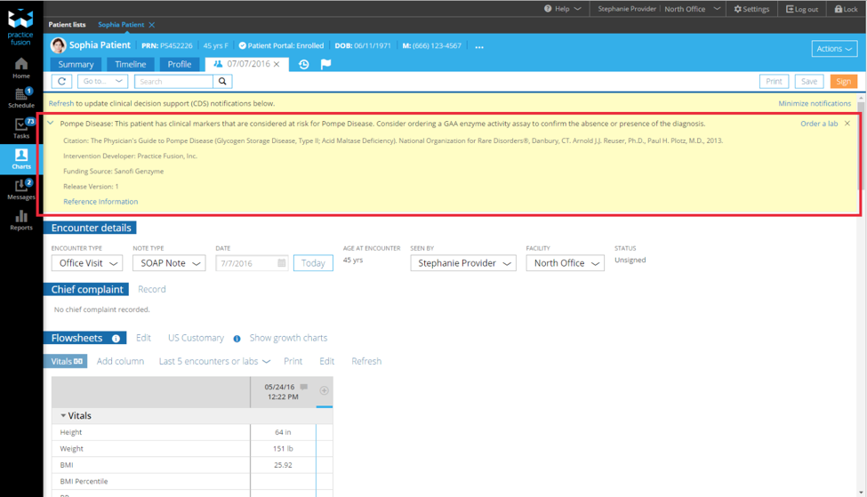

# practice-fusion

## Practice Fusion

## Terminology

Practice Fusion’s EHR uses the Health Language Enterprise Terminology Management Platform[3](https://confluence.ihtsdotools.org/display/DOCCDS/Practice+Fusion#Footnote3) from Wolters Kluwer[4](https://confluence.ihtsdotools.org/display/DOCCDS/Practice+Fusion#Footnote4) to support the management of its terminology content. This terminology platform enables Practice Fusion’s patient health records to be encoded using SNOMED CT, ICD-9, ICD-10 and a range of other code systems. Practice Fusion’s EHR uses a physician friendly library of terms, together with mappings to SNOMED CT, ICD-9 and ICD-10, to support the selection of appropriate clinical concepts at the user interface.

Practice Fusion has chosen to make SNOMED CT codes and descriptions available for viewing in the user interface. As shown in the screen shot below, when recording a diagnosis a provider can examine the mappings between the user interface term, ICD-9, ICD-10 and SNOMED CT. This approach has received positive feedback from their users as it provides an additional layer of validation when selecting a concept to record in the patient’s health record. Since 2014, all diagnoses recorded in Practice Fusion’s EHRs have included the associated SNOMED CT codes.

<figure><figcaption>
Figure 1: Adding a diagnosis in Practice Fusion’s EHR
</figcaption></figure>

## Clinical Decision Support Advisories

Practice Fusion includes a feature called Clinical Decision Support (CDS) advisories.[5](https://confluence.ihtsdotools.org/display/DOCCDS/Practice+Fusion#Footnote5) When a new encounter is entered, the patient's record is processed against a rule engine with specific criteria to determine whether the patient requires a clinical intervention. If the patient requires an intervention, one or more yellow alerts will appear at the top of the encounter. These alerts can be resolved by following an appropriate sequence of events such as ordering a lab test or completing a screening or assessment.

Practice Fusion creates and maintains value sets which include, SNOMED CT concepts to support criteria for their CDS advisories. SNOMED CT codes recorded in the patient’s record are tested for membership in relevant SNOMED CT value sets, to determine which CDS advisories should be triggered. All diagnosis related value sets and some procedural value sets used by their CDS advisories contain SNOMED CT concepts. In addition, Practice Fusion uses SNOMED CT to define their encounter and attribute value sets.The SNOMED CT value sets used by Practice Fusion’s advisories are mostly defined intensionally using SNOMED CT’s hierarchy and (in some cases) SNOMED CT’s defining relationships. This allows the value sets to be easily updated (by re-executing their intensional definition) when a new version of the terminology is adopted. Practice Fusion has found that SNOMED CT’s polyhierarchy provides a significant advantage when defining these value sets, because similar concepts can easily be grouped together by including all descendants of a common supertype.

SNOMED CT is particularly useful for rare diseases, enabling expression of diagnoses requiring a high degree of specificity and which may not be sufficiently defined in ICD. For example, the screen shot below illustrates a CDS advisory that is triggered when clinical markers considered high-risk for [274864009 | Pompe disease|](http://snomed.info/id/274864009) , are detected in the patient’s health record. Using the hierarchy of SNOMED CT, appropriate value sets were defined that help to identify those patients for which a GAA enzyme assay order should be considered to confirm the presence or absence of the diagnosis.

<figure><figcaption>
Figure 2: CDS advisory for Pompe Disease
</figcaption></figure>

Examples of other advisories that use SNOMED CT value sets in their criteria include:

* Patient requires screening for clinical depression and follow-up plan
* Patient has poor control of hemoglobin A1C and needs a new lab test
* Patient has diabetes and is due for an eye exam
* Patient has hypertension that is not adequately controlled
* Patient has Chronic Obstructive Pulmonary Disorder (COPD) and requires spirometry test
* Patient has COPD and requires bronchodilator
* Patient has asthma and no record of pharmacological treatment
* Patient has asthma and should be evaluated for asthma control every 6 months
* Patient is over 40 with urinary incontinence and requires a care plan
* Patient has clinical markers considered high-risk for paroxysmal nocturnal hemoglobinuria (PNH) according to the International Clinical Cytometry Society (ICCS) guideline and PNH flow cytometry should be considered

Practice Fusion has also used SNOMED CT to represent procedures for follow up actions, such as assessments and interventions. CDS advisories are often linked to Clinical Quality Measures (CQM) in the Practice Fusion workflow. When a provider fulfills the requirements associated with a specific CDS advisory, they will get credit for fulfilling the requirements of the associated CQM, such as completing a specific assessment. Using SNOMED CT for these assessments facilitates the capture and storage of the associated treatment plans.

***

| Footnotes Ref                                                                            | Notes                                                                                                                                                                                                                                            |
| ---------------------------------------------------------------------------------------- | ------------------------------------------------------------------------------------------------------------------------------------------------------------------------------------------------------------------------------------------------ |
| [1](https://confluence.ihtsdotools.org/display/DOCCDS/Practice+Fusion#FootnoteMarker1-0) | [https://en.wikipedia.org/wiki/Practice\_Fusion/](https://en.wikipedia.org/wiki/Practice_Fusion/)                                                                                                                                                |
| [2](https://confluence.ihtsdotools.org/display/DOCCDS/Practice+Fusion#FootnoteMarker2-0) | [http://www.practicefusion.com/about-practice-fusion/](http://www.practicefusion.com/about-practice-fusion/)                                                                                                                                     |
| [3](https://confluence.ihtsdotools.org/display/DOCCDS/Practice+Fusion#FootnoteMarker3-0) | [http://www.healthlanguage.com/](http://www.healthlanguage.com/)                                                                                                                                                                                 |
| [4](https://confluence.ihtsdotools.org/display/DOCCDS/Practice+Fusion#FootnoteMarker4-0) | [http://wolterskluwer.com/](http://wolterskluwer.com/)                                                                                                                                                                                           |
| [5](https://confluence.ihtsdotools.org/display/DOCCDS/Practice+Fusion#FootnoteMarker5-0) | [http://knowledgebase.practicefusion.com/knowledgebase/articles/484996-what-are-clinical-decision-support-cds-advisorie](http://knowledgebase.practicefusion.com/knowledgebase/articles/484996-what-are-clinical-decision-support-cds-advisorie) |
