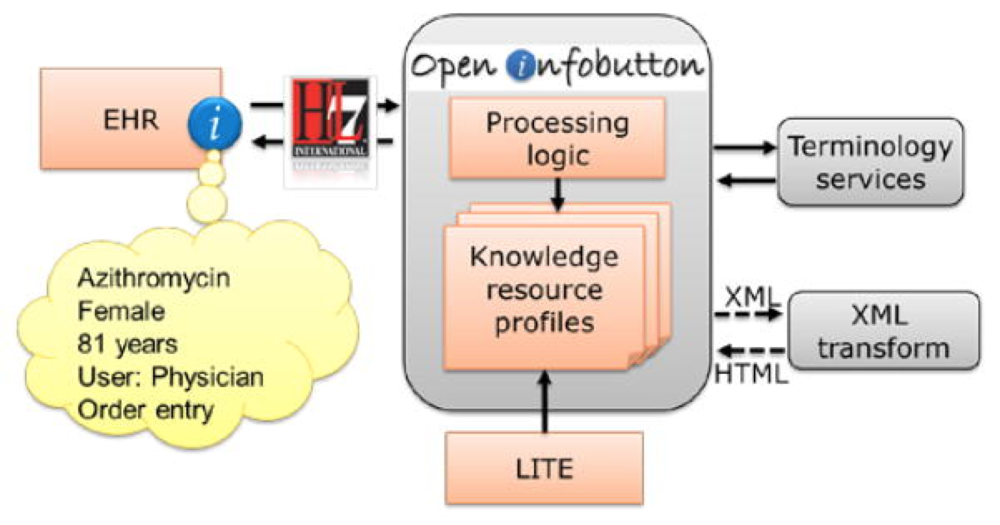

# university-of-utah

## University of Utah

## Overview

The Department of Biomedical Informatics at the University of Utah is an internationally recognized leader in both research and education in the field of medical informatics.[3](https://confluence.ihtsdotools.org/display/DOCCDS/University+of+Utah#Footnote3) The university has been a major contributor to the development of health information standards and open source initiatives, many of which have been leveraged in their own solutions, including their clinical decision support systems.

## Standards, Architectures, Techniques

As a major contributor to the development of the [OpenCDS](http://www.opencds.org/) collaborative, the University of Utah has been able use the architecture from OpenCDS to provide a service-based approach to their CDSS and clinical quality measurement efforts. As part of this effort, they have made use of HL7 International’s [Decision Support Service](http://www.hl7.org/implement/standards/product_brief.cfm?product_id=334) (DSS). The University also played a key role in the development of [OpenInfobutton](http://www.openinfobutton.org/), an opensource web service and reference implementation of HL7's infobutton standard. Infobuttons are context-sensitive links, which can be embedded in EHR systems as buttons or tabs. OpenInfobutton was funded by the US Veterans Health Administration (VHA) and developed by researchers at the VHA, Duke University, and the University of Utah.

## Using SNOMED CT

SNOMED CT value sets are used to map to clinical concepts referenced in the University's CDS rules. SNOMED CT value sets are also used to configure patient problem lists in OpenInfobutton. Since the Infobutton standard uses SNOMED CT for problem lists, SNOMED CT concept identifiers are embedded in the requests and responses between the EHR and OpenInfobutton architecture, as shown in the figure below.

<figure><figcaption>
Figure 1: Infobutton architecture which uses SNOMED CT for patient problem lists
</figcaption></figure>

The University has benefited from using a standardized clinical reference terminology which can be used across clinical domains. By using SNOMED CT in OpenInfobutton, the University has improved the interoperability between EHR systems and knowledge resources, by providing more efficient access to the indexed knowledge content.

***

| Footnotes Ref                                                                               | Notes                                                                      |
| ------------------------------------------------------------------------------------------- | -------------------------------------------------------------------------- |
| [1](https://confluence.ihtsdotools.org/display/DOCCDS/University+of+Utah#FootnoteMarker1-0) | [http://medicine.utah.edu/](http://medicine.utah.edu/)                     |
| [2](https://confluence.ihtsdotools.org/display/DOCCDS/University+of+Utah#FootnoteMarker2-0) | [http://medicine.utah.edu/ccts/bmic/](http://medicine.utah.edu/ccts/bmic/) |
| [3](https://confluence.ihtsdotools.org/display/DOCCDS/University+of+Utah#FootnoteMarker3-0) | [http://medicine.utah.edu/bmi/](http://medicine.utah.edu/bmi/)             |
