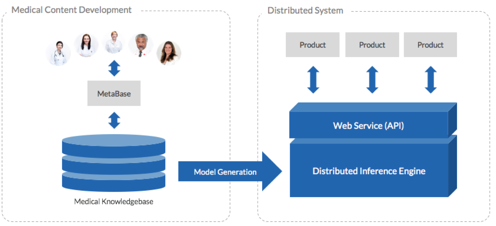
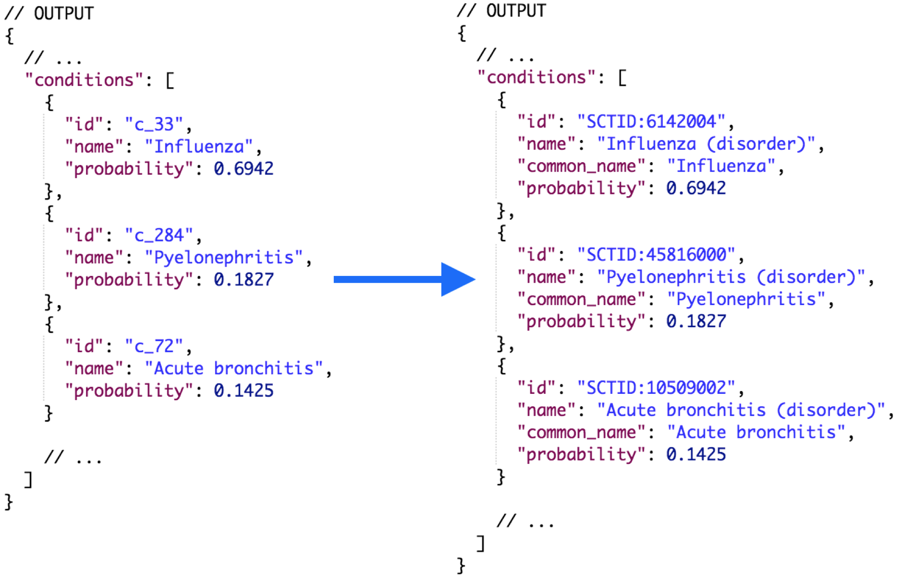
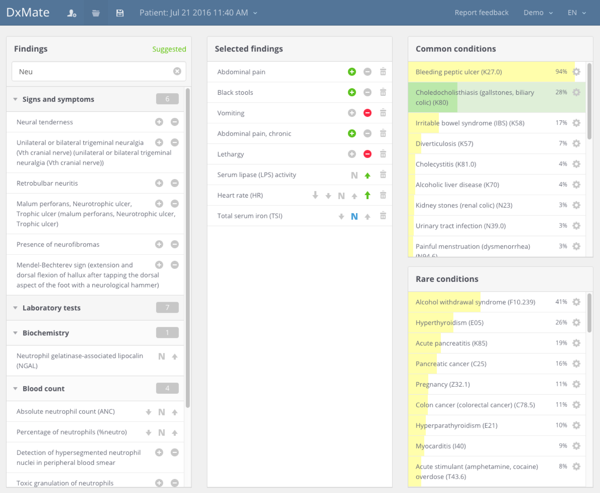
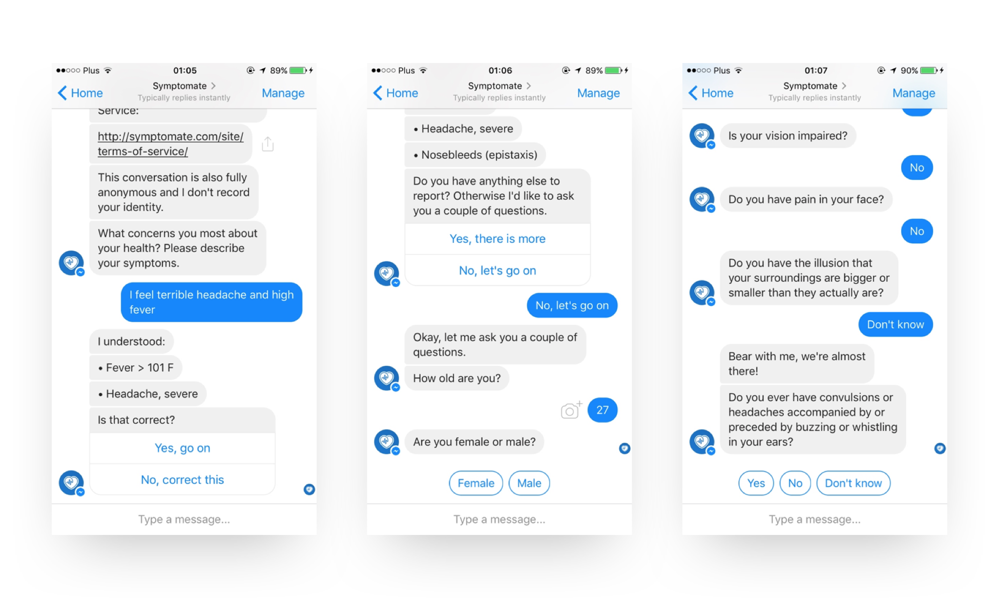

# infermedica

## Infermedica

## Overview

Infermedica is a developer of healthcare software, based in Poland, that was established in 2012.[1](https://confluence.ihtsdotools.org/display/DOCCDS/Infermedica#Footnote1) Infermedica has designed a diagnostic engine which uses artificial intelligence (AI) and can be integrated into third party EHRs and other health applications. Their technology is accessed through their [Infermedica API](https://developer.infermedica.com/) which analyzes anonymized patient data in real-time and provides clinical recommendations, such as verifiable symptoms or orderable lab tests. Clinical decision support alerts which act on the probable diagnoses can also be implemented. Behind the API, Infermedica uses a proprietary statistical knowledge base which contains the CDS algorithms developed by their clinical experts. A modeling tool called "MetaBase" allows the system to be further refined to meet the needs of specific users. The process of content development is also supported by machine learning algorithms which operate on real patient records. This architecture is depicted in the figure below.

<figure><figcaption>
Figure 1: Infermedica API system architecture
</figcaption></figure>

Using SNOMED CT

Infermedica has started to incorporate SNOMED CT into their core medical ontology and API interface. The inputs into the Infermedica service are being mapped from SNOMED CT, and the outputs of the service are being mapped to SNOMED CT. This allows them to integrate the system with SNOMED CT coded patient records. An example extract of the output map is shown in the figure below.

<figure><figcaption>
Figure 2: Examples of Infermedica internal diagnosis codes mapped to SNOMED CT
</figcaption></figure>

SNOMED CT integration will allow the medical team to develop new knowledge base artifacts for conditions, symptoms and risk factors based on SNOMED CT concepts and their [defining relationships](https://confluence.ihtsdotools.org/display/DOCGLOSS/defining+relationship). Informedica also plans to use [postcoordinated expressions](https://confluence.ihtsdotools.org/display/DOCGLOSS/postcoordinated+expression) with [attribute value refinements](https://confluence.ihtsdotools.org/display/DOCGLOSS/attribute+value+pair) to create new representations of clinical meanings that are processable by a computer. These additional clinical meanings will be assigned local codes, and will be used to develop CDS rules in the knowledge base. As the diagnostic engine is primarily focused on symptoms, conditions, and risk factors, it is expected that [subsets](https://confluence.ihtsdotools.org/display/DOCGLOSS/subset) of SNOMED CT content will be developed that focus on these areas. There are also plans for Infermedica's inference engine to utilize subsumption testing.

Deployments

The Infermedica API has been used within a number of other commercial products for insurers and health systems, as well as other solutions developed by Infermedica such as [DxMate](https://dxmate.com). As shown in the screen shot below, DxMate is a prototype diagnostic clinical decision support tool which has already been used by thousands of clinicians.

<figure><figcaption>
Figure 3: DxMate, a prototype CDS application built using the Infermedica APIInfermedica also provides an online symptom checker and a chat-bot called Symptomate which serves as an alternative to "Googling" your health information, and helps patients make better decisions regarding their symptoms. The chat-bot is shown in the figure below.
</figcaption></figure>

<figure><figcaption>
Figure 4: A symptom checker chat-bot developed by Infermedica
</figcaption></figure>

## Benefits

As a key standard in health information data exchange, SNOMED CT facilitates interoperability between platforms from different vendors. Support for SNOMED CT in the inputs and outputs of Infermedica's API will help to simplify integrations with existing platforms. Using the Infermedica API in tandem with existing electronic health record (EHR) systems will help offer medical professionals with intelligent data-driven suggestions, relevant questions and tests to order, and likely diagnoses for consideration.

SNOMED CT provides Infermedica with a rich dictionary of terms which can be used to improve search and Natural Language Processing (NLP) capabilities. The available translations will facilitate support for additional languages. Usage of SNOMED CT in Infermedica's clinical content editing tool will also help to improve interoperability.

***

| Footnotes Ref                                                                        | Notes                                                                                        |
| ------------------------------------------------------------------------------------ | -------------------------------------------------------------------------------------------- |
| [1](https://confluence.ihtsdotools.org/display/DOCCDS/Infermedica#FootnoteMarker1-0) | [https://www.linkedin.com/company/infermedica](https://www.linkedin.com/company/infermedica) |
