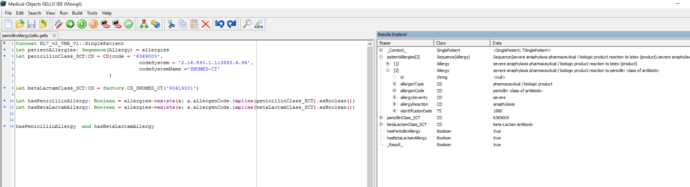
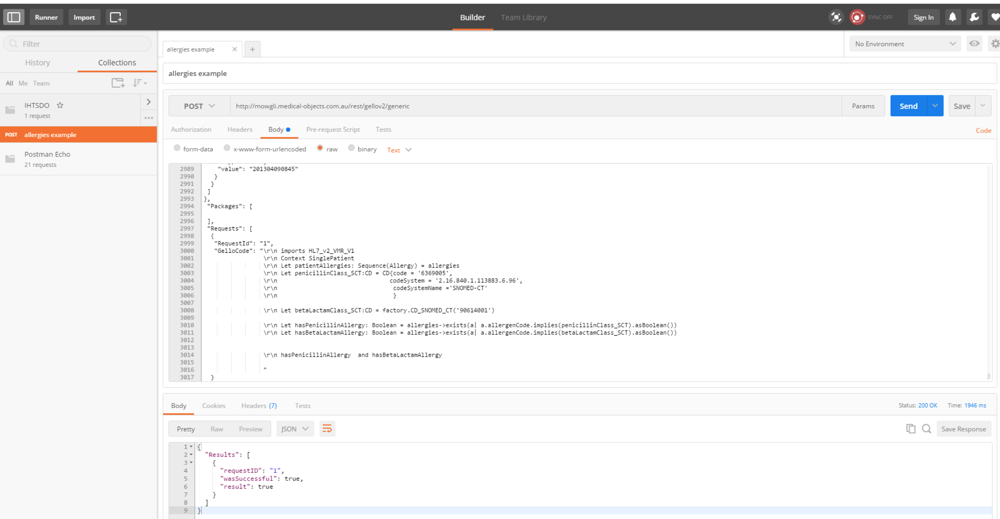
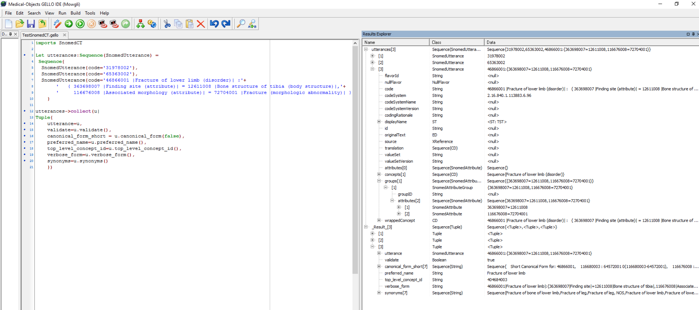
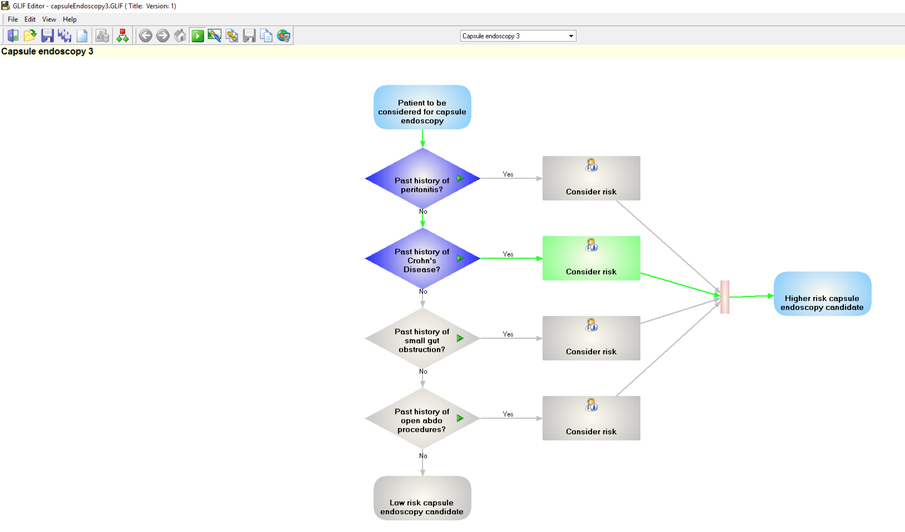
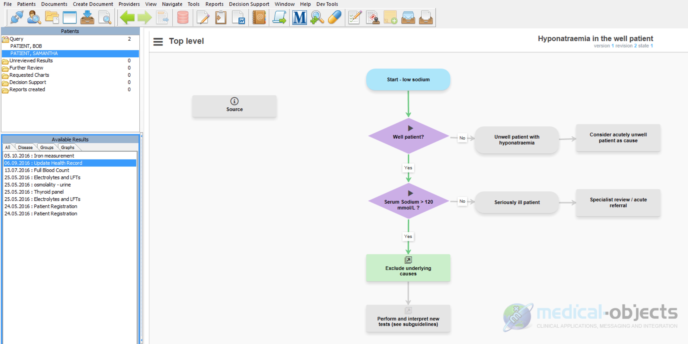
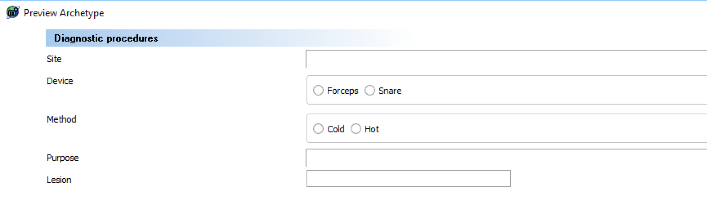
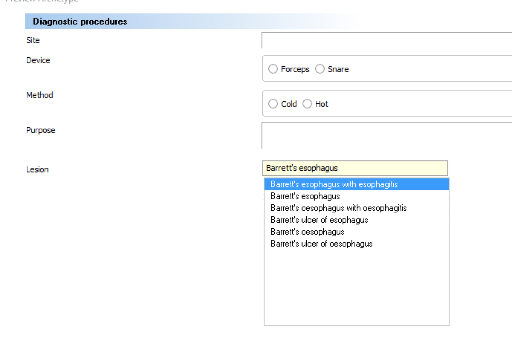
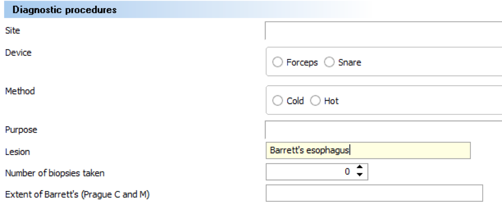

# Medical-Objects


Our team has a dedicated view towards creating practical and quality products for the health care industry. This united view towards products and services has seen rapid growth in our target market. [Medical-Objects is now used by over 40,000 health care providers Australia wide](#user-content-fn-1)[^1]. Due to Medical-Objects expertise in an integrated standards based suite of technologies, [we can work with you to electronically capture, persist, decision support, and report across the full clinical complexity of your enterprise](#user-content-fn-2)[^2].\

For more information please visit [https://www.medical-objects.com.au](https://www.medical-objects.com.au/).


## Overview

Medical-Objects Pty Ltd (MO) is an Australian company that specializes in electronic messaging and clinical applications. They are also active in healthcare standards development and have been key contributors to HL7 GELLO and GLIF. MO works closely with business, government, and health professionals to provide clinical tools which help with connectivity, integration, and workflow. MO has developed several [CDS tools](https://kb.medical-objects.com.au/display/PUB/Clinical+Decision+Support) including:

* A GELLO Release 2 (R2) editor, engine, and RESTful web service. (The GELLO editor is shown below in Figure 3.)
* A GLIF editor, engine, and web service. (The GLIF editor is shown below in Figure 4.)
* An ISO 13606 archetype template editor

## GELLO

[GELLO](../../4-inference-engine.md#gello) R2 i s an ANSI and HL7 standard for clinical decision support. It makes use of a virtual medical record (VMR) to abstract and present clinical data. As a language, GELLO is both declarative and functional and can query SNOMED CT and other reference terminologies.

The screenshots below illustrate the use of an _implies_ method which uses SNOMED CT subsumption with the [ISO 21090 CD datatype](https://kb.medical-objects.com.au/display/PUB/ISO+21090+Datatypes+Guide#ISO21090DatatypesGuide-ISOCD-ConceptDescriptorType) ( concept descriptor). Note that \_ allergies \_in line 2 of the screen shot below, comes from the vMR instance.

<figure><figcaption>
Figure 1: A fragment in Medical-Object's GELLO editor
</figcaption></figure>

<figure><figcaption>
Figure 2: The same GELLO query running on Medical-Object's web service
</figcaption></figure>

MO is in the process of migrating its GELLO R1 SNOMED CT object to the new GELLO R2 format. The screen shot below captures some of the added functionalities. Note the use of SNOMED CT attribute relationships in the language, specifically [<mark style="color:blue;">|</mark> Finding site<mark style="color:blue;">|</mark>](http://snomed.info/id/363698007) and [<mark style="color:blue;">|</mark> Associated morphology<mark style="color:blue;">|</mark>](http://snomed.info/id/116676008).

<figure><figcaption>
Figure 3: GELLO R2 object which illustrates the use of SNOMED CT attribute relationships
</figcaption></figure>

MO has found that being able to write GELLO queries to access both the information model (e.g. VMR, archetypes) and the terminology model (e.g. SNOMED CT) has been extremely useful.

## GLIF

[GLIF](../../3-knowledge-base/3.2-guidelines.md#guideline-interchange-format) (GuideLine Interchange Format) is a clinical guideline representation protocol for exchanging clinical guidelines. It uses GELLO (and therefore can use SNOMED CT) in its automated decisions and state declarations. To the user it looks like a smart flowchart of guidelines and sub-guidelines with an interactive interface presenting such things as pop up [didactics](https://en.wikipedia.org/wiki/Didactic_method#Didactic_teaching). The diagram below depicts a user interface view of a SNOMED CT based query in GLIF:

<figure><figcaption>
Figure 4: SNOMED CT based guideline, represented in GLIF
</figcaption></figure>

## Deployments

GLIF and GELLO are incorporated into the Medical-Object's _Explorer_ EHR software. The diagram below is a screenshot of a guideline, that is represented in GLIF, being used.

<figure><figcaption>
Figure 5: Explorer is one of Medical-Object's clinical application which uses GLIF
</figcaption></figure>

Terminology-enabled GELLO was made available as part of MO's contribution to the [Veterans Health Administration](https://www.va.gov/health/) (VHA) [CHIO Innovation](https://sites.google.com/site/enhancedcprscds/home) project. MO has started to see some adoption of SNOMED CT based querying of GELLO in pathology laboratory panel archetypes.

An example gastroenterology archetype is shown in the sequence of figures below. This archetype is currently in development for a gastroenterology clinic. If an endoscopy is being performed for a Barrett's esophagus type of lesion, then [visibility](https://kb.medical-objects.com.au/display/PUB/Node+Visibility) GELLO displays relevant extra nodes. (Note: Visibility GELLO can be used for developing smart forms to show or hide nodes depending on values entered elsewhere.)

<figure><figcaption>
Figure 6: Diagnostic procedure archetype which uses GELLO visibility nodes (to display additional fields)
</figcaption></figure>

<figure><figcaption>
Figure 7: Barrett's esophagus is entered in the node named 'lesion' using a SNOMED CT concept
</figcaption></figure>

<figure><figcaption>
Figure 8: Which then displays additional elements in the data collection form
</figcaption></figure>

***

[^1]: [https://www.medical-objects.com.au/company-information/about-us/](https://www.medical-objects.com.au/company-information/about-us/)

[^2]: [https://www.medical-objects.com.au/solutions/clinical-decision-support/](https://www.medical-objects.com.au/solutions/clinical-decision-support/)

<a href="https://docs.google.com/forms/d/e/1FAIpQLScTmbZIf0UEQwYDkY27EEWBkaiYkHSbR0_9DmFrMLXoQLyL7Q/viewform?usp=pp_url&entry.1767247133=CDS+Guide&entry.670899847=Medical-Objects" class="button primary">Provide Feedback</a>
