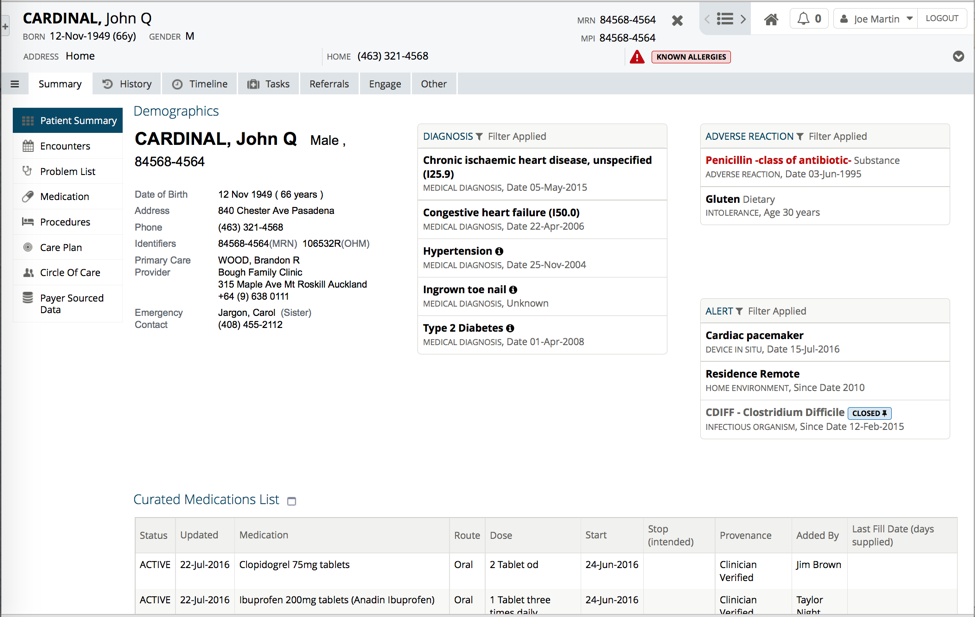
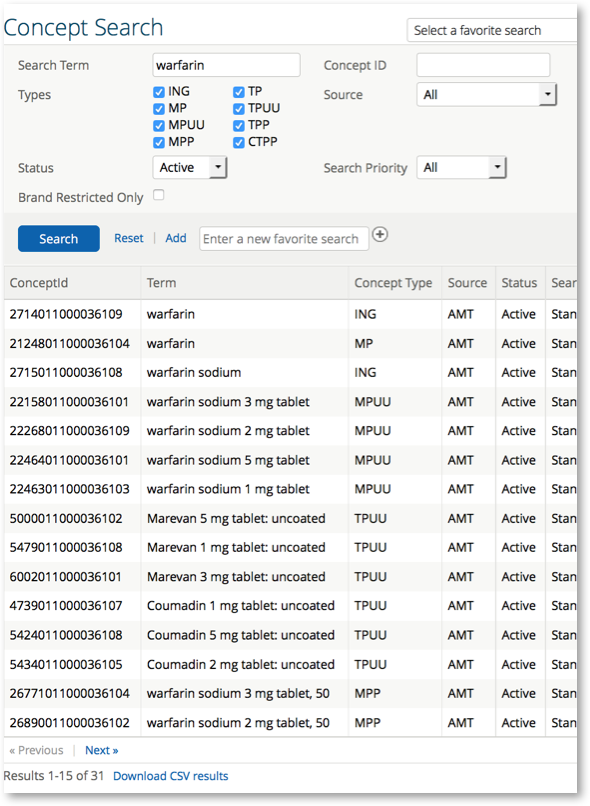
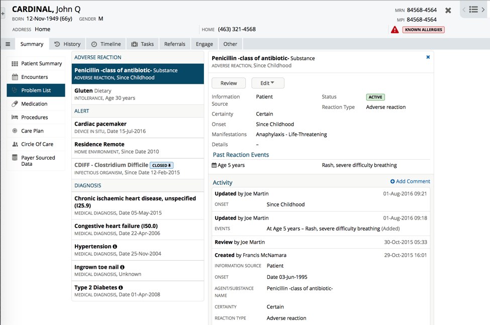

# orion-health

## Orion Health

## Overview

Orion Health currently has four products which leverage SNOMED CT for Clinical Decision Support. These are:

* Global Drug Model (GDM);
* Orion Health Medicines;
* Orion Health Problem List; and
* Clinical Decision Support (CDS) application.

To allow for multiple customers to be supported worldwide, these products adopt a modular approach to terminology deployment. A customer selects the relevant data loader for their jurisdiction and the experience is customized for their region automatically. When deployed in SNOMED CT member countries, this process involves loading the relevant SNOMED CT National Edition and local medication codes. Drug data is represented using a common model based on SNOMED CT. This enables customers already using SNOMED CT coding to migrate to these products very quickly. Other local medication codes can be translated to the SNOMED CT equivalent representation using integrated mappings. Orion’s Medicines platform provides support for terminologies from the UK, Australia, New Zealand, USA and France, as well as support for other customers with local data sets.

SNOMED CT offers a range of significant benefits to Orion Health’s CDS solutions. SNOMED CT’s relationships and drug class information are used to optimize the drug database during the import process. Orion Health has also developed several algorithms which allow for extremely fast retrieval of medication data, traversal of the medication hierarchy and testing for concept subsumption. These SNOMED CT features are used extensively by the Clinical Decision Support APIs and are therefore a core part of Orion Health’s CDS applications. These products also provide the ability to add new medications that are not predefined in the terminology, such as extemporaneous medications, clinical trial drugs or medications obtained in a different country. New medications can be fully modeled within the GDM concept hierarchy, and assigned a valid SNOMED CT extension identifier using the customer’s assigned namespace.

The Amadeus Clinical Portal as shown in the diagram below provides a single point of access for clinicians to manage patient information. This portal integrates the CDS products mentioned above, including the Medicines and Problem List applications. All Orion Health’s CDS applications expose their data using FHIR’s RESTful APIs. The use of SNOMED CT in these products also facilitates easier translation to standard messaging formats, such as HL7 CDA or other message structures mandated by local jurisdictions.

<figure><figcaption>
Figure 1: Clinical Portal
</figcaption></figure>

## Global Drug Model

The _Global Drug Model_ (GDM) enables Orion’s software to be deployed worldwide. This application standardizes and normalizes data sets from many different countries into a single data model. Customers upload their local SNOMED CT edition into GDM via an application that runs inside the Orion Health Clinical Portal. GDM processes the data and then publishes it using HL7 FHIR’s RESTful APIs. The processing performed by GDM makes heavy use of the SNOMED CT defining relationships, as well as discovering data about drug classes that is present in the terminology releases. This application facilitates a number of clinical decision support functions, including duplicate therapy checking and linking to relevant drug monographs. The use of SNOMED CT concepts in the GDM is illustrated in the screenshot shown in the diagram below.

<figure><figcaption>
Figure 2: Global Drug Model
</figcaption></figure>

## Orion Health Medicines

_Orion Health Medicines_ supports an authoritative medication list for each patient, and enables its curation, reconciliation and management. The Medicines application uses the FHIR APIs from GDM to allow the discovery and validation of medications. Patients can also manage their own list of medications via the Orion Health Patient Portal or the Orion Health Engage mobile application.

## Orion Health Problem List

_Orion Health Problem List_ is a centralized and web-based list of patient problems. It enables healthcare providers to view, create and change clinical information, procedures, psychosocial and cultural issues that may affect the care of the patient, as well as safety and security concerns that may be relevant to medical staff caring for the patient. The Problem List application also integrates with GDM via the FHIR APIs, and enables clinicians to record allergies, adverse reactions and intolerances at the drug class level. The Problem List application is fully integrated with SNOMED CT, with a variety of fields using SNOMED CT subsets.

## Clinical Decision Support

The _Clinical Decision Support_ (CDS) application is a new product that integrates with the three applications mentioned above, as well as other third party decision support applications. The CDS application provides APIs to support duplicate drug therapy checking, drug allergy checking, links to drug monographs and additional drug information, and grouping of similar medications based on a common ingredient or therapeutic moiety.

For example, when new medications are added to a patient’s medication list, they are automatically screened against the current list of medications for that patient using the CDS Duplicate Therapy API. This check ensures that the clinician is advised of existing medications with the same ingredients. Clinicians viewing medications are able to access drug monographs and any other additional information listed against a medication. The medication list is also screened using the CDS Drug Allergy API, which presents a warning if a drug allergy or intolerance to a particular medication or drug class is detected. These checks use data traversal algorithms that were developed by Orion Health for fast traversal of the SNOMED CT concept hierarchy and defining relationships. The warnings have been specifically designed to minimize alert fatigue. The Orion Health Problem List application is shown below in the diagram below with an adverse reaction alert.

<figure><figcaption>
Figure 3: Problem List with CDS alert functionality
</figcaption></figure>

***

| Footnotes Ref                                                                         | Notes                                                                                                                                |
| ------------------------------------------------------------------------------------- | ------------------------------------------------------------------------------------------------------------------------------------ |
| [1](https://confluence.ihtsdotools.org/display/DOCCDS/Orion+Health#FootnoteMarker1-0) | [https://orionhealth.com/global/about-us/our-story/our-story/](https://orionhealth.com/global/about-us/our-story/our-story/)         |
| [2](https://confluence.ihtsdotools.org/display/DOCCDS/Orion+Health#FootnoteMarker2-0) | [https://orionhealth.com/global/about-us/our-story/vision-values/](https://orionhealth.com/global/about-us/our-story/vision-values/) |
