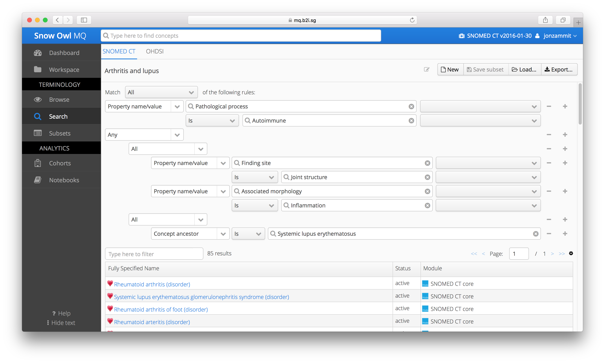
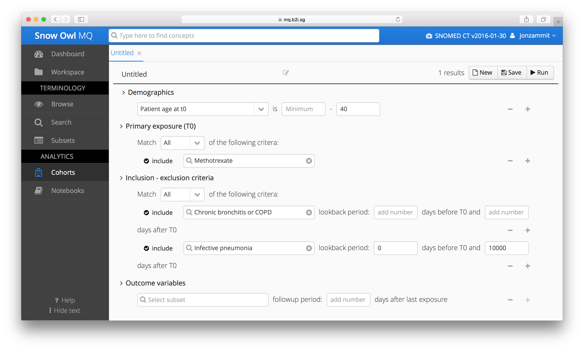

# B2i Healthcare

# Overview

B2i Healthcare (B2i) provides tools and services to help maximize the features of SNOMED CT. Snow Owl, their flagship product, is a clinical terminology platform which has been deployed in over 3000 locations in 84 countries.[1](https://confluence.ihtsdotools.org/display/DOCCDS/B2i+Healthcare#Footnote1 "Footnote: Click here to display the footnote") In 2015, SNOMED International procured the Snow Owl Terminology Server as a key component of its terminology authoring platform.

[Snow Owl Meaningful Query](https://mq.b2i.sg) (MQ) is a scalable, big data platform for performing queries and analytics over electronic health records. Snow Owl MQ supports patient cohort selection for clinical trials and observational data analysis by exploiting the semantics of SNOMED CT to find answers to clinical questions and thus provide evidence to support decision-making. Snow Owl MQ includes the following modules:

  * **The terminology search and browse interface** supports the creation of subsets based on semantic or manual criteria,
  * **The patient cohort builder** enables electronic health records to be filtered using demographic or terminology criteria,
  * **The analytics module** supports the statistical processing of and information retrieval from patient data.

# Use of SNOMED CT

The terminology search module within Snow Owl MQ leverages the SNOMED CT [concept model](https://confluence.ihtsdotools.org/display/DOCGLOSS/concept+model "Glossary link: concept model") to build attribute-based, complex queries over the terminology. This can be seen in the screen shot below where a query using the attributes [ | Pathological process|](http://snomed.info/id/370135005 "370135005 | Pathological process |") , [ | Finding site|](http://snomed.info/id/363698007 "363698007 | Finding site |") , and [ | Associated morphology|](http://snomed.info/id/116676008 "116676008 | Associated morphology |") has been dynamically executed to create an exportable subset. 

<figure><figcaption>
Figure 1: Results of attribute-based query are shown in the search module
</figcaption></figure>

The search interface facilitates the retrieval of concepts based on their clinical meaning, as represented using SNOMED CT's defining relationships . This provides a mechanism to create subsets dynamically, based on their intensional definition. This semantic approach to subset definition also supports automatic updating when a new version of SNOMED CT is released. For convenience, Snow Owl MQ provides a terminology browser to search SNOMED CT and other terminologies. 

As shown in the screen shot below, the cohort builder module uses the previously defined subsets in combination with temporal constraints and demographic filters.

<figure><figcaption>
Figure 2: Patient cohort builder which uses subsets defined from SNOMED CT content
</figcaption></figure>

A patient list is generated by simply executing the query. These patient records can then be explored in more detail. To further analyze the patient data of the selected cohorts, the semantic notebook functionality in the analytics module executes statistical analysis on the data in real time.

# Additional Standards and Formalisms

Patient records in Snow Owl MQ are aligned with the [Observational Medical Outcomes Partnership](http://omop.org/) (OMOP) Common Data Model. In addition to searching and browsing SNOMED CT, Snow Owl MQ uses all of the terminologies that are part of the OMOP Standardized Vocabularies (including RxNorm, LOINC, ICD-10, ICD-9-CM, HCPCS and others).

# Benefits

Based on B2i's experience, SNOMED CT's concept model helps to support dynamic subset creation, and in turn, flexible selection of patient cohorts. B2i has also found that patient records encoded with SNOMED CT are embedded with the clinical knowledge to help answer complex clinical questions that can then support new decision-making algorithms. By leveraging SNOMED CT, Snow Owl MQ supports real-time cohort creation and observational data analysis to quickly validate clinical hypotheses.

* * *

Footnotes Ref | Notes  
---|---  
[1](https://confluence.ihtsdotools.org/display/DOCCDS/B2i+Healthcare#FootnoteMarker1-0 "Footnote: Click to return to reference in text") |  <https://b2i.sg/> [ [a](https://confluence.ihtsdotools.org/display/DOCCDS/B2i+Healthcare#FootnoteMarker1-0 "Footnote: Click to return to reference in text") [b](https://confluence.ihtsdotools.org/display/DOCCDS/B2i+Healthcare#FootnoteMarker1-1 "Footnote: Click to return to reference in text") ] 
