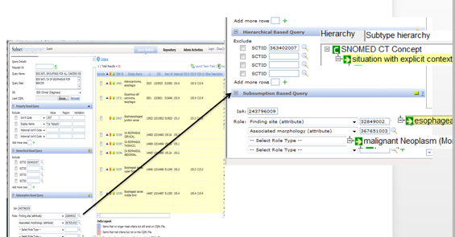
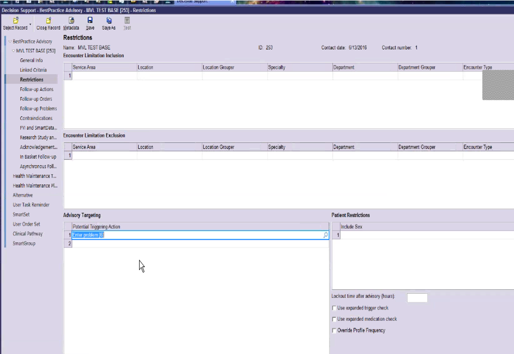
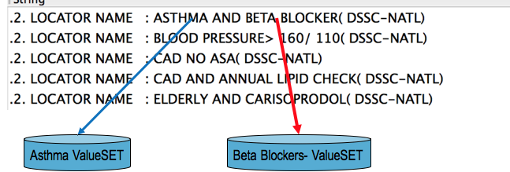

# Kaiser Permanente

# Overview

Kaiser Permanente (KP) has a long history with SNOMED CT, dating back to the 1990s when they collaborated with the College of American Pathologists (CAP) on the development of SNOMED RT (Reference Terminology). KP was also one of the first healthcare organizations to implement a SNOMED CT enabled health record (EHR). [KP HealthConnect](https://share.kaiserpermanente.org/total-health/connectivity/) (KPHC), Kaiser Permanente's enterprise electronic medical record, was developed by Epic and hosts the records of over 10 million patients.[3](https://confluence.ihtsdotools.org/display/DOCCDS/Kaiser+Permanente#Footnote3 "Footnote: Click here to display the footnote") KPHC uses a set of clinician and patient friendly terminologies, collectively known as the Convergent Medical Terminology (CMT), with SNOMED CT as its core reference terminology.[4](https://confluence.ihtsdotools.org/display/DOCCDS/Kaiser+Permanente#Footnote4 "Footnote: Click here to display the footnote") KP has made their contributions to SNOMED CT available to the broader community by donating CMT to SNOMED International and the US National Library of Medicine (NLM).

# KP HealthConnect

KP loads SNOMED CT in its native [RF2](https://confluence.ihtsdotools.org/display/DOCGLOSS/RF2 "Glossary link: RF2") format into the HealthConnect EMR system. The EMR "Chart Search" functionality can execute a global search for diagnoses, procedures, and laboratory results against a given patient. All patient encounters that match the resulting criteria are displayed to the clinician. This provides a global summary of all encounters which relate to a given condition. This function takes advantage of the hierarchical structure of SNOMED CT. KP also maps the "clinician friendly" terms used in the EMR to SNOMED CT to meet [Meaningful Use](https://www.healthit.gov/providers-professionals/meaningful-use-definition-objectives) and Health Information Exchange reporting requirements.

# Value Sets

Value sets are an integral part of terminology management services at Kaiser Permanente. Value set identification, development, deployment, and maintenance is performed using a custom tool developed within KP. This "Subset Management" tool utilizes the native ontological structure of SNOMED CT and adds KPHC local terminology as additional artifacts within the terminology model. The formal concept definitions of SNOMED CT are used to define and generate the required value sets. The "CMT Query" tool also uses the hierarchy of SNOMED CT and description logic reasoning to identify value sets of clinician friendly terms used in patient clinical encounters. These value sets are also used within KPHC to drive business intelligence (including CDS), support workflow, and enable data reporting and analytics. As shown in the screen shot below, the queries used to define value sets leverage SNOMED CT defining relationships, such as those using the attributes [ 363698007 | Finding site|](http://snomed.info/id/363698007 "363698007 | Finding site |") and [ 116676008 | Associated morphology|](http://snomed.info/id/116676008 "116676008 | Associated morphology |") .

<figure><figcaption>
Figure 1: KP Query Tool enables subset management using SNOMED CT's hierarchy and defining relationships
</figcaption></figure>

# Clinical Decision Support

KP uses the native functions provided by Epic to define and maintain CDS rules. This accounts for all criteria used in the rules, such as inclusions and exclusions. A screen shot of the tool used to define these criteria is shown below.

<figure><figcaption>
Figure 2: KP uses Epic's built-in functions to define CDS rules (in this case a best practice advisory).
</figcaption></figure>

Clinical decision support at Kaiser Permanente leverages the value sets developed by their CMT team. For example, a CDS rule which uses value sets associated with [ 195967001 | Asthma|](http://snomed.info/id/195967001 "195967001 | Asthma |") and [ 33252009 | beta-blocker|](http://snomed.info/id/33252009 "33252009 | beta-blocker |") drugs is used to trigger an alert when specific conditions are met in the patient encounter, diagnosis, or problem list. The diagram below shows the associated value sets used in this rule. 

<figure><figcaption>
Figure 3: An example of an alert that uses SNOMED CT value sets in business intelligence and CDS at KP
</figcaption></figure>

  

* * *

Footnotes Ref | Notes  
---|---  
[1](https://confluence.ihtsdotools.org/display/DOCCDS/Kaiser+Permanente#FootnoteMarker1-0 "Footnote: Click to return to reference in text") |  <https://share.kaiserpermanente.org/article/fast-facts-about-kaiser-permanente/>  
[2](https://confluence.ihtsdotools.org/display/DOCCDS/Kaiser+Permanente#FootnoteMarker2-0 "Footnote: Click to return to reference in text") |  <https://share.kaiserpermanente.org/total-health/connectivity/>  
[3](https://confluence.ihtsdotools.org/display/DOCCDS/Kaiser+Permanente#FootnoteMarker3-0 "Footnote: Click to return to reference in text") |  [https://share.kaiserpermanente.org/total-health/connectivity](https://share.kaiserpermanente.org/total-health/connectivity/)  
[4](https://confluence.ihtsdotools.org/display/DOCCDS/Kaiser+Permanente#FootnoteMarker4-0 "Footnote: Click to return to reference in text") |  <https://www.nlm.nih.gov/research/umls/cmt/cmt_faq.html#q1>
