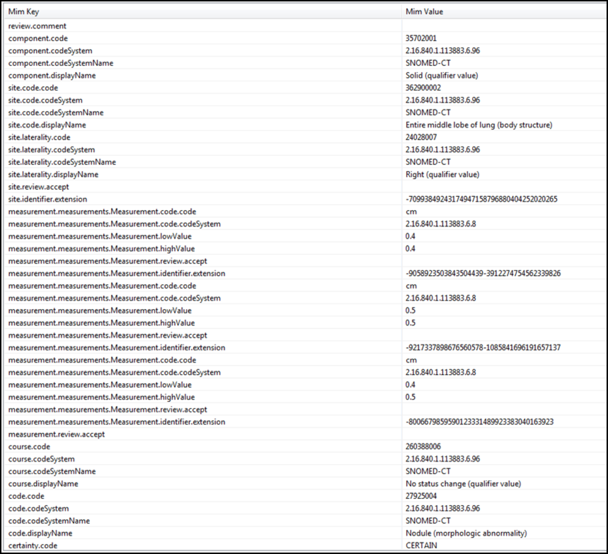
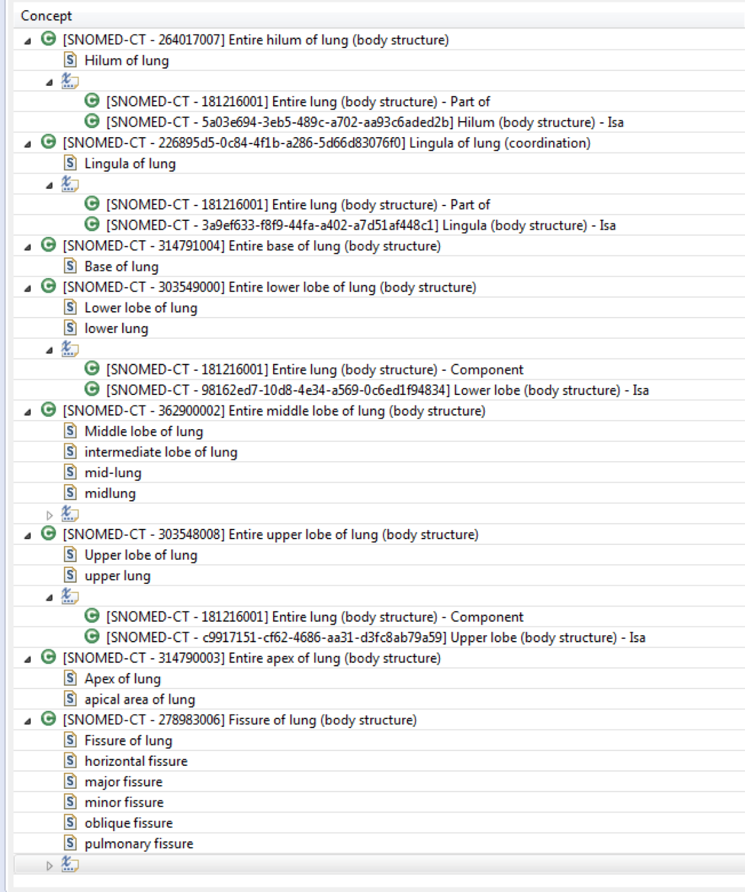
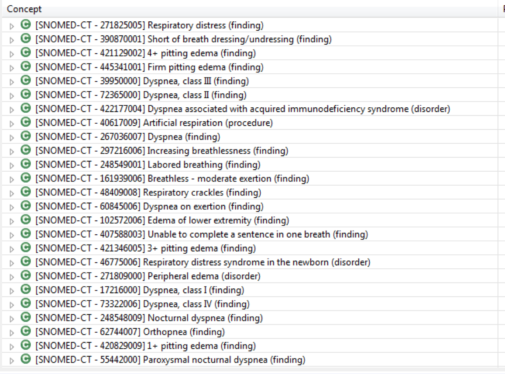
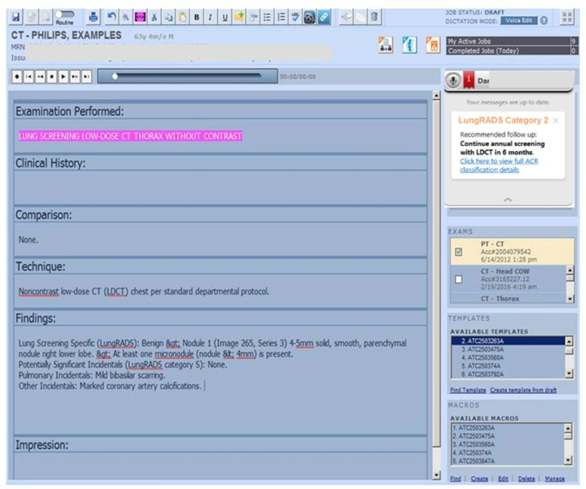
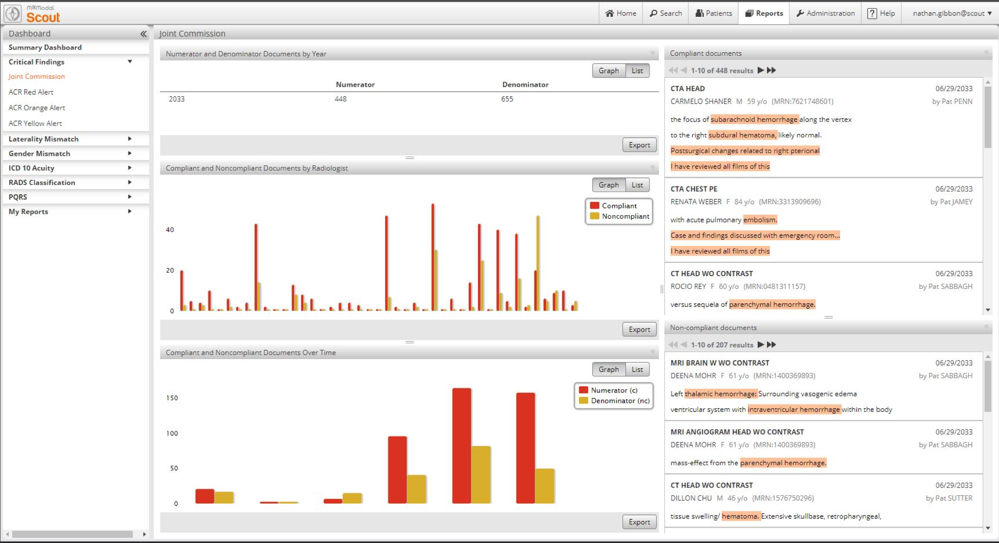
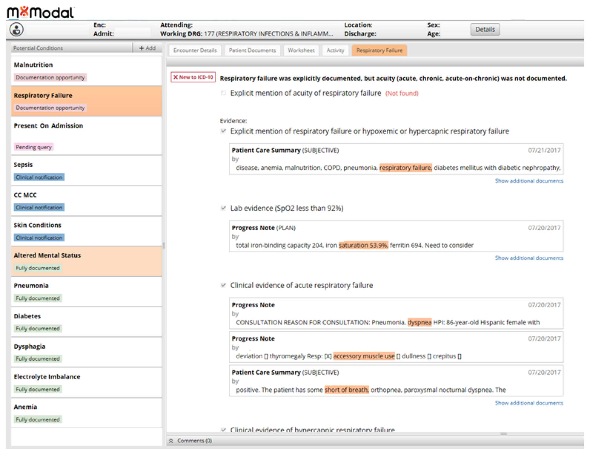

# M*Modal

# Overview

M*Modal’s suite of clinical documentation solutions bring forward a seamless platform that delivers back-end transcription, front-end speech recognition, mobile documentation, Computer-Assisted Physician Documentation (CAPD), virtual scribing, and Natural Language Understanding (NLU) driven Clinical Documentation Improvement (CDI) and coding workflows. The M*Modal Fluency® platform has been deployed at thousands of facilities including leading healthcare providers and is designed to improve clinical and financial outcomes while enhancing physician workflows to free up time for patient care.

# M*Modal Fluency

Built on proprietary NLU and learning technologies, the M*Modal platform aggregates, abstracts and presents clinical information, both structured and unstructured. M*Modal Fluency has a built-in clinical reasoning layer which uses natural language to deliver information to different stakeholders through task-specific, real-time workflow applications. By combining NLU with speech recognition technology, M*Modal embeds clinical intelligence and flexibility into front-end physician workflows while leveraging existing systems for sustainable improvement. Utilizing the company’s single platform, M*Modal solutions also deliver clinical insights to inform back-end CDI, coding and quality processes. This closed-loop approach provides back-end users visibility into physician behavior and lets back-end correction workflows inform physician documentation practices.

Part of the M*Modal Fluency platform, Fluency DirectTM is a cloud-based front-end speech recognition solution for hospitals and larger clinics that speech enables the EHR.[1](https://confluence.ihtsdotools.org/display/DOCCDS/M*Modal#Footnote1 "Footnote: Click here to display the footnote") Physicians can freely dictate narrative in real-time into the patient record, as well as edit and sign reports using speech commands. Its built-in CAPD functionality delivers real-time and context-specific feedback to physicians on quality and compliance for better documentation and optimized physician experience.[2](https://confluence.ihtsdotools.org/display/DOCCDS/M*Modal#Footnote2 "Footnote: Click here to display the footnote") SNOMED CT is a central component of M*Modal's NLU technology and is widely used within its solutions. SNOMED CT provides a rich ontology for capturing patient conditions in clinical documentation. Using a proprietary M*Modal information model (MIM), all related concepts are organized in a simple tabular fashion which then facilitates clinical decision support reasoning. SNOMED CT's flexible extension mechanism has also been leveraged to represent new clinical ideas.

## Natural Language Understanding (NLU)

The M*Modal NLU platform was developed using the [Unstructured Information Management Architecture](https://en.wikipedia.org/wiki/UIMA) (UIMA) framework. The propriety solution is able to detect document structure, establish sentence boundaries, and consider temporality and negation. Clinical information is processed and inserted into clinical information models using predefined terminologies, such as SNOMED CT. The algorithms within the solution support a range of use cases including clinical documentation improvement, coding support, and clinical decision support.

## Information Models and Terminology

The data elements within M*Modal's proprietary information models (MIMs) are bound to a range of standard ontologies, including SNOMED CT, RxNorm, LOINC, ICD, and [CPT](https://www.ama-assn.org/practice-management/cpt-current-procedural-terminology) codes. Models representing findings, disorders, organs, and devices use SNOMED CT while laboratory MIMs use LOINC and medications MIMs use RxNorm. Complex MIMs such as "action course" use a combination of terminologies. The aforementioned ontologies are used to create value sets for use in various clinical scenarios.

Use of SNOMED CT

SNOMED CT is used as the primary reference terminology within the M*Modal Content Management System. In addition to its use in defining value sets, SNOMED CT is used as the basis for defining new clinical ideas through M*Modal's concept level information models. For example, |finding site| and |laterality| relationships on any given _concept_ are used to automatically populate the information models, while |course| and |distribution| are populated with SNOMED CT codes using relationships defined outside SNOMED CT directly in the MIMs.

Clinical Decision Support

M*Modal uses SNOMED CT in a number of clinical decision support use cases, including those described below. 

## Lung Nodules Classification and Physician Feedback

### Clinical Finding MIM

Concept level information models are represented as a series of name-value pairs as shown in [Figure 1](https://confluence.ihtsdotools.org/display/DOCCDS/M*Modal#Figure-finding-information-model-using-snomed-ct-concepts "Finding information model using SNOMED CT concepts") below.

<figure><figcaption>
Figure 1: Finding information model using SNOMED CT concepts
</figcaption></figure>

This finding information model can capture additional information about any SNOMED CT Clinical Finding or Disorder. In this case, the model is interpreting the clinical narrative of “ _4-5 mm solid, lobulated, parenchymal nodule right middle lobe previously 4-5 mm_ ” and mapping the text to the following SNOMED CT concepts:

**Finding** : [ 27925004 | Nodule (morphologic abnormality)|](http://snomed.info/id/27925004 "27925004 | Nodule \(morphologic abnormality\) |")

**Site** : [ 362900002 | Entire middle lobe of lung (body structure)|](http://snomed.info/id/362900002 "362900002 | Entire middle lobe of lung \(body structure\) |")

**Laterality** : [ 24028007 | Right (qualifier value)|](http://snomed.info/id/24028007 "24028007 | Right \(qualifier value\) |")

**Component** : [ 35702001 | Solid (qualifier value)|](http://snomed.info/id/35702001 "35702001 | Solid \(qualifier value\) |")

The size was captured with the measurement engine as 4-5 mm and compared to the previous size of 4-5 mm resulting in the interpretation of unchanged size which is then mapped to the SNOMED CT concept:

**Course** : [ 260388006 | No status change (qualifier value)|](http://snomed.info/id/260388006 "260388006 | No status change \(qualifier value\) |")

### ValueSets

Population of the information model is also helped by defining value sets of permitted concepts. For example, [Figure 2](https://confluence.ihtsdotools.org/display/DOCCDS/M*Modal#Figure-lung-site-value-set "Lung site value set") below shows a list of concepts which are considered legitimate finding sites for lung nodules. 

<figure><figcaption>
Figure 2: Lung site value set
</figcaption></figure>

In cases where the lexical forms are required by NLU and not represented in SNOMED CT, a synonym may be added. Postcoordination may also be used to define new clinical ideas. Value sets based on SNOMED CT content are used to gather evidence of clinical confidence for a specific condition. For example, "Signs and Symptoms of Exacerbation of Congestive Heart Failure (CHF)" is a value set which leverages the SNOMED CT hierarchy. 49 SNOMED CT concepts and their descendants are used to define this value set, a fragment of which is shown in [Figure 3](https://confluence.ihtsdotools.org/display/DOCCDS/M*Modal#Figure-signs-and-symptoms-of-exacerbation-of-chf-value-set "Signs and symptoms of exacerbation of CHF value set") below.

<figure><figcaption>
Figure 3: Signs and symptoms of exacerbation of CHF value set
</figcaption></figure>

### Clinical Decision Support

CDS interventions are presented to clinicians via web-based applications, such as Fluency for ImagingTM (FFI), M*Modal's speech reporting and workflow management solution. Computer-Assisted Physician Documentation (CAPD) technology presents radiologists with real-time, automated quality-improvement feedback. In [Figure 4](https://confluence.ihtsdotools.org/display/DOCCDS/M*Modal#Figure-m-modal-fluency-for-imaging-application-with-cds-feedback-through-capd-technology "M*Modal Fluency for Imaging application with CDS feedback through CAPD technology") below, a clinical decision support notification is presented to a radiologist while dictating a CT lung screening study which had the same finding as described in [Figure 1](https://confluence.ihtsdotools.org/display/DOCCDS/M*Modal#Figure-finding-information-model-using-snomed-ct-concepts "Finding information model using SNOMED CT concepts") above. The clinical reasoning reaches a conclusion that the patient has “ _Unchanged solid nodule < 6mm_” which is classified as “LungRads Category 2” based on [American College of Radiologists](https://www.acr.org/Quality-Safety/Resources/LungRADS) (ACR) recommendations and follow-up of “ _Repeat (low dose CT scan) LDCT in 6 months_ ”.

<figure><figcaption>
Figure 4: M*Modal Fluency for Imaging application with CDS feedback through CAPD technology
</figcaption></figure>

## Critical Findings Physician Feedback and Tracking

ACR guidelines also stipulate that critical findings have to be reported back to the ordering physician in a timely fashion. In some high priority cases, the follow up must be completed within an hour. M*Modal delivers real-time feedback to the radiologist on the critical finding as the report is created. Moreover _,_ M*Modal ScoutTM, the company’s radiology business intelligence and analytics solution, has the ability to track critical finding occurrences and compliance of radiologists in communicating them which drives continuous improvement.

[Figure 5](https://confluence.ihtsdotools.org/display/DOCCDS/M*Modal#Figure-critical-finding-dashboard-showing-compliant-and-non-compliant-reporting-of-critical-findings-found "Critical finding dashboard showing compliant and non-compliant reporting of critical findings found") below is a screen capture of a dashboard which indicates how often a particular critical finding was found, and how often the radiologist fulfilled the follow up requirements. All critical findings in this application are identified using SNOMED CT codes defined in a value set.

<figure><figcaption>
Figure 5: Critical finding dashboard showing compliant and non-compliant reporting of critical findings found
</figcaption></figure>

## Clinical Documentation Improvement (CDI)

The CDI use case leverages M*Modal's CDS reasoning layer to identify encounters that do not capture clinical diagnosis at the appropriate level of specificity in concepts such as laterality, acuity, severity, episode of care, risk of mortality, etc., to support ICD-10 and quality requirements. The M*Modal system delivers these insights to CDI Specialists in the back end to automate chart review while also generating summarized supporting evidence of clinical indicators that include information on vital signs, labs, symptoms/diseases, medications, social history, etc. as shown in [Figure 6](https://confluence.ihtsdotools.org/display/DOCCDS/M*Modal#Figure-m-modal-evidence-sheet-of-clinical-indicators-to-support-the-back-end-cdi-specialist-workflow "M*Modal evidence sheet of clinical indicators to support the back-end CDI Specialist workflow") below.

<figure><figcaption>
Figure 6: M*Modal evidence sheet of clinical indicators to support the back-end CDI Specialist workflow
</figcaption></figure>

As mentioned earlier, the same clinical reasoning is also leveraged to provide real-time feedback to physicians at the front-end of the documentation creation process to identify gaps in documentation and variance in patient care for a closed-loop approach.

* * *

Footnotes Ref | Notes  
---|---  
[1](https://confluence.ihtsdotools.org/display/DOCCDS/M*Modal#FootnoteMarker1-0 "Footnote: Click to return to reference in text") |  <https://mmodal.com/resources/product-brochures/mmodal-fluency-direct/>  
[2](https://confluence.ihtsdotools.org/display/DOCCDS/M*Modal#FootnoteMarker2-0 "Footnote: Click to return to reference in text") |  <https://mmodal.com/>
