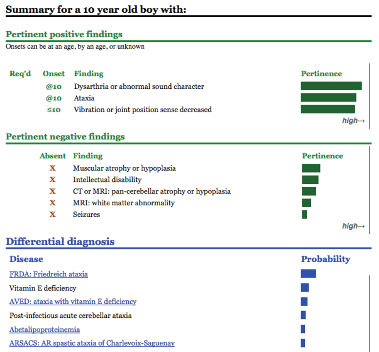

# SimulConsult

# Overview

SimulConsult is a developer of diagnostic decision support software based in the United States. They provide solutions which cover three main functionalities:

  * **Clinical Diagnostic Decision** **Support:** Uses signs, symptoms, and clinical knowledge from a peer-reviewed database to suggest tests and present a differential diagnosis as shown in [Figure 1](https://confluence.ihtsdotools.org/display/DOCCDS/SimulConsult#Figure-clinical-findings-and-diseases-can-be-represented-using-snomed-ct-content-in-simulconsult "Clinical findings and diseases can be represented using SNOMED CT content in SimulConsult.") below.
  * **Loss of** **Heterozygosity:** Supports the analysis of microarrays**.**
  * **Genome-Phenome Analyzer:** Analyzes and reports on whole exome and genome testing.

<figure><figcaption>
Figure 1: Clinical findings and diseases can be represented using SNOMED CT content in SimulConsult.
</figcaption></figure>

By using SNOMED CT in the electronic reports generated by their software, SimulConsult has been able to achieve improved interoperability with other systems and EHRs.

# Standards and Guidelines

Diseases in SimulConsult are linked to [Online Mendelian Inheritance in Man](https://www.omim.org/) (OMIM), a catalog of Human Genes and Genetic Disorders, and additional knowledge resources from the National Library of Medicine (NLM). Tests are linked to "gene test advice" , provided by the NLM . Much of the frequency-based information is based on [GeneReviews](https://www.ncbi.nlm.nih.gov/books/NBK1116/) content.[3](https://confluence.ihtsdotools.org/display/DOCCDS/SimulConsult#Footnote3 "Footnote: Click here to display the footnote") It is also possible to assess a diagnosis based on the patient’s findings, which indicates the frequency as well as the absence or presence of findings.

# Using SNOMED CT

Although SimulConsult does not use SNOMED CT codes to drive decision support logic, their solution links to SNOMED CT through mappings provided by SimulConsult's terminology partner, [Intelligent Medical Objects](https://www.e-imo.com/) (IMO). IMO assigns proprietary codes to findings and diseases, which are then mapped to SNOMED CT. SimulConsult can be configured to use SNOMED CT terms to display [ | clinical findings|](http://snomed.info/id/404684003 "404684003 | clinical findings |") and [ | diseases|](http://snomed.info/id/64572001 "64572001 | diseases |") in the outputs of their software, such as patient summaries or genome analysis reports.

* * *

Footnotes Ref | Notes  
---|---  
[1](https://confluence.ihtsdotools.org/display/DOCCDS/SimulConsult#FootnoteMarker1-0 "Footnote: Click to return to reference in text") |  <http://www.simulconsult.com/>  
[2](https://confluence.ihtsdotools.org/display/DOCCDS/SimulConsult#FootnoteMarker2-0 "Footnote: Click to return to reference in text") |  <http://osp.od.nih.gov/sites/default/files/resources/Segal_0.pdf>  
[3](https://confluence.ihtsdotools.org/display/DOCCDS/SimulConsult#FootnoteMarker3-0 "Footnote: Click to return to reference in text") |  [SimulConsult leverages National Library of Medicine information to improve medical diagnosis](https://www.youtube.com/watch?v=4zVquU2z53Q)
